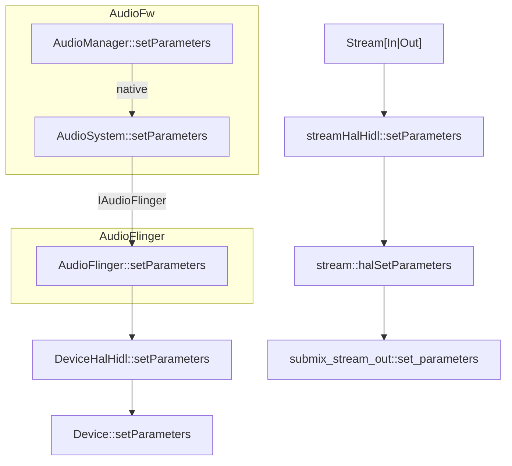
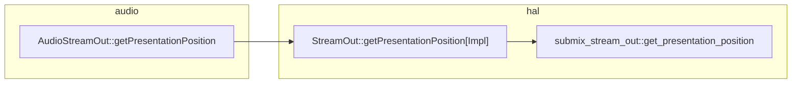

Android Audio latency讲解

<!-- more -->

* TOC
{:toc}
最近在作音频的优化， 需要将参数传到audio hal， 记录下。

# Android avsync


# Audio::SetParameters


# ExoPlayer Sync


# Audio SetParameters


Android source

[Android remote-submix](https://cs.android.com/android/platform/superproject/+/master:hardware/libhardware/modules/audio_remote_submix/audio_hw.cpp?q=audio_hw.cpp&ss=android%2Fplatform%2Fsuperproject)

```
//打开设备
static int adev_open(const hw_module_t* module, const char* name,
                     hw_device_t** device)
{
    ALOGI("adev_open(name=%s)", name);
    struct submix_audio_device *rsxadev;

    if (strcmp(name, AUDIO_HARDWARE_INTERFACE) != 0)
        return -EINVAL;

    rsxadev = (submix_audio_device*) calloc(1, sizeof(struct submix_audio_device));
    if (!rsxadev)
        return -ENOMEM;

    rsxadev->device.common.tag = HARDWARE_DEVICE_TAG;
    rsxadev->device.common.version = AUDIO_DEVICE_API_VERSION_2_0;
    rsxadev->device.common.module = (struct hw_module_t *) module;
    rsxadev->device.common.close = adev_close;

    rsxadev->device.init_check = adev_init_check;
    rsxadev->device.set_voice_volume = adev_set_voice_volume;
    rsxadev->device.set_master_volume = adev_set_master_volume;
    rsxadev->device.get_master_volume = adev_get_master_volume;
    rsxadev->device.set_master_mute = adev_set_master_mute;
    rsxadev->device.get_master_mute = adev_get_master_mute;
    rsxadev->device.set_mode = adev_set_mode;
    rsxadev->device.set_mic_mute = adev_set_mic_mute;
    rsxadev->device.get_mic_mute = adev_get_mic_mute;
    rsxadev->device.set_parameters = adev_set_parameters;
    rsxadev->device.get_parameters = adev_get_parameters;
    rsxadev->device.get_input_buffer_size = adev_get_input_buffer_size;
    rsxadev->device.open_output_stream = adev_open_output_stream;
    rsxadev->device.close_output_stream = adev_close_output_stream;
    rsxadev->device.open_input_stream = adev_open_input_stream;
    rsxadev->device.close_input_stream = adev_close_input_stream;
    rsxadev->device.dump = adev_dump;

    for (int i=0 ; i < MAX_ROUTES ; i++) {
            memset(&rsxadev->routes[i], 0, sizeof(route_config));
            strcpy(rsxadev->routes[i].address, "");
        }

    *device = &rsxadev->device.common;

    return 0;
}
```

主要关注 `set_parameters` 和`get_presentation_position`。

流的结构

```c++

//打开流
static int adev_open_output_stream(struct audio_hw_device *dev,
                                   audio_io_handle_t handle,
                                   audio_devices_t devices,
                                   audio_output_flags_t flags,
                                   struct audio_config *config,
                                   struct audio_stream_out **stream_out,
                                   const char *address)
{
    struct submix_audio_device * const rsxadev = audio_hw_device_get_submix_audio_device(dev);
    ALOGD("adev_open_output_stream(address=%s)", address);
    struct submix_stream_out *out;
    (void)handle;
    (void)devices;
    (void)flags;

    *stream_out = NULL;

    // Make sure it's possible to open the device given the current audio config.
    submix_sanitize_config(config, false);

    int route_idx = -1;

    pthread_mutex_lock(&rsxadev->lock);

    status_t res = submix_get_route_idx_for_address_l(rsxadev, address, &route_idx);
    if (res != OK) {
        ALOGE("Error %d looking for address=%s in adev_open_output_stream", res, address);
        pthread_mutex_unlock(&rsxadev->lock);
        return res;
    }

    if (!submix_open_validate_l(rsxadev, route_idx, config, false)) {
        ALOGE("adev_open_output_stream(): Unable to open output stream for address %s", address);
        pthread_mutex_unlock(&rsxadev->lock);
        return -EINVAL;
    }

    out = (struct submix_stream_out *)calloc(1, sizeof(struct submix_stream_out));
    if (!out) {
        pthread_mutex_unlock(&rsxadev->lock);
        return -ENOMEM;
    }

    // Initialize the function pointer tables (v-tables).
    out->stream.common.get_sample_rate = out_get_sample_rate;
    out->stream.common.set_sample_rate = out_set_sample_rate;
    out->stream.common.get_buffer_size = out_get_buffer_size;
    out->stream.common.get_channels = out_get_channels;
    out->stream.common.get_format = out_get_format;
    out->stream.common.set_format = out_set_format;
    out->stream.common.standby = out_standby;
    out->stream.common.dump = out_dump;
    //stream
    out->stream.common.set_parameters = out_set_parameters;
    out->stream.common.get_parameters = out_get_parameters;
    out->stream.common.add_audio_effect = out_add_audio_effect;
    out->stream.common.remove_audio_effect = out_remove_audio_effect;
    out->stream.get_latency = out_get_latency;
    out->stream.set_volume = out_set_volume;
    out->stream.write = out_write;
    out->stream.get_render_position = out_get_render_position;
    out->stream.get_next_write_timestamp = out_get_next_write_timestamp;
    out->stream.get_presentation_position = out_get_presentation_position;

    // If the sink has been shutdown or pipe recreation is forced (see above), delete the pipe so
    // that it's recreated.
    if ((rsxadev->routes[route_idx].rsxSink != NULL
            && rsxadev->routes[route_idx].rsxSink->isShutdown())) {
        submix_audio_device_release_pipe_l(rsxadev, route_idx);
    }

    // Store a pointer to the device from the output stream.
    out->dev = rsxadev;
    // Initialize the pipe.
    const size_t pipeSizeInFrames = pipe_size_in_frames(config->sample_rate);
    ALOGI("adev_open_output_stream(): about to create pipe at index %d, rate %u, pipe size %zu",
          route_idx, config->sample_rate, pipeSizeInFrames);
    submix_audio_device_create_pipe_l(rsxadev, config, pipeSizeInFrames,
            DEFAULT_PIPE_PERIOD_COUNT, NULL, out, address, route_idx);
#if LOG_STREAMS_TO_FILES
    out->log_fd = open(LOG_STREAM_OUT_FILENAME, O_CREAT | O_TRUNC | O_WRONLY,
                       LOG_STREAM_FILE_PERMISSIONS);
    ALOGE_IF(out->log_fd < 0, "adev_open_output_stream(): log file open failed %s",
             strerror(errno));
    ALOGV("adev_open_output_stream(): log_fd = %d", out->log_fd);
#endif // LOG_STREAMS_TO_FILES
    // Return the output stream.
    *stream_out = &out->stream;

    pthread_mutex_unlock(&rsxadev->lock);
    return 0;
}
```


## setParameters

```c++
    /**
     * set/get audio stream parameters. The function accepts a list of
     * parameter key value pairs in the form: key1=value1;key2=value2;...
     *
     * Some keys are reserved for standard parameters (See AudioParameter class)
     *
     * If the implementation does not accept a parameter change while
     * the output is active but the parameter is acceptable otherwise, it must
     * return -ENOSYS.
     *
     * The audio flinger will put the stream in standby and then change the
     * parameter value.
     */
    int (*set_parameters)(struct audio_stream *stream, const char *kv_pairs);
```





# getTimestamp

```c
    /* return the number of audio frames written by the audio dsp to DAC since
     * the output has exited standby
     */
    int (*get_render_position)(const struct audio_stream_out *stream,
                               uint32_t *dsp_frames);

    /**
     * get the local time at which the next write to the audio driver will be presented.
     * The units are microseconds, where the epoch is decided by the local audio HAL.
     */
    int (*get_next_write_timestamp)(const struct audio_stream_out *stream,
                                    int64_t *timestamp);

	/**
     * Return a recent count of the number of audio frames presented to an external observer.
     * This excludes frames which have been written but are still in the pipeline.
     * The count is not reset to zero when output enters standby.
     * Also returns the value of CLOCK_MONOTONIC as of this presentation count.
     * The returned count is expected to be 'recent',
     * but does not need to be the most recent possible value.
     * However, the associated time should correspond to whatever count is returned.
     * Example:  assume that N+M frames have been presented, where M is a 'small' number.
     * Then it is permissible to return N instead of N+M,
     * and the timestamp should correspond to N rather than N+M.
     * The terms 'recent' and 'small' are not defined.
     * They reflect the quality of the implementation.
     *
     * 3.0 and higher only.
     */
    int (*get_presentation_position)(const struct audio_stream_out *stream,
                               uint64_t *frames, struct timespec *timestamp);
```




```c++
//frameworks/av/services/audioflinger/Threads.cpp
// A differential check on the timestamps to see if there is a change in the
// timestamp frame position between the last call to checkRunningTimestamp.   
// 判断是否还在running
bool AudioFlinger::PlaybackThread::checkRunningTimestamp()
{
    uint64_t position = 0;
    struct timespec unused;
    const status_t ret = mOutput->getPresentationPosition(&position, &unused);
    if (ret == NO_ERROR) {
        if (position != mLastCheckedTimestampPosition) {
            mLastCheckedTimestampPosition = position;
            return true;
        }
    }
    return false;
}
```


```c++
//frameworks/av/services/audioflinger/Threads.h
// Always query HAL timestamp and update timestamp verifier. In standby or pause,
// HAL may be draining some small duration buffered data for fade out.

status_t    threadloop_getHalTimestamp_l(ExtendedTimestamp *timestamp) const override {
       // For DIRECT and OFFLOAD threads, query the output sink directly.
       if (mOutput != nullptr) {
           uint64_t uposition64;
           struct timespec time;
           if (mOutput->getPresentationPosition(
               &uposition64, &time) == OK) {
               timestamp->mPosition[ExtendedTimestamp::LOCATION_KERNEL]
                   = (int64_t)uposition64;
               timestamp->mTimeNs[ExtendedTimestamp::LOCATION_KERNEL]
                   = audio_utils_ns_from_timespec(&time);
               return NO_ERROR;
           }
       }
       return INVALID_OPERATION;
   }
```


## AudioTrack

```java
    /**
     * Returns this track's estimated latency in milliseconds. This includes the latency due
     * to AudioTrack buffer size, AudioMixer (if any) and audio hardware driver.
     *
     * DO NOT UNHIDE. The existing approach for doing A/V sync has too many problems. We need
     * a better solution.
     * @hide
     */
    @UnsupportedAppUsage(trackingBug = 130237544)
    public int getLatency() {
        return native_get_latency();
    }

   /**
    * Poll for a timestamp on demand.
    * <p>
    * If you need to track timestamps during initial warmup or after a routing or mode change,
    * you should request a new timestamp periodically until the reported timestamps
    * show that the frame position is advancing, or until it becomes clear that
    * timestamps are unavailable for this route.
    * <p>
    * After the clock is advancing at a stable rate,
    * query for a new timestamp approximately once every 10 seconds to once per minute.
    * Calling this method more often is inefficient.
    * It is also counter-productive to call this method more often than recommended,
    * because the short-term differences between successive timestamp reports are not meaningful.
    * If you need a high-resolution mapping between frame position and presentation time,
    * consider implementing that at application level, based on low-resolution timestamps.
    * <p>
    * The audio data at the returned position may either already have been
    * presented, or may have not yet been presented but is committed to be presented.
    * It is not possible to request the time corresponding to a particular position,
    * or to request the (fractional) position corresponding to a particular time.
    * If you need such features, consider implementing them at application level.
    *
    * @param timestamp a reference to a non-null AudioTimestamp instance allocated
    *        and owned by caller.
    * @return true if a timestamp is available, or false if no timestamp is available.
    *         If a timestamp is available,
    *         the AudioTimestamp instance is filled in with a position in frame units, together
    *         with the estimated time when that frame was presented or is committed to
    *         be presented.
    *         In the case that no timestamp is available, any supplied instance is left unaltered.
    *         A timestamp may be temporarily unavailable while the audio clock is stabilizing,
    *         or during and immediately after a route change.
    *         A timestamp is permanently unavailable for a given route if the route does not support
    *         timestamps.  In this case, the approximate frame position can be obtained
    *         using {@link #getPlaybackHeadPosition}.
    *         However, it may be useful to continue to query for
    *         timestamps occasionally, to recover after a route change.
    */
    // Add this text when the "on new timestamp" API is added:
    //   Use if you need to get the most recent timestamp outside of the event callback handler.
    public boolean getTimestamp(AudioTimestamp timestamp)
```


frameworks/av/media/libmediahelper/include/media/AudioParameter.h

# update 2023/02/15


# MediaSync
```java
/**
 * MediaSync class can be used to synchronously play audio and video streams.
 * It can be used to play audio-only or video-only stream, too.
 *
 * <p>MediaSync is generally used like this:
 * <pre>
 * MediaSync sync = new MediaSync();
 * sync.setSurface(surface);
 * Surface inputSurface = sync.createInputSurface();
 * ...
 * // MediaCodec videoDecoder = ...;
 * videoDecoder.configure(format, inputSurface, ...);
 * ...
 * sync.setAudioTrack(audioTrack);
 * sync.setCallback(new MediaSync.Callback() {
 *     {@literal @Override}
 *     public void onAudioBufferConsumed(MediaSync sync, ByteBuffer audioBuffer, int bufferId) {
 *         ...
 *     }
 * }, null);
 * // This needs to be done since sync is paused on creation.
 * sync.setPlaybackParams(new PlaybackParams().setSpeed(1.f));
 *
 * for (;;) {
 *   ...
 *   // send video frames to surface for rendering, e.g., call
 *   // videoDecoder.releaseOutputBuffer(videoOutputBufferIx, videoPresentationTimeNs);
 *   // More details are available as below.
 *   ...
 *   sync.queueAudio(audioByteBuffer, bufferId, audioPresentationTimeUs); // non-blocking.
 *   // The audioByteBuffer and bufferId will be returned via callback.
 *   // More details are available as below.
 *   ...
 *     ...
 * }
 * sync.setPlaybackParams(new PlaybackParams().setSpeed(0.f));
 * sync.release();
 * sync = null;
 *
 * // The following code snippet illustrates how video/audio raw frames are created by
 * // MediaCodec's, how they are fed to MediaSync and how they are returned by MediaSync.
 * // This is the callback from MediaCodec.
 * onOutputBufferAvailable(MediaCodec codec, int bufferId, BufferInfo info) {
 *     // ...
 *     if (codec == videoDecoder) {
 *         // surface timestamp must contain media presentation time in nanoseconds.
 *         codec.releaseOutputBuffer(bufferId, 1000 * info.presentationTime);
 *     } else {
 *         ByteBuffer audioByteBuffer = codec.getOutputBuffer(bufferId);
 *         sync.queueAudio(audioByteBuffer, bufferId, info.presentationTime);
 *     }
 *     // ...
 * }
 *
 * // This is the callback from MediaSync.
 * onAudioBufferConsumed(MediaSync sync, ByteBuffer buffer, int bufferId) {
 *     // ...
 *     audioDecoder.releaseBuffer(bufferId, false);
 *     // ...
 * }
 *
 * </pre>
 *
 * The client needs to configure corresponding sink by setting the Surface and/or AudioTrack
 * based on the stream type it will play.
 * <p>
 * For video, the client needs to call {@link #createInputSurface} to obtain a surface on
 * which it will render video frames.
 * <p>
 * For audio, the client needs to set up audio track correctly, e.g., using {@link
 * AudioTrack#MODE_STREAM}. The audio buffers are sent to MediaSync directly via {@link
 * #queueAudio}, and are returned to the client via {@link Callback#onAudioBufferConsumed}
 * asynchronously. The client should not modify an audio buffer till it's returned.
 * <p>
 * The client can optionally pre-fill audio/video buffers by setting playback rate to 0.0,
 * and then feed audio/video buffers to corresponding components. This can reduce possible
 * initial underrun.
 * <p>
 */
```

 [MediaSync.queueAudio](https://cs.android.com/android/platform/superproject/+/master:frameworks/base/media/java/android/media/MediaSync.java;drc=d4903a630ce6d55578f00a5fae1f6e5afb0edee4;l=507)

```java
   /**
     * Queues the audio data asynchronously for playback (AudioTrack must be in streaming mode).
     * If the audio track was flushed as a result of {@link #flush}, it will be restarted.
     * @param audioData the buffer that holds the data to play. This buffer will be returned
     *     to the client via registered callback.
     * @param bufferId an integer used to identify audioData. It will be returned to
     *     the client along with audioData. This helps applications to keep track of audioData,
     *     e.g., it can be used to store the output buffer index used by the audio codec.
     * @param presentationTimeUs the presentation timestamp in microseconds for the first frame
     *     in the buffer.
     * @throws IllegalStateException if audio track is not set or internal configureation
     *     has not been done correctly.
     */
    public void queueAudio(
            @NonNull ByteBuffer audioData, int bufferId, long presentationTimeUs) {
        if (mAudioTrack == null || mAudioThread == null) {
            throw new IllegalStateException(
                    "AudioTrack is NOT set or audio thread is not created");
        }

        synchronized(mAudioLock) {
            mAudioBuffers.add(new AudioBuffer(audioData, bufferId, presentationTimeUs));
        }

        if (mPlaybackRate != 0.0) {
            postRenderAudio(0);
        }
    }
```

[JNI_MediaSync](https://cs.android.com/android/platform/superproject/+/master:frameworks/base/media/jni/android_media_MediaSync.cpp;drc=d4903a630ce6d55578f00a5fae1f6e5afb0edee4;l=257?q=%22native_updateQueuedAudioData%22&ss=android%2Fplatform%2Fsuperproject)

```c++
static void android_media_MediaSync_native_updateQueuedAudioData(
        JNIEnv *env, jobject thiz, jint sizeInBytes, jlong presentationTimeUs) {
    sp<JMediaSync> sync = getMediaSync(env, thiz);
    if (sync == NULL) {
        throwExceptionAsNecessary(env, INVALID_OPERATION);
        return;
    }

    status_t err = sync->updateQueuedAudioData(sizeInBytes, presentationTimeUs);
    if (err != NO_ERROR) {
        throwExceptionAsNecessary(env, err);
        return;
    }
}
```

[MediaSync.cpp](https://cs.android.com/android/platform/superproject/+/master:frameworks/av/media/libstagefright/MediaSync.cpp;drc=d4903a630ce6d55578f00a5fae1f6e5afb0edee4;l=297)

```c++

status_t MediaSync::updateQueuedAudioData(
        size_t sizeInBytes, int64_t presentationTimeUs) {
    if (sizeInBytes == 0) {
        return OK;
    }

    Mutex::Autolock lock(mMutex);

    if (mAudioTrack == NULL) {
        ALOGW("updateQueuedAudioData: audioTrack has NOT been configured.");
        return INVALID_OPERATION;
    }

    //计算帧数
    int64_t numFrames = sizeInBytes / mAudioTrack->frameSize();
    //最大媒体时间
    int64_t maxMediaTimeUs = presentationTimeUs
            + getDurationIfPlayedAtNativeSampleRate_l(numFrames);

    //本地时间
    int64_t nowUs = ALooper::GetNowUs();
    //当前媒体播放的媒体时间
    int64_t nowMediaUs = presentationTimeUs
        	//透过帧算出开始时间
            - getDurationIfPlayedAtNativeSampleRate_l(mNumFramesWritten)
        	//透过AudioTrack的getTimestamp计算已经播放的duration, 加上上面算出的开始时间,即为当前媒体时间
            + getPlayedOutAudioDurationMedia_l(nowUs);

    mNumFramesWritten += numFrames;

    int64_t oldRealTime = -1;
    if (mNextBufferItemMediaUs != -1) {
        oldRealTime = getRealTime(mNextBufferItemMediaUs, nowUs);
    }

    mMediaClock->updateAnchor(nowMediaUs, nowUs, maxMediaTimeUs);
    mHasAudio = true;

    if (oldRealTime != -1) {
        int64_t newRealTime = getRealTime(mNextBufferItemMediaUs, nowUs);
        if (newRealTime >= oldRealTime) {
            return OK;
        }
    }

    mNextBufferItemMediaUs = -1;
    onDrainVideo_l();
    return OK;
}

//计算当前播放的duration
int64_t MediaSync::getPlayedOutAudioDurationMedia_l(int64_t nowUs) {
    CHECK(mAudioTrack != NULL);

    uint32_t numFramesPlayed;
    int64_t numFramesPlayedAtUs;
    AudioTimestamp ts;

    status_t res = mAudioTrack->getTimestamp(ts);
    if (res == OK) {
        // case 1: mixing audio tracks.
        //帧数据
        numFramesPlayed = ts.mPosition;
        //当前本地时间的present timestamp
        numFramesPlayedAtUs = ts.mTime.tv_sec * 1000000LL + ts.mTime.tv_nsec / 1000;
        //ALOGD("getTimestamp: OK %d %lld",
        //      numFramesPlayed, (long long)numFramesPlayedAtUs);
    } else if (res == WOULD_BLOCK) {
        // case 2: transitory state on start of a new track
        numFramesPlayed = 0;
        numFramesPlayedAtUs = nowUs;
        //ALOGD("getTimestamp: WOULD_BLOCK %d %lld",
        //      numFramesPlayed, (long long)numFramesPlayedAtUs);
    } else {
        // case 3: transitory at new track or audio fast tracks.
        res = mAudioTrack->getPosition(&numFramesPlayed);
        CHECK_EQ(res, (status_t)OK);
        numFramesPlayedAtUs = nowUs;
        numFramesPlayedAtUs += 1000LL * mAudioTrack->latency() / 2; /* XXX */
        //ALOGD("getPosition: %d %lld", numFramesPlayed, (long long)numFramesPlayedAtUs);
    }

    //can't be negative until 12.4 hrs, test.
    //CHECK_EQ(numFramesPlayed & (1 << 31), 0);
    int64_t durationUs =
        //帧数据计算的时间
        getDurationIfPlayedAtNativeSampleRate_l(numFramesPlayed)
        //从numFramesPlayedAtUs到nowUs的偏移时间
            + nowUs - numFramesPlayedAtUs;
    if (durationUs < 0) {
        // Occurs when numFramesPlayed position is very small and the following:
        // (1) In case 1, the time nowUs is computed before getTimestamp() is
        //     called and numFramesPlayedAtUs is greater than nowUs by time more
        //     than numFramesPlayed.
        // (2) In case 3, using getPosition and adding mAudioTrack->latency()
        //     to numFramesPlayedAtUs, by a time amount greater than
        //     numFramesPlayed.
        //
        // Both of these are transitory conditions.
        ALOGV("getPlayedOutAudioDurationMedia_l: negative duration %lld "
              "set to zero", (long long)durationUs);
        durationUs = 0;
    }
    ALOGV("getPlayedOutAudioDurationMedia_l(%lld) nowUs(%lld) frames(%u) "
          "framesAt(%lld)",
          (long long)durationUs, (long long)nowUs, numFramesPlayed,
          (long long)numFramesPlayedAtUs);
    return durationUs;
}
```


[r-submix test](hardware/libhardware/modules/audio_remote_submix/tests/remote_submix_tests.cpp)


# QA

- output standby
- 
