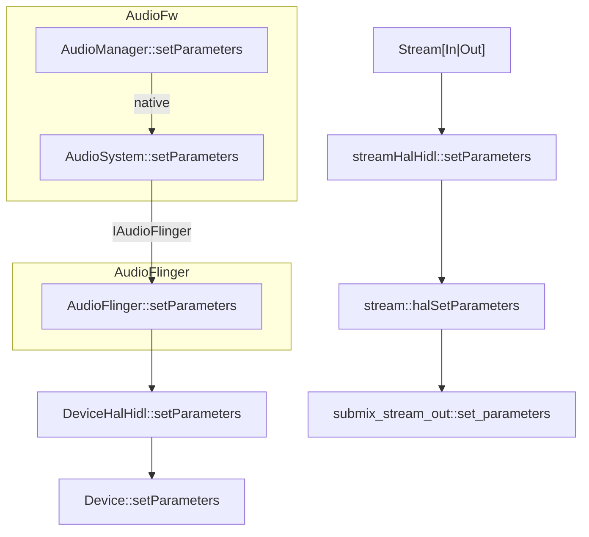

Android Audio 配置参数流程介绍

<!-- more -->

* TOC
{:toc}
最近在作音频的相关优化， 需要用到HAL的参数修改， 所以追踪了下配置参数流程:





```java
//android/frameworks/base/media/java/android/media/AudioManager.java
((AudioManager) getContext().getSystemService(Context.AUDIO_SERVICE)).setParameters("key=value");
```

搜索android_media_AudioSystem*，可查到是在android/frameworks/base/core/jni/android_media_AudioSystem.cpp

```java
 static jint
  android_media_AudioSystem_setParameters(JNIEnv *env, jobject thiz, jstring keyValuePairs)
  {
      const jchar* c_keyValuePairs = env->GetStringCritical(keyValuePairs, 0);
      String8 c_keyValuePairs8;
      if (keyValuePairs) {
          c_keyValuePairs8 = String8(
              reinterpret_cast<const char16_t*>(c_keyValuePairs),
              env->GetStringLength(keyValuePairs));
          env->ReleaseStringCritical(keyValuePairs, c_keyValuePairs);
      }
      // jni异常会报错， 如没有声明modify audio settings
      int status = check_AudioSystem_Command(AudioSystem::setParameters(c_keyValuePairs8));
      return (jint) status;
  }
```

在android/frameworks/av/media/libaudioclient/AudioSystem.cpp

```cpp
status_t AudioSystem::setParameters(audio_io_handle_t ioHandle, const String8& keyValuePairs)
  {
      
      const sp<IAudioFlinger>& af = AudioSystem::get_audio_flinger();
      if (af == 0) return PERMISSION_DENIED;
      return af->setParameters(ioHandle, keyValuePairs);
  }
```


[AudioFlinger::setParameters](https://cs.android.com/android/platform/superproject/+/master:frameworks/av/services/audioflinger/AudioFlinger.cpp;l=1772;drc=b45a2ea782074944f79fc388df20b06e01f265f7;bpv=1;bpt=1)

```c++

status_t AudioFlinger::setParameters(audio_io_handle_t ioHandle, const String8& keyValuePairs)
{
    ALOGV("setParameters(): io %d, keyvalue %s, calling pid %d calling uid %d",
            ioHandle, keyValuePairs.string(),
            IPCThreadState::self()->getCallingPid(), IPCThreadState::self()->getCallingUid());

    // check calling permissions-android.permission.MODIFY_AUDIO_SETTINGS
    if (!settingsAllowed()) {
        return PERMISSION_DENIED;
    }

    String8 filteredKeyValuePairs = keyValuePairs;
    filterReservedParameters(filteredKeyValuePairs, IPCThreadState::self()->getCallingUid());

    ALOGV("%s: filtered keyvalue %s", __func__, filteredKeyValuePairs.string());

    // AUDIO_IO_HANDLE_NONE means the parameters are global to the audio hardware interface
    if (ioHandle == AUDIO_IO_HANDLE_NONE) {
        Mutex::Autolock _l(mLock);
        // result will remain NO_INIT if no audio device is present
        status_t final_result = NO_INIT;
        {
            AutoMutex lock(mHardwareLock);
            mHardwareStatus = AUDIO_HW_SET_PARAMETER;
            for (size_t i = 0; i < mAudioHwDevs.size(); i++) {
                sp<DeviceHalInterface> dev = mAudioHwDevs.valueAt(i)->hwDevice();
                status_t result = dev->setParameters(filteredKeyValuePairs);
                // return success if at least one audio device accepts the parameters as not all
                // HALs are requested to support all parameters. If no audio device supports the
                // requested parameters, the last error is reported.
                if (final_result != NO_ERROR) {
                    final_result = result;
                }
            }
            mHardwareStatus = AUDIO_HW_IDLE;
        }
        // disable AEC and NS if the device is a BT SCO headset supporting those pre processings
        AudioParameter param = AudioParameter(filteredKeyValuePairs);
        String8 value;
        if (param.get(String8(AudioParameter::keyBtNrec), value) == NO_ERROR) {
            bool btNrecIsOff = (value == AudioParameter::valueOff);
            if (mBtNrecIsOff.exchange(btNrecIsOff) != btNrecIsOff) {
                for (size_t i = 0; i < mRecordThreads.size(); i++) {
                    mRecordThreads.valueAt(i)->checkBtNrec();
                }
            }
        }
        String8 screenState;
        if (param.get(String8(AudioParameter::keyScreenState), screenState) == NO_ERROR) {
            bool isOff = (screenState == AudioParameter::valueOff);
            if (isOff != (AudioFlinger::mScreenState & 1)) {
                AudioFlinger::mScreenState = ((AudioFlinger::mScreenState & ~1) + 2) | isOff;
            }
        }
        return final_result;
    }

    // hold a strong ref on thread in case closeOutput() or closeInput() is called
    // and the thread is exited once the lock is released
    sp<ThreadBase> thread;
    {
        Mutex::Autolock _l(mLock);
        thread = checkPlaybackThread_l(ioHandle);
        if (thread == 0) {
            thread = checkRecordThread_l(ioHandle);
            if (thread == 0) {
                thread = checkMmapThread_l(ioHandle);
            }
        } else if (thread == primaryPlaybackThread_l()) {
            // indicate output device change to all input threads for pre processing
            AudioParameter param = AudioParameter(filteredKeyValuePairs);
            int value;
            if ((param.getInt(String8(AudioParameter::keyRouting), value) == NO_ERROR) &&
                    (value != 0)) {
                broadcastParametersToRecordThreads_l(filteredKeyValuePairs);
            }
        }
    }
    if (thread != 0) {
        status_t result = thread->setParameters(filteredKeyValuePairs);
        forwardParametersToDownstreamPatches_l(thread->id(), filteredKeyValuePairs);
        return result;
    }
    return BAD_VALUE;
}
```


```cpp
mDevicesFactoryHal = DevicesFactoryHalInterface::create();
```


> https://blog.csdn.net/hmz0303hf/article/details/124338270
