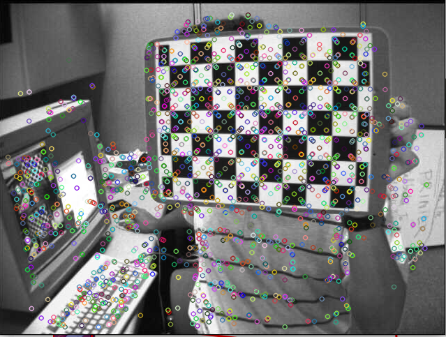
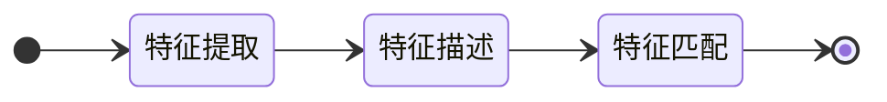
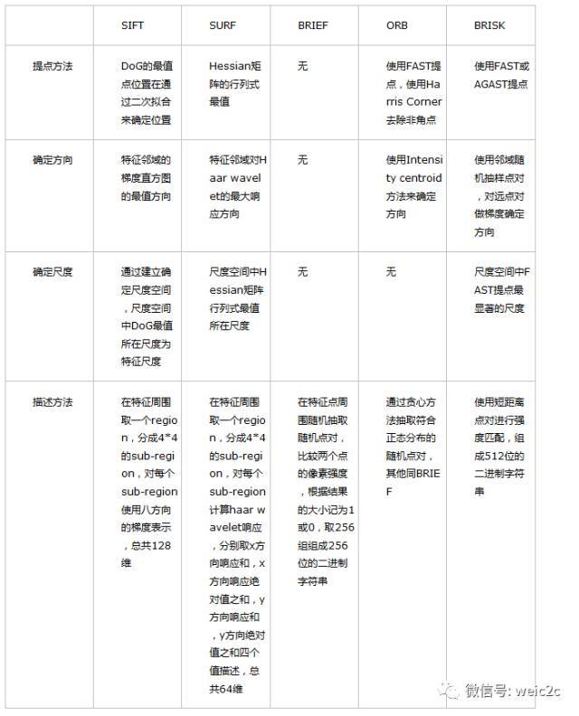
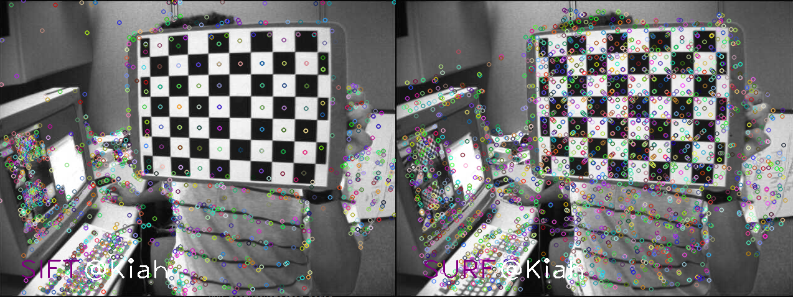
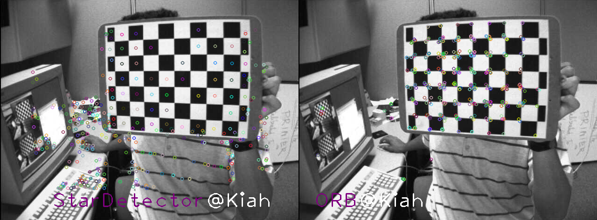
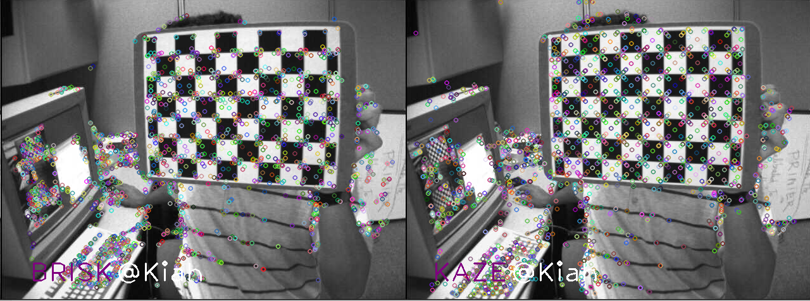
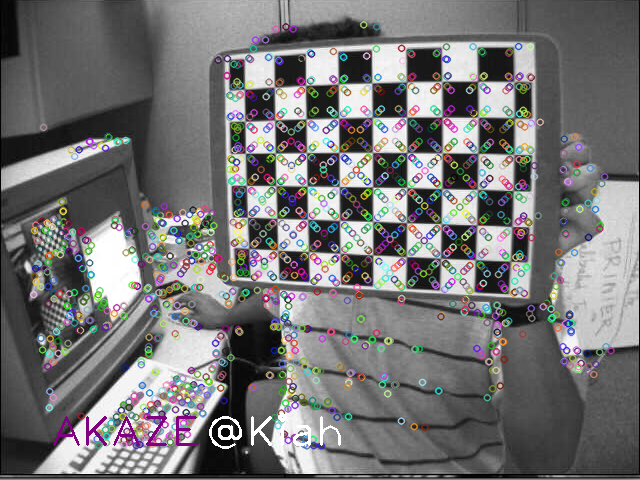
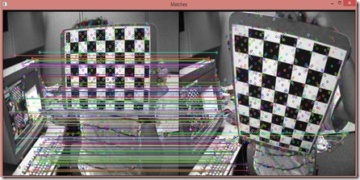
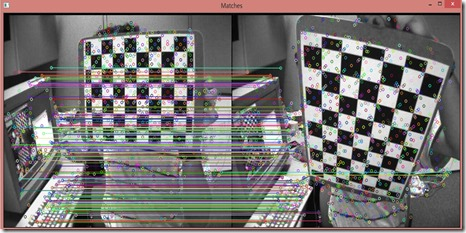

最近在搞一个实时拼接的任务， 所以总结以下相关知识。

# 1. 介绍

特征匹配（Feature Match)是计算机视觉中很多应用的基础，比如说图像配准，摄像机跟踪，三维重建，物体识别，[人脸识别](https://cloud.tencent.com/product/facerecognition?from=10680)，所以花一些时间去深入理解这个概念是不为过的。本文希望通过一种通俗易懂的方式来阐述特征匹配这个过程，以及在过程中遇到的一些问题。

首先我通过几张图片来指出什么是特征匹配，以及特征匹配的过程。

图像一：彩色圆圈为图像的特征点



图像二：


图像一与图像二的匹配：


## **1.1 概念理解：什么是特征，什么是特征描述，什么是特征匹配**

特征主要是角、边、纹理等反应图像特征的信息；

假设这样的一个场景，小白和小黑都在看一个图片，但是他们想知道他们看的是否是同一幅图片，于是他们就通过电话描述这个图片，来判断是否是同一个图片。比如说有下面两个图片


对话1：

小白：我的图片里面有五个很明显的特征，分别在图像的上下左右中五个位置。

小黑：我的图片里面也有五个很明显的特征，分别在图像的上下左右中五个位置。

对话2：

小白：我的一个特征左边是三角形，右边是圆形，上面是菱形，下面是正方形。

小黑：我也有一个特征左边是三角形，右边是圆形，上面是菱形，下面是正方形。

对话3：

小白和小黑：那我们看到的就是同一个特征了。

上述三个对话其实分别代表这特征提取，特征描述和特征匹配。



那么来详细的分析一下，我们的问题是要匹配两张图像是否是同一个图像，比较好的方法就是找出图像中特征显著的内容然后来进行比较，如果这些特征都一致，那么就有很高的概率称他们为同一个图像。所以首先第一步就是找出图像中特征性强的内容（Feature Detect），上图中特征性强的就是五个红色的图案。但是只知道有显著特征没用，必须知道两张图像中的特征是不是一致的，如何判断特征是不是一致的，就需要我们对这个特征进行描述（Feature Descriptor），如果描述非常的相似或者说是相同，那么就可以判断为是同一特征。那么问题来了，该如何去描述一个特征，什么样的描述是一个好的描述呢。从对话2中我们可以看出，描述一个特征其实就是描述特征与他周围内容的相互关系。那么什么样的描述是一个好的描述呢，就要提到我们为什么要描述特征了？我们描述特征是为了能够更好的匹配特征，使得我们认为描述相同的特征是同一个特征的是可信的（概率高的）。所以我们的描述必须是有代表性的，具有排他性的（discriminative）,而不是模棱两可泛泛而谈的。最后我们就可以根据描述的相似性来判断这对特征是否是同一个特征。

## 1.2 特征不变性的理解

接下来我们将谈一下特征的不变性。我们用过很多特征，**Harris Corner、SIFT、SURF、BRIEF、BRISK**等，而特征的一个重要特性就是特征不变性，常见的就是旋转不变性和尺度不变性，还有一些具有仿射不变性的特征。而这些特征该怎么理解呢？下面我就用通俗地解释一下。

- 旋转不变性：

再看下面两张图片：


于是我们在看审视三个对话，你会发现对话2就改变了。

对话2：

小白：我的一个特征左边是三角形，右边是圆形，上面是菱形，下面是正方形。

小黑：我有一个特征左边是正方形，右边是菱形，上面是三角形，下面是圆形。

于是小黑和小白就认为他们看得并不是同一个图片。但事实上他们看得确实是同一种图片。于是我们就说这种特征不具有旋转不变性。

**那么如何实现旋转不变性呢，再看下面两张图片：**


然后我们再来审视对话2：

对话2：

小白：我的一个特征西边是三角形，东边是圆形，北边是菱形，南边是正方形。

小黑：我也有一个特征西边是三角形，东边是圆形，北边是菱形，南边是正方形。

这时候两个特征的描述就一致了，即拥有了旋转不变性。所以只要对特征定义方向，然后在同一个方向上进行特征描述就可以实现旋转不变性。这称之为Rotation Normalization。

- 尺度不变性

接下来谈一下尺度不变性，依然看下面两张图片：


对话2：

小白：我的一个特征东边5个像素的地方有个圆形。

小黑：我有一个特征东边7个像素的地方有个圆形。

这就是尺度变化造成的特征不匹配，为了实现尺度不变性，就需要给特征加上尺度因子，比如说小白看到的是尺度为5的，小黑看到的是尺度为7的，那么在进行描述的时候，将尺度统一就可以实现尺度不变性了。这过程称为Scale Normalization。

所谓的旋转不变性和尺度不变性的原理，就是我们在描述一个特征之前，将两张图像都变换到同一个方向和同一个尺度上，然后再在这个统一标准上来描述这个特征。同样的，如果在描述一个特征之前，将图像变换到同一个仿射尺度或者投影尺度上，那么就可以实现仿射不变性和投影不变性。分别称为Affine Normalization 和 Projected Normalization.

## 1.2 常见特征匹配算法

特征匹配的方法是先找出特征显著的特征点（Feature Detect），然后再分别描述两个特征点（Feature Descriptor），最后比较两个描述的的相似程度来判断是否为同一个特征（Feature Match）。而在特征描述之前如果能够做到确定特征的方向，则可以实现旋转不变性（Rotation invarient），如果能确定尺度，则可以实现尺度不变性（Scale invarient）。

下面是我根据上面的方式对常用的Feature所做的总结。




# 2. 特征检测介绍

## 2.1 SIFT

SIFT 全称 Scale Invariant Feature Transform，是特征检测中里程碑式的算法，也是目前最有效的特征检测，该算法申请了专利，直到 2020年3月才过保护期

OpenCV 从 4.4.0 起，已经将 SIFT 移到了主模块 feature2d 中，SIFT 继承自 Feature2D 类，而 Feature2D 继承自 Algorithm 类，SIFT 的 create() 函数定义如下：

```cpp
class SIFT : public Feature2D
{
public:
    static Ptr<SIFT> create(
        int nfeatures = 0,               // The number of best features to retain
        int nOctaveLayers = 3,           // The number of layers in each octave. 3 is the value used in D.Lowe paper
        double contrastThreshold = 0.04, // The contrast threshold used to filter out weak features in low-contrast regions
        double edgeThreshold = 10,       // The threshold used to filter out edge-like features
        double sigma = 1.6 );            // The sigma of the Gaussian applied to the input image at the octave 0　　　
```

Algorithm 类中有两个虚函数：detect() 检测特征，compute() 计算描述符

```cpp
class Feature2D : public virtual Algorithm
{
public:
    /* Detects keypoints in an image (first variant) or image set(second variant). */
    virtual void detect(InputArray image, std::vector<KeyPoint>& keypoints, InputArray mask=noArray() );
 
    /* Computes the descriptors for a set of keypoints detected in an image (first variant) or image set (second variant). */
    virtual void compute(InputArray image, std::vector<KeyPoint>& keypoints, OutputArray descriptors );　　 
```

## 2.2 SURF

SIFT 算法虽好，但计算速度不够快，于是 SIFT 的近似版 SURF (Speeded Up Robust Features) 应运而生， SURF 的运行时间约为 SIFT 的 1/3

SURF 属于 xfeature2d 模块，也继承自 Feature2D 类，其 create() 函数定义如下：

```cpp
namespace xfeatures2d
{
class SURF : public Feature2D
{
public:
    static Ptr<SURF> create(
        double hessianThreshold = 100, // Threshold for hessian keypoint detector used in SURF
        int nOctaves = 4,              // Number of pyramid octaves the keypoint detector will use
        int nOctaveLayers = 3,         // Number of octave layers within each octave
        bool extended = false,         // Extended descriptor flag (true, 128-element descriptors; false, 64-element descriptors)
        bool upright = false);         // Up-right or rotated features flag (true,do not compute orientation of features; false, compute orientation)　　　
```

其中，hessianThreshold 为海森阈值，只有大于该阈值的特征才会被保留，因此，海森阈值越大，检测到的特征越少。海森阈值取决于图像对比度，一般取 300~500 时的检测效果较好

## 2.3 CenSurE

CenSurE (Center Surround Extremas)，是在 SURF 基础上做的一种改进，基于 CenSurE 特征检测 和 M-SURF 特征描述符，号称比 SURF 更快，可用于实时处理领域

OpenCV 并没有完全实现 CenSurE 算法，而是借鉴衍生出了 StarDetector，其 create() 函数定义如下：

```cpp
static Ptr<StarDetector> create(
    int maxSize = 45,                   //
    int responseThreshold = 30,         //
    int lineThresholdProjected = 10,    //
    int lineThresholdBinarized = 8,     //
    int suppressNonmaxSize = 5          //
);　　
```

## 3. 实时特征检测

SURF 的运行速度比 SIFT 快 3 倍，但在一些实时处理系统 (视觉里程计) 或低功耗设备中，SURF 还是不够快，于是，便有了下面的两种算法

## 3.1 ORB

OpenCV Labs 实现了一种更快的算法 ORB - Oriented FAST and Rotated BRIEF，它是在 FAST 角点检测 和 BRIEF 特征描述符的基础上修改实现的

视觉 SLAM (Simultaneous Localization and Mapping 同步定位与建图) 领域中，著名的开源项目 ORB-SLAM，其特征提取就是基于 ORB 算法

OpenCV 中 ORB 的 create() 函数定义如下：

```cpp
static Ptr<ORB> create (
    int nfeatures = 500,           // The maximum number of features to retain
    float scaleFactor = 1.2f,      // Pyramid decimation ratio, greater than 1
    int nlevels = 8,               // The number of pyramid levels
    int edgeThreshold = 31,        // This is size of the border where the features are not detected
    int firstLevel = 0,            // The level of pyramid to put source image to
    int WTA_K = 2,                 // The number of points that produce each element of the oriented BRIEF descriptor
    ORB::ScoreType scoreType = ORB::HARRIS_SCORE, // The default HARRIS_SCORE means that Harris algorithm is used to rank features
    int patchSize = 31,            // size of the patch used by the oriented BRIEF descriptor
    int fastThreshold = 20         // the fast threshold
 ); 　　
```

## 3.2 BRISK

BRISK 号称比 SURF 的运行速度快一个数量级，它基于 AGAST 角点检测 和 BRIEF 特征描述符，其中 AGAST 是比 FAST 更快的一种角点检测算法

BRISK 的 create() 函数如下：

```cpp
/* The BRISK constructor */
   static Ptr<BRISK> create(
       int thresh = 30,            // AGAST detection threshold score
       int octaves = 3,            // octaves detection octaves. Use 0 to do single scale
       float patternScale = 1.0f   // apply this scale to the pattern used for sampling the neighbourhood of a keypoint
   );
 
   /* The BRISK constructor for a custom pattern, detection thresholdand octaves */
   static Ptr<BRISK> create(
       int   thresh,                           // AGAST detection threshold score
       int   octaves,                          // detection octaves. Use 0 to do single scale.
       const std::vector<float> &radiusList,   // defines the radii(in pixels) where the samples around a keypoint are taken (for keypoint scale 1).
       const std::vector<int> &numberList,     // defines the number of sampling points on the sampling circle.Must be the same size as radiusList..
       float dMax = 5.85f,                     // threshold for the short pairings used for descriptor formation (in pixels for keypoint scale 1)
       float dMin = 8.2f,                      // threshold for the long pairings used for orientation determination (in pixels for keypoint scale 1)
       const std::vector<int>&indexChange = std::vector<int>()  // index remapping of the bits
   );　　　
```

## 3.3 BRIEF 描述符

上述 ORB 和 BRISK 中，都提到了 BRIEF 特征描述符，BRIEF 全称 Binary Robust Independent Elementary Feature)，是用二进制串向量来描述特征的一种方式

SIFT 中的一个特征，对应着一个由128个浮点数组成的向量，占 512 个字节；而 SURF 的一个特征，对应着一个由 64个浮点数组成的向量，占 256 个字节

当有成千上万个特征时， 特征描述符会占用大量的内存，并且会增加匹配的时间，在一些资源受限的场合，尤其是嵌入式系统中，SIFT 和 SURF 并非最优选择

而 BRIEF 特征描述符，采用的是二进制串，可将所占字节缩减为 64 或 32 甚至 16，**相比 SIFT 和 SURF，大大减少了对内存的占用，非常适合于实时处理系统**

OpenCV 中 BRIEF 描述符的定义如下：

```cpp
// Class for computing BRIEF descriptors described in @cite calon2010 .
class BriefDescriptorExtractor : public Feature2D
{
public:
    static Ptr<BriefDescriptorExtractor> create(
        int bytes = 32,                  // legth of the descriptor in bytes, valid values are: 16, 32 (default) or 64 .
        bool use_orientation = false);   // sample patterns using keypoints orientation, disabled by default.
}; 　　
```

## 4. 非线性尺度空间

**SIFT 和 SURF 是在线性尺度空间内的分析，在构建高斯尺度空间的过程中，高斯滤波会将图像中的边界和细节信息等，连同噪声一起模糊化掉，因此，会造成一定程度上特征定位精度的损失**

为了克服高斯滤波的缺点，2012年，西班牙人 Pablo F. Alcantarilla 利用非线性扩散滤波代替高斯滤波，通过加性算子分裂法 (Additive Operator Splitting) 构建了非线性尺度空间，提出了 KAZE 算法

KAZE 是为了纪念“尺度空间分析之父” Iijima 而取得名字，在日语中是 “风” 的意思，发音“卡哉”；AKAZE 是 Accelerated KAZE，顾名思义是 KAZE 的加速版本


## 4.1 KAZE

KAZE 的 create() 函数如下：

```cpp
 /* The KAZE constructor */
static Ptr<KAZE> create (
    bool extended = false,          // Set to enable extraction of extended (128-byte) descriptor
    bool upright = false,           // Set to enable use of upright descriptors (non rotation-invariant)
    float threshold = 0.001f,       // Detector response threshold to accept point
    int nOctaves = 4,               // Maximum octave evolution of the image
    int nOctaveLayers = 4,          // Default number of sublevels per scale level
    KAZE::DiffusivityType diffusivity = KAZE::DIFF_PM_G2  // Diffusivity type. DIFF_PM_G1, DIFF_PM_G2, DIFF_WEICKERT or DIFF_CHARBONNIER
);　　　
```

## 4.2 AKAZE

AKAZE 的 create() 函数如下：

```cpp
/* The AKAZE constructor */
static Ptr<AKAZE> create(
    AKAZE::DescriptorType descriptor_type = AKAZE::DESCRIPTOR_MLDB, // Type of the extracted descriptor: DESCRIPTOR_KAZE, DESCRIPTOR_KAZE_UPRIGHT, DESCRIPTOR_MLDB or DESCRIPTOR_MLDB_UPRIGHT.
    int descriptor_size = 0,                // Size of the descriptor in bits. 0 -> Full size
    int descriptor_channels = 3,            // Number of channels in the descriptor (1, 2, 3)
    float threshold = 0.001f,               // Detector response threshold to accept point
    int nOctaves = 4,                       // Maximum octave evolution of the image
    int nOctaveLayers = 4,                  // Default number of sublevels per scale level
    KAZE::DiffusivityType diffusivity = KAZE::DIFF_PM_G2  // Diffusivity type. DIFF_PM_G1, DIFF_PM_G2, DIFF_WEICKERT or DIFF_CHARBONNIER
);　
```


# 3. 特征提取代码例程

2004年 D. Lowe 提出 SIFT 算法后，在提高运算速度的方向上，先是诞生了比 SIFT 快3倍的 SURF，而后在 SURF 的基础上，实现了可用于实时处理领域的 CenSurE

BRIEF 特征描述符，利用二进制串描述符，减少了对内存的占用，提高了匹配的速度，特别适合资源受限的场合，如嵌入式系统

在 BRIEF 的基础上，ORB 结合 FAST 角点检测 和 BRIEF 描述符，BRISK 结合 AGAST 角点检测 和 BRIEF 描述符，真正实现了实时特征检测

KAZE 和 AKAZE 针对高斯滤波的缺点，另辟蹊径，直接从 线性尺度空间 跳转到 非线性尺度空间，变换尺度空间后，重新定义了特征检测

以上七种特征检测的算法，代码例程如下：

```cpp
#include "opencv2/highgui.hpp"
#include "opencv2/features2d.hpp"
#include "opencv2/xfeatures2d.hpp"
 
using namespace cv;
 
int main()
{
    // read
    Mat img = imread("messi.jpg");
    if (img.empty())
        return -1;
 
    // create and detect
    Ptr<SIFT> detector = SIFT::create();
    // Ptr<xfeatures2d::SURF> detector = xfeatures2d::SURF::create(400);
    // Ptr<xfeatures2d::StarDetector> detector = xfeatures2d::StarDetector::create(20, 20);
    // Ptr<ORB> detector = ORB::create(2000);
    // Ptr<BRISK> detector = BRISK::create();
    // Ptr<KAZE> detector = KAZE::create();
    // Ptr<AKAZE> detector = AKAZE::create();
    std::vector<KeyPoint>  keypoints;
    detector->detect(img, keypoints);
 
    // draw and show
    Mat img_keypoints;
    drawKeypoints(img, keypoints, img_keypoints);
    imshow("SIFT", img_keypoints);
 
    waitKey();
}　　
```

## 3.1 各算法的特征检测效果










默认参数

```c++
template <typename type>
cv::Mat featureDetector(const char* hint, InputArray img1, InputArray img2)
{
    //-- Step 1: Detect the keypoints using SURF Detector, compute the descriptors
    char chint[128] = {0};
    snprintf(chint, sizeof(chint), "%s featureDetector", hint);
    
    Mat img_matches;
    std::vector<KeyPoint> keypoints1, keypoints2;
    Mat descriptors1, descriptors2;
    std::vector<DMatch> matches;
    {
    TIME_LOG(chint);

    Ptr<type> detector = type::create();

    detector->detectAndCompute(img1, noArray(), keypoints1, descriptors1);
    detector->detectAndCompute(img2, noArray(), keypoints2, descriptors2);
    //-- Step 2: Matching descriptor vectors with a brute force matcher
    // Since SURF is a floating-point descriptor NORM_L2 is used
    Ptr<DescriptorMatcher> matcher = DescriptorMatcher::create(DescriptorMatcher::BRUTEFORCE);
    matcher->match(descriptors1, descriptors2, matches);
    }

        
    //-- Draw matches
    drawMatches(img1, keypoints1, img2, keypoints2, matches, img_matches);

    int baseLine = 0;
    int thickness = 2;
    cv::Size textSize = cv::getTextSize(hint, 1, 1, thickness, &baseLine);
    cv::putText(img_matches, hint, {(img_matches.cols-textSize.width)/2, (img_matches.rows - textSize.height)/2}, 1, 1,cv::Scalar(255,255,255),thickness);
    return img_matches;
}

#define TEST_DETECT(x) imgs.push_back(featureDetector<x>(#x, img1, img2));
    TEST_DETECT(SIFT);
    TEST_DETECT(SURF);
    // TEST_DETECT(StarDetector);
    TEST_DETECT(ORB);

    TEST_DETECT(BRISK);
    TEST_DETECT(KAZE);
    TEST_DETECT(AKAZE);

```


```
SIFT featureDetector begin
SIFT featureDetector cost 149 ms
SURF featureDetector begin
SURF featureDetector cost 187 ms
ORB featureDetector begin
ORB featureDetector cost 15 ms
BRISK featureDetector begin
BRISK featureDetector cost 167 ms
KAZE featureDetector begin
KAZE featureDetector cost 372 ms
AKAZE featureDetector begin
AKAZE featureDetector cost 108 ms
```


# 4. 特征匹配

特征匹配及细化，主要包括以下几个内容：

- DescriptorMatcher
- DMatcher
- KNN匹配
- 计算两视图的基础矩阵F，并细化匹配结果
- 计算两视图的单应矩阵H，并细化匹配结果

## 4.1 DescriptorMatcher 和 DMatcher

DescriptorMatcher是匹配特征向量的抽象类，在OpenCV2中的特征匹配方法都继承自该类（例如：BFmatcher，FlannBasedMatcher）。该类主要包含了两组匹配方法：**图像对之间的匹配以及图像和一个图像集之间的匹配**。

用于图像对之间匹配的方法的声明

```c++
// Find one best match for each query descriptor (if mask is empty).
CV_WRAP void match( const Mat& queryDescriptors, const Mat& trainDescriptors,
                   CV_OUT vector<DMatch>& matches, const Mat& mask=Mat() ) const;
// Find k best matches for each query descriptor (in increasing order of distances).
// compactResult is used when mask is not empty. If compactResult is false matches
// vector will have the same size as queryDescriptors rows. If compactResult is true
// matches vector will not contain matches for fully masked out query descriptors.
CV_WRAP void knnMatch( const Mat& queryDescriptors, const Mat& trainDescriptors,
                      CV_OUT vector<vector<DMatch> >& matches, int k,
                      const Mat& mask=Mat(), bool compactResult=false ) const;
// Find best matches for each query descriptor which have distance less than
// maxDistance (in increasing order of distances).
void radiusMatch( const Mat& queryDescriptors, const Mat& trainDescriptors,
                 vector<vector<DMatch> >& matches, float maxDistance,
                 const Mat& mask=Mat(), bool compactResult=false ) const;
```

方法重载，用于图像和图像集匹配的方法声明

```c++
CV_WRAP void match( const Mat& queryDescriptors, CV_OUT vector<DMatch>& matches,
                const vector<Mat>& masks=vector<Mat>() );
CV_WRAP void knnMatch( const Mat& queryDescriptors, CV_OUT vector<vector<DMatch> >& matches, int k,
                      const vector<Mat>& masks=vector<Mat>(), bool compactResult=false );
void radiusMatch( const Mat& queryDescriptors, vector<vector<DMatch> >& matches, float maxDistance,
                 const vector<Mat>& masks=vector<Mat>(), bool compactResult=false );
```

DMatcher 是用来保存匹配结果的，主要有以下几个属性

```c++
CV_PROP_RW int queryIdx; // query descriptor index
CV_PROP_RW int trainIdx; // train descriptor index
CV_PROP_RW int imgIdx;   // train image index
CV_PROP_RW float distance;
```

在图像匹配时有两种图像的集合，查找集（Query Set）和训练集（Train Set），对于每个Query descriptor，DMatch中保存了和其最好匹配的Train descriptor。另外，每个train image会生成多个train descriptor。

如果是图像对之间的匹配的话，由于所有的train descriptor都是由一个train image生成的，**所以在匹配结果DMatch中所有的imgIdx是一样的，都为0**.

 

## 4.2 KNNMatch

匹配过程中很可能发生错误的匹配，错误的匹配主要有两种, 匹配的特征点错误，图像上的特征点无法匹配。

常用的删除错误的匹配有

- 交叉过滤

  如果第一幅图像的一个特征点和第二幅图像的一个特征点相匹配，则进行一个相反的检查，即将第二幅图像上的特征点与第一幅图像上相应特征点进行匹配，如果匹配成功，则认为这对匹配是正确的。

  OpenCV中的BFMatcher已经包含了这种过滤  BFMatcher matcher(NORM_L2,true)，在构造BFMatcher是将第二个参数设置为true。

- 比率测试
  KNNMatch，可设置K = 2 ，即对每个匹配返回两个最近邻描述符，仅当第一个匹配与第二个匹配之间的距离足够小时，才认为这是一个匹配。

在抽象基类DescriptorMatcher中封装了knnMatch方法，具体使用方法如下：

```c++
void FeatureMatchTest::knnMatch(vector<DMatch>& matches) {
    const float minRatio = 1.f / 1.5f;
    const int k = 2;

    vector<vector<DMatch>> knnMatches;
    matcher->knnMatch(leftPattern->descriptors, rightPattern->descriptors, knnMatches, k);

    for (size_t i = 0; i < knnMatches.size(); i++) {
        const DMatch& bestMatch = knnMatches[i][0];
        const DMatch& betterMatch = knnMatches[i][1];

        float  distanceRatio = bestMatch.distance / betterMatch.distance;
        if (distanceRatio < minRatio)
            matches.push_back(bestMatch);
    }
}
```

## 4.3 RASIC方法计算基础矩阵，并细化匹配结果

如果已经知道了两视图（图像）间的多个点的匹配，就可以进行**基础矩阵F的计算**了。OpenCV2中可以使用**findFundamentalMat**方法，其声明如下：

```c++
//! finds fundamental matrix from a set of corresponding 2D points
CV_EXPORTS_W Mat findFundamentalMat( InputArray points1, InputArray points2,
                                     int method=FM_RANSAC,
                                     double param1=3., double param2=0.99,
                                     OutputArray mask=noArray());
```

参数说明：

points1，points2 两幅图像间相匹配的点，**点的坐标要是浮点数（float或者double）**

第三个参数method是用来计算基础矩阵的具体方法，是一个枚举值。

param1,param2保持默认值即可。

主要来说下mask参数，有N个匹配点用来计算基础矩阵，则该值有N个元素，每个元素的值为0或者1.值为0时，代表该匹配点事错误的匹配（离群值），只在使用RANSAC和LMeds方法时该值有效，

可以使用该值来删除错误的匹配。

另外，**在匹配完成后使用得到的匹配点来计算基础矩阵时，首先需要将特征点对齐，并且将特征点转换为2D点**，具体实现如下：

```c++
//Align all points
vector<KeyPoint> alignedKps1, alignedKps2;
for (size_t i = 0; i < matches.size(); i++) {
    alignedKps1.push_back(leftPattern->keypoints[matches[i].queryIdx]);
    alignedKps2.push_back(rightPattern->keypoints[matches[i].trainIdx]);
}

//Keypoints to points
vector<Point2f> ps1, ps2;
for (unsigned i = 0; i < alignedKps1.size(); i++)
    ps1.push_back(alignedKps1[i].pt);

for (unsigned i = 0; i < alignedKps2.size(); i++)
    ps2.push_back(alignedKps2[i].pt);
```

使用RANSAC方法计算基础矩阵后可以得到一个status向量，用来删除错误的匹配

```c++
//优化匹配结果
vector<KeyPoint> leftInlier;
vector<KeyPoint> rightInlier;
vector<DMatch> inlierMatch;

int index = 0;
for (unsigned i = 0; i < matches.size(); i++) {
    if (status[i] != 0){
        leftInlier.push_back(alignedKps1[i]);
        rightInlier.push_back(alignedKps2[i]);
        matches[i].trainIdx = index;
        matches[i].queryIdx = index;
        inlierMatch.push_back(matches[i]);
        index++;
    }
}
leftPattern->keypoints = leftInlier;
rightPattern->keypoints = rightInlier;
matches = inlierMatch;
```


## 4.4 计算单应矩阵H，并细化匹配结果

同基础矩阵类似，得到匹配的特征点后也可以计算单应矩阵。

```c++
//! computes the best-fit perspective transformation mapping srcPoints to dstPoints.
CV_EXPORTS_W Mat findHomography( InputArray srcPoints, InputArray dstPoints,
                                 int method=0, double ransacReprojThreshold=3,
                                 OutputArray mask=noArray());
```

参数说明：

srcPoints,dstPoints是两视图中匹配的点

method 是**计算单应矩阵所使用的方法**，是一个枚举值。

ransacReprojThreshold 是允许的最大反投影错误，只在使用RANSAC方法时有效。

mask 同**findFundamentalMat** 类似，指出匹配的点是不是离群值，用来优化匹配结果。

```c++
void FeatureMatchTest::refineMatcheswithHomography(vector<DMatch>& matches, double reprojectionThreshold, Mat& homography){
    const int minNumbermatchesAllowed = 8;
    if (matches.size() < minNumbermatchesAllowed)
        return;

    //Prepare data for findHomography
    vector<Point2f> srcPoints(matches.size());
    vector<Point2f> dstPoints(matches.size());

    for (size_t i = 0; i < matches.size(); i++) {
        srcPoints[i] = rightPattern->keypoints[matches[i].trainIdx].pt;
        dstPoints[i] = leftPattern->keypoints[matches[i].queryIdx].pt;
    }

    //find homography matrix and get inliers mask
    vector<uchar> inliersMask(srcPoints.size());
    homography = findHomography(srcPoints, dstPoints, CV_FM_RANSAC, reprojectionThreshold, inliersMask);

    vector<DMatch> inliers;
    for (size_t i = 0; i < inliersMask.size(); i++){
        if (inliersMask[i])
            inliers.push_back(matches[i]);
    }
    matches.swap(inliers);
}
```

 

## 4.5 匹配结果对比

| **基础矩阵后的过滤**                                         | **单应矩阵后的过滤**                                         |
| ------------------------------------------------------------ | ------------------------------------------------------------ |
| [](https://images0.cnblogs.com/blog/439761/201503/122207495895600.jpg) | [](https://images0.cnblogs.com/blog/439761/201503/122207547141733.jpg) |
| **交叉过滤**                                                 | **KNNMatch**                                                 |
| [](https://images0.cnblogs.com/blog/439761/201503/122207589173950.jpg) | [](https://images0.cnblogs.com/blog/439761/201503/122208026208081.jpg) |

 

## 4.6 代码说明

定义了Pattern结构用来保存匹配过程中需要用到的数据

```
struct Pattern
{
    cv::Mat image;
    std::vector<cv::KeyPoint>  keypoints;
    cv::Mat descriptors;

    Pattern(cv::Mat& img) :
        image(img) {}
};
```

将各种匹配方法封装到了一个类中，在该类的构造函数中填充Pattern取得匹配所需的数据

```c++
FeatureMatchTest::FeatureMatchTest(std::shared_ptr<Pattern> left, std::shared_ptr<Pattern> right, std::shared_ptr<cv::DescriptorMatcher> matcher) :
leftPattern(left), rightPattern(right), matcher(matcher) {
    //step1:Create detector
    int minHessian = 400;
    SurfFeatureDetector detector(minHessian);

    //step2:Detecte keypoint
    detector.detect(leftPattern->image, leftPattern->keypoints);
    detector.detect(rightPattern->image, rightPattern->keypoints);

    //step3:Compute descriptor
    detector.compute(leftPattern->image, leftPattern->keypoints, leftPattern->descriptors);
    detector.compute(rightPattern->image, rightPattern->keypoints, rightPattern->descriptors);
}
```


> [转自-特征提取、特征描述、特征匹配的通俗解释](https://cloud.tencent.com/developer/article/1160452)
>
> [OpenCV 之 特征检测](https://zhuanlan.zhihu.com/p/411370961)
>
> [SIFT 算法作者 David Lowe 的主页](https://link.zhihu.com/?target=https%3A//www.cs.ubc.ca/~lowe/)
>
> OpenCV-Python Tutorials / Feature Detection and Description / [Introduction to SIFT (Scale-Invariant Feature Transform)](https://link.zhihu.com/?target=https%3A//docs.opencv.org/master/da/df5/tutorial_py_sift_intro.html)
>
> OpenCV-Python Tutorials / Feature Detection and Description / [Introduction to SURF (Speeded-Up Robust Features)](https://link.zhihu.com/?target=https%3A//docs.opencv.org/master/df/dd2/tutorial_py_surf_intro.html)
>
> [Censure: Center surround extremas for realtime feature detection and matching](https://link.zhihu.com/?target=https%3A//link.springer.com/content/pdf/10.1007%2F978-3-540-88693-8_8.pdf). In *Computer Vision–ECCV 2008*
>
> OpenCV-Python Tutorials / Feature Detection and Description / [BRIEF (Binary Robust Independent Elementary Features)](https://link.zhihu.com/?target=https%3A//docs.opencv.org/master/dc/d7d/tutorial_py_brief.html)
>
> OpenCV-Python Tutorials / Feature Detection and Description / [ORB (Oriented FAST and Rotated BRIEF)](https://link.zhihu.com/?target=https%3A//docs.opencv.org/master/d1/d89/tutorial_py_orb.html)
>
> OpenCV Tutorials / 2D Features framework (feature2d module) / [AKAZE and ORB planar tracking](https://link.zhihu.com/?target=https%3A//docs.opencv.org/master/dc/d16/tutorial_akaze_tracking.html)
>
> [KAZE 和 AKAZE 作者 Pablo F. Alcantarilla 的个人主页](https://link.zhihu.com/?target=http%3A//www.robesafe.com/personal/pablo.alcantarilla/index.html)