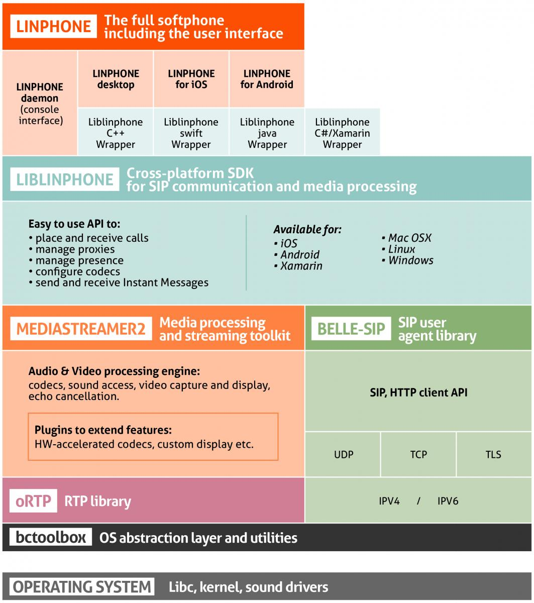

最近在搞音视频通话, 所以接触到linphone.Linphone是一款开源基于SIP协议的语音视频电话软件，可移植到移动端Android、IOS、WindowsPhone8.

<!-- more-->

需要解决的问题:

1. 如何实现Android上音视频的低延迟;
2. AMR和AAC那种编码更适合通话场景;
3. 如何优化通话过程中的语音音质;
4. 自适应码率
5. 如何实现sip phone

# linphone概览

> Linphone is an open source softphone for voice and video over IP calling and instant messaging.
>
> It is fully SIP-based, for all calling, presence and IM features.
>
> General description is available from [linphone web site](https://www.linphone.org/technical-corner/linphone).

## 架构图




[**Liblinphone**](https://www.linphone.org/technical-corner/liblinphone) relies on the following software components:

- [**Mediastreamer2**](https://www.linphone.org/technical-corner/mediastreamer2), a powerful multimedia SDK for audio/video streaming and processing
- [**oRTP**](https://www.linphone.org/technical-corner/ortp), a simple RTP library
- [**belle-sip**](https://www.linphone.org/technical-corner/belle-sip), the SIP library

[**Liblinphone**](https://www.linphone.org/technical-corner/liblinphone) and all its dependencies are written in C++ and C.


## **Linphone 功能**

- **HD audio and video calls**
- Multiple call management (pause and resume)
- Call transfer
- Audio conferencing (merge calls into a conference call)
- **Call recording and replay (audio only)**
- Instant Messaging
- Message delivery status (IMDN)
- Picture and file sharing
- Message forwarding (Android only)
- Chat access during calls
- Contact list
- "Invite your friends" feature
- Call history
- Display of advanced call statistics
- **Echo cancellation**
- **Call quality indicator**
- Secure user authentication: md5 / SHA256 digest, TLS client certificates
- SRTP, zRTP and SRTP-DTLS voice and video encryption
- Supported languages: English, French
- Account creation assistant
- Remote provisioning

**ADVANCED FEATURES**

- **Audio codecs:  opus, speex, g711, g729, gsm, iLBC, AMR, AMR-WB, g722, SILK, iSAC, BV16, Codec2**
- **Video codecs: VP8, H.264 and H.265 with resolutions up to 1080P, MPEG4**
- **Hardware accelerated H.264 and H.265 codec for Mac OSX / iOS (VideoToolbox) and Android (MediaCodec)**
- **Innovative RTP jitter buffer algorithm, which quickly adapts to network conditions with a lot of jitter and improves control of the audio latency**
- **Adaptive bit rate control algorithm: congestion control and estimation of available bandwidth, in order to optimise the quality of audio and video**
- Integration with push notification (requires compatible SIP server; [***linphone.org SIP service\***](https://www.linphone.org/freesip/home) is push enabled)
- ICE (RFC 5245), STUN and TURN (RFC 5766) for optimised NAT traversal, allowing for peer-to-peer audio and video connections whenever possible
- Call handover accross a change of network access type (e.g. start a call in wifi and continue in 3G)
- Ability to configure multiple proxy accounts with different transports protocols (UDP, TCP, TLS)
- IPv6 (dual-stack and v6-only support)
- DTMF (telephone tone) support using SIP INFO or RFC 4733

For more information, consult the complete list of implemented standards in the [***Liblinphone*** ](https://www.linphone.org/technical-corner/liblinphone)section.

### Mobile-specific features (iOS/Android)

- Multi-participant Instant Messaging (group chat)
- End-to-end encryption for both 1-to-1 and group instant messages (requires ***[LIME](https://www.linphone.org/technical-corner/lime)\*** library)
- Smart contact list (shows people using the service) using list subscription to a presence server
- Provisioning via QR Code
- Support for bluetooth headset
- Dedicated tablet user interface
- Blind accessibility
- Replay of recorded calls from the "Recordings" menu
- Configurable setting to automatically / manually download attachments

Linphone is available on the following mobile platforms:

- Apple iOS 9 to 14 (ARM v7, ARM 64)
- Google Android 6 to 11 (ARM v7, ARM 64, x86, x86-64)

**iOS ADDITIONAL FEATURES**

- AAC-ELD support

**ANDROID ADDITIONAL FEATURES**

- **Video overlay**

**PORTABILITY**

- **GNU/Linux: x86, x86-64, ARM v5, v7, arm64 ; Debian 8/9, Centos 7**
- **Windows Desktop: x86 (works also on x86_64), Windows 7 and later**
- **Mac OS X: x86_64 ; 10.11 and later.**
- **GNU/Linux embedded:** linphone-daemon is a good candidate to provide the software stack for a hardware phone or hardware communication system.

## 代码

| **Project**                                                  | **Git repository**                                           |
| ------------------------------------------------------------ | ------------------------------------------------------------ |
| linphone-desktop, comprising:linphone (Qt user interface)linphone-sdk | git clone https://gitlab.linphone.org/BC/public/linphone-desktop.git --recursive |
| linphone-iphone (iOS application)                            | git clone https://gitlab.linphone.org/BC/public/linphone-iphone.git |
| linphone-android (Android application)                       | git clone https://gitlab.linphone.org/BC/public/linphone-android.git |


# linphone构建


# linphone集成

首先引入依赖，可以直接下载aar包导入项目，或者使用gradle引入

在项目的build.gradle文件中，添加linphone的maven库地址
```
allprojects {
    repositories {
        google()
        jcenter()
        //linphone
        maven {
            url "https://linphone.org/releases/maven_repository/"
        }
    }
}
```
在model项目中的build.gradle文件，添加sdk依赖
```
dependencies {
    //linphone
    debugImplementation "org.linphone:linphone-sdk-android-debug:5.0.0"
    releaseImplementation "org.linphone:linphone-sdk-android:5.0.0"
}
```
官方Demo有很详细的使用演示，这里只记录部分配置

CoreManager：CoreManager是sdk里面的管理类，在里面控制来电铃声和启动CoreService，无特殊需求不用调用。注意：启动来电铃声需要导入media包，否则不会有来电铃声（这里坑死我了）
```
dependencies {
    implementation 'androidx.media:media:1.2.0'
}
```

CoreService：CoreService是sdk里面的保活服务，在来电时会调用震动方法和启动通知，必须在AndroidManifest.xml里声明
```
        <service
            android:name="org.linphone.core.tools.service.CoreService"
            android:foregroundServiceType="phoneCall|camera|microphone"
            android:label="@string/app_name"
            android:stopWithTask="false" />
```
或者像官方demo那样继承CoreService自己实现

在登录之后，会默认保存用户信息，如果没有调用 core.clearProxyConfig()删除代理的话，下次启动后会自动登录之前保存的用户，所以如果不需要自动登录功能，需要退出app时删除代理。

其余的配置可对照官方Demo添加相应的功能，这个是我创建的只包含基础功能的项目:https://github.com/MattLjp/LinphoneCall

# 语音优化

## 网络抖动延时丢包

## 均衡器

## 降噪

## 回声消除

## 自动增益

对于部分设备可能存在啸叫、噪音的问题，可以修改assets/linphone_factory 文件下的语音参数。

agc=0 #这个是自动增益

###回声消除###

echocancellation=1 #回声消除这个必须=1，否则会听到自己说话的声音
ec_tail_len= 100 #尾长表示回声时长，越长需要cpu处理能力越强
ec_delay=0 #延时表示回声从话筒到扬声器时间，默认不写
ec_framesize=128 #采样数，肯定是刚好一个采样周期最好，默认不写

####回声抑制####
echolimiter=0 #这个不开会有空洞的声音，建议不开
el_type=mic #这个选full 和 mic 表示抑制哪个设备
eq_location=hp #这个表示均衡器用在哪个设备
speaker_agc_enabled=0 #这个表示是否启用扬声器增益
el_thres=0.001 #系统响应的阈值 意思在哪个阈值以上系统有响应处理
el_force=600 #控制收音范围 值越大收音越广 意思能否收到很远的背景音
el_sustain=50 #控制发声到沉默时间 用于控制声音是否拉长 意思说完一个字是否被拉长丢包时希望拉长避免断断续续

####降噪声####
noisegate=1 #这个表示开启降噪音，不开会有背景音
ng_thres=0.03 #这个表示声音这个阈值以上都可以通过，用于判断哪些是噪音
ng_floorgain=0.03 #这个表示低于阈值的声音进行增益，用于补偿声音太小被吃掉

####均衡器#### 这里就不详细描述这个更高级
eq_active=0
mic_eq_active=0
mic_eq_gains=300:0.1:100 700:0.2:250
spk_eq_active=0
spk_eq_gains=300:0.1:100 700:0.2:250

####网络抖动延时丢包####
[rtp]
audio_jitt_comp=160 #这个参数用于抖动处理，值越大处理抖动越好，但声音延时较大 理论值是80根据实际调整160
nortp_timeout=20 #这个参数用于丢包处理，值越小丢包越快声音不会断很长时间，同时要跟el_sustain配合声音才好听

# 参考网址

> [linhone官网](http://www.linphone.org/technical-corner/liblinphone)
> [linphone官网文档](https://wiki.linphone.org/xwiki/wiki/public/view/Lib/Getting%20started/Android/)
> [linphone官方Android demo](https://gitlab.linphone.org/BC/public/linphone-android)
> [linphone android的各个版本的aar库](https://linphone.org/releases/maven_repository/org/linphone/linphone-sdk-android/)
>[Android音视频通话——Linphone开发笔记总结](https://blog.csdn.net/weixin_42046829/article/details/120953737)

