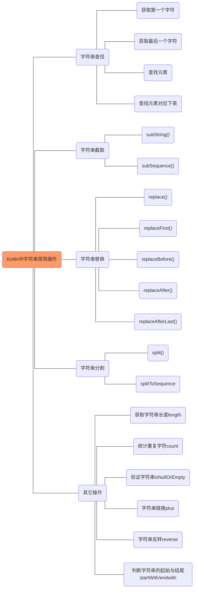

最近看一些开源软件,发现很多高质量的工程已经逐渐使用kotlin重写了. 不去系统学习下kotlin, 可能后续看代码都不太方便了.现在程序员接触的语言太多了,随便想想自己应该看的语言就有kotlin\rust\python\go\R\java\c/c++等.潜意识是不想去学习Kotlin,虽然别人说Kotlin多么多么好, 不过使用Java已经有十几年了,该踩的坑都踩过了.java已经够用,而且没有发现啥问题,也算是自己的舒适区.

<!-- more -->

那如何学习一门语言呢? 我想程序语言是相同的, 就比如kotlin与java, rust与c/c++, 虽然看起来语法更简单,用法更简洁,但是本质是不变的.那就简单整理一篇参考java的kotlin学习笔记好了.

1. 面向对象开发:
   1. 类
      1. 类的构造
      2. 类的成员函数/变量
      3. 类的静态变量
      4. 类的静态初始化
      5. 单例实现
2. 条件控制
   1. if
   2. while
   3. when
   4. for
   5. foreach
3. 字符串处理
4. 数组处理
5. IO处理
6. 并发编程:
   1. 线程
   2. 协程
   3. 线程池
   4. 线程同步
7. Lambda
   1. let
   2. apply
8. 容器
   1. 不支持线程同步的容器
      1. com.java.concurrent包
   2. 支持线程同步的容器


如果需要短暂编辑代码验证, 可以使用官网的[kotlin online ide](https://kotlinlang.org/)


# kotlin基础

## Kotlin 基本数据类型

Kotlin 的基本数值类型包括 Byte、Short、Int、Long、Float、Double 等。不同于 Java 的是，字符不属于数值类型，是一个独立的数据类型。

| 类型   | 位宽度 |
| :----- | :----- |
| Double | 64     |
| Float  | 32     |
| Long   | 64     |
| Int    | 32     |
| Short  | 16     |
| Byte   | 8      |

------

## 字面常量

下面是所有类型的字面常量：

- 十进制：123
- 长整型以大写的 L 结尾：123L
- 16 进制以 0x 开头：0x0F
- 2 进制以 0b 开头：0b00001011
- 注意：8进制不支持

Kotlin 同时也支持传统符号表示的浮点数值：

- Doubles 默认写法: `123.5`, `123.5e10`
- Floats 使用 f 或者 F 后缀：`123.5f`

你可以使用下划线使数字常量更易读：

```
val oneMillion = 1_000_000
val creditCardNumber = 1234_5678_9012_3456L
val socialSecurityNumber = 999_99_9999L
val hexBytes = 0xFF_EC_DE_5E
val bytes = 0b11010010_01101001_10010100_10010010
```

------

## 比较两个数字

Kotlin 中没有基础数据类型，只有封装的数字类型，你每定义的一个变量，其实 Kotlin 帮你封装了一个对象，这样可以保证不会出现空指针。数字类型也一样，所以在比较两个数字的时候，就有比较数据大小和比较两个对象是否相同的区别了。

**在 Kotlin 中，三个等号 === 表示比较对象地址，两个 == 表示比较两个值大小。**

```kotlin
fun main(args: Array<String>) {
    val a: Int = 10000
    println(a === a) // true，值相等，对象地址相等

    //经过了装箱，创建了两个不同的对象
    val boxedA: Int? = a
    val anotherBoxedA: Int? = a

    //虽然经过了装箱，但是值是相等的，都是10000
    println(boxedA === anotherBoxedA) //  false，值相等，对象地址不一样
    println(boxedA == anotherBoxedA) // true，值相等
}
```

------

## 类型转换

由于不同的表示方式，**较小类型并不是较大类型的子类型，较小的类型不能隐式转换为较大的类型**。 这意味着在不进行显式转换的情况下我们不能把 Byte 型值赋给一个 Int 变量。

```kotlin
val b: Byte = 1 // OK, 字面值是静态检测的
val i: Int = b // 错误
```

我们可以代用其toInt()方法。

```kotlin
val b: Byte = 1 // OK, 字面值是静态检测的
val i: Int = b.toInt() // OK
```

每种数据类型都有下面的这些方法，可以转化为其它的类型：

```kotlin
toByte(): Byte
toShort(): Short
toInt(): Int
toLong(): Long
toFloat(): Float
toDouble(): Double
toChar(): Char
```

有些情况下也是可以使用自动类型转化的，前提是可以根据上下文环境推断出正确的数据类型而且数学操作符会做相应的重载。例如下面是正确的：

```kotlin
val l = 1L + 3 // Long + Int => Long
```

------

## 位操作符

对于Int和Long类型，还有一系列的位操作符可以使用，分别是：

```
shl(bits) – 左移位 (Java’s <<)
shr(bits) – 右移位 (Java’s >>)
ushr(bits) – 无符号右移位 (Java’s >>>)
and(bits) – 与(java &)
or(bits) – 或(Java |)
xor(bits) – 异或(java ^)
inv() – 反向(java !)
```

------

## 字符

和 Java 不一样，Kotlin 中的 Char 不能直接和数字操作，Char 必需是单引号 **'** 包含起来的。比如普通字符 '0'，'a'。

```
fun check(c: Char) {
    if (c == 1) { // 错误：类型不兼容
        // ……
    }
}
```

字符字面值用单引号括起来: '1'。 特殊字符可以用反斜杠转义。 支持这几个转义序列：\t、 \b、\n、\r、\'、\"、\\ 和 \$。 编码其他字符要用 Unicode 转义序列语法：'\uFF00'。

我们可以显式把字符转换为 Int 数字：

```
fun decimalDigitValue(c: Char): Int {
    if (c !in '0'..'9')
        throw IllegalArgumentException("Out of range")
    return c.toInt() - '0'.toInt() // 显式转换为数字
}
```

当需要可空引用时，像数字、字符会被装箱。装箱操作不会保留同一性。

------

## 布尔

布尔用 Boolean 类型表示，它有两个值：true 和 false。

若需要可空引用布尔会被装箱。

内置的布尔运算有：

```kotlin
|| – 短路逻辑或
&& – 短路逻辑与
! - 逻辑非
```

------

## 数组

数组用类 Array 实现，并且还有一个 size 属性及 get 和 set 方法，由于使用 [] 重载了 get 和 set 方法，所以我们可以通过下标很方便的获取或者设置数组对应位置的值。

数组的创建两种方式：一种是使用函数arrayOf()；另外一种是使用工厂函数。如下所示，我们分别是两种方式创建了两个数组：

```
fun main(args: Array<String>) {
    //[1,2,3]
    val a = arrayOf(1, 2, 3)
    //[0,2,4]
    val b = Array(3, { i -> (i * 2) })

    //读取数组内容
    println(a[0])    // 输出结果：1
    println(b[1])    // 输出结果：2
}
```

如上所述，[] 运算符代表调用成员函数 get() 和 set()。

注意: 与 Java 不同的是，Kotlin 中数组是不协变的（invariant）。

除了类Array，还有ByteArray, ShortArray, IntArray，用来表示各个类型的数组，省去了装箱操作，因此效率更高，其用法同Array一样：

```kotlin
val x: IntArray = intArrayOf(1, 2, 3)
x[0] = x[1] + x[2]
```

------

## 字符串




和 Java 一样，String 是不可变的。方括号 [] 语法可以很方便的获取字符串中的某个字符，也可以通过 for 循环来遍历：

```kotlin
for (c in str) {
    println(c)
}
```

Kotlin 支持三个引号 """ 扩起来的字符串，支持多行字符串，比如：

```kotlin
fun main(args: Array<String>) {
    val text = """
    多行字符串
    多行字符串
    """
    println(text)   // 输出有一些前置空格
}
```

String 可以通过 trimMargin() 方法来删除多余的空白。

```kotlin
fun main(args: Array<String>) {
    val text = """
    |多行字符串
    |菜鸟教程
    |多行字符串
    |kotlin
    """.trimMargin()
    println(text)    // 前置空格删除了
}
```

默认 | 用作边界前缀，但你可以选择其他字符并作为参数传入，比如 trimMargin(">")。

------

## 字符串模板

**字符串可以包含模板表达式 ，即一些小段代码，会求值并把结果合并到字符串中**。 模板表达式以美元符（$）开头，由一个简单的名字构成:

```kotlin
fun main(args: Array<String>) {
    val i = 10
    val s = "i = $i" // 求值结果为 "i = 10"
    println(s)
}
```

或者用花括号扩起来的任意表达式:

```
fun main(args: Array<String>) {
    val s = "kotlin"
    val str = "$s.length is ${s.length}" // 求值结果为 "kotlin.length is 6"
    println(str)
}
```

原生字符串和转义字符串内部都支持模板。 如果你需要在原生字符串中表示字面值 **$ 字符（它不支持反斜杠转义）**，你可以用下列语法：

```
fun main(args: Array<String>) {
    val price = """
    ${'$'}9.99
    """
    println(price)  // 求值结果为 $9.99
}
```

## 变量声明

Kotlin 使用两个不同的关键字（即 `val` 和 `var`）来声明变量。

- `val` 用于值从不更改的变量。使用 `val` 声明的变量无法重新赋值。类似Java的添加final关键字.
- `var` 用于值可以更改的变量。

在以下示例中，`count` 是一个 `Int` 类型的变量，初始赋值为 `10`：

```kotlin
var count: Int = 10
```

`Int` 是一种表示整数的类型，是可以用 Kotlin 表示的众多数值类型之一。与其他语言类似，您还可以使用 `Byte`、`Short`、`Long`、`Float` 和 `Double`，具体取决于您的数值数据。

`var` 关键字表示可以根据需要为 `count` 重新赋值。例如，可以将 `count` 的值从 `10` 更改为 `15`：

```kotlin
var count: Int = 10
count = 15
```

不过，有些值不应更改。假设有一个名为 `languageName` 的 `String`。如果希望确保 `languageName` 的值始终为“Kotlin”，则可以使用 `val` 关键字声明 `languageName`：

```kotlin
val languageName: String = "Kotlin"
```

通过这些关键字，您可以明确指出哪些变量的值可以更改。请根据需要加以利用。如果引用的变量必须可重新赋值，则将其声明为 `var`。否则，请使用 `val`。

### 类型推断

接着前面的示例来讲，为 `languageName` 赋予初始值后，Kotlin 编译器可根据所赋值的类型来推断其类型。

由于 `"Kotlin"` 的值为 `String` 类型，因此编译器推断 `languageName` 也为 `String`。请注意，**Kotlin 是一种静态类型的语言**。这意味着，类型将在编译时解析且从不改变。

在以下示例中，`languageName` 推断为 `String`，因此无法对其调用任何不属于 `String` 类的函数：

```kotlin
val languageName = "Kotlin"
val upperCaseName = languageName.toUpperCase()

// Fails to compile
languageName.inc()
```

`toUpperCase()` 是一个只能对 `String` 类型的变量调用的函数。由于 Kotlin 编译器已将 `languageName` 推断为 `String`，因此可以安全地调用 `toUpperCase()`。不过，`inc()` 是一个 `Int` 运算符函数，因此无法对 `String` 调用它。利用 Kotlin 的类型推断，既能确保代码简洁，又能确保类型安全。

### Null 安全

在某些语言中，可以声明引用类型变量而不明确提供初始值。在这类情况下，变量通常包含 null 值。默认情况下，Kotlin 变量不能持有 null 值。这意味着以下代码段无效：

```kotlin
// Fails to compile
val languageName: String = null
```

要使变量持有 null 值，它必须是可为 null 类型。可以在变量类型后面加上 `?` 后缀，将变量指定为可为 null，如以下示例所示：

```kotlin
val languageName: String? = null
```

指定 `String?` 类型后，可以为 `languageName` 赋予 `String` 值或 `null`。

必须小心处理可为 null 的变量，否则可能会出现可怕的 `NullPointerException`。例如，在 Java 中，如果尝试对 null 值调用方法，程序会发生崩溃。

Kotlin 提供了多种机制来安全地处理可为 null 的变量。

### 延迟加载

通过`by` 关键字 代理到 lazy，这样p属性或对象会在调用的时候才会初始化

```kotlin
val p: String by lazy {
    // 生成string的值
}
```


## 条件语句

Kotlin 提供了几种实现条件逻辑的机制，其中最常见的是 if-else 语句。如果 `if` 关键字后面括在圆括号内的表达式求值为 `true`，则会执行该分支中的代码（即，紧跟在后面的括在大括号内的代码）。否则，会执行 `else` 分支中的代码。

```kotlin
if (count == 42) {
    println("I have the answer.")
} else {
    println("The answer eludes me.")
}
```

您可以使用 `else if` 表示多个条件。这样，您就可以在单个条件语句中表示更精细、更复杂的逻辑，如以下示例所示：

```kotlin
if (count == 42) {
    println("I have the answer.")
} else if (count > 35) {
    println("The answer is close.")
} else {
    println("The answer eludes me.")
}
```

条件语句对于表示有状态的逻辑很有用，但您可能会发现，编写这些语句时会出现重复。在上面的示例中，每个分支都是输出一个 `String`。为了避免这种重复，Kotlin 提供了条件表达式。最后一个示例可以重新编写如下：

```kotlin
val answerString: String = if (count == 42) {
    "I have the answer."
} else if (count > 35) {
    "The answer is close."
} else {
    "The answer eludes me."
}

println(answerString)
```

每个条件分支都隐式地返回其最后一行的表达式的结果，因此无需使用 `return` 关键字。由于全部三个分支的结果都是 `String` 类型，因此 if-else 表达式的结果也是 `String` 类型。在本例中，根据 if-else 表达式的结果为 `answerString` 赋予了一个初始值。利用类型推断可以省略 `answerString` 的显式类型声明，但为了清楚起见，通常最好添加该声明。

**注意**：Kotlin 不包含传统的[三元运算符](https://en.wikipedia.org/wiki/%3F:)，而是倾向于使用条件表达式。

随着条件语句的复杂性不断增加，您可以考虑将 if-else 表达式替换为 when 表达式，如以下示例所示：

```kotlin
val answerString = when {
    count == 42 -> "I have the answer."
    count > 35 -> "The answer is close."
    else -> "The answer eludes me."
}

println(answerString)
```

`when` 表达式中每个分支都由一个条件、一个箭头 (`->`) 和一个结果来表示。如果箭头左侧的条件求值为 true，则会返回右侧的表达式结果。请注意，执行并不是从一个分支跳转到下一个分支。`when` 表达式示例中的代码在功能上与上一个示例中的代码等效，但可能更易懂。

Kotlin 的条件语句彰显了它的一项更强大的功能，即智能类型转换。您不必使用安全调用运算符或非 null 断言运算符来处理可为 null 的值，而可以使用条件语句来检查变量是否包含对 null 值的引用，如以下示例所示：

```kotlin
val languageName: String? = null
if (languageName != null) {
    // No need to write languageName?.toUpperCase()
    println(languageName.toUpperCase())
}
```

在条件分支中，`languageName` 可能会被视为不可为 null。Kotlin 非常智能，能够识别执行分支的条件是 `languageName` 不持有 null 值，因此您不必在该分支中将 `languageName` 视为可为 null。这种智能类型转换适用于 null 检查、[类型检查](https://kotlinlang.org/docs/reference/typecasts.html#is-and-is-operators)，或符合[合约](https://kotlinlang.org/docs/reference/whatsnew13.html#contracts)的任何条件。

## 循环

### for

```
fun main(args: Array<String>) {
  val items = listOf("a", "b", "c")
  for (item in items) {
    println(item)
  }
}

// or

fun main(args: Array<String>) {
  val items = listOf("a", "b", "c")
  for (index in items.indices) {
    println("item at $index is ${items[index]}")
  }
}
```

### while

```
fun main(args: Array<String>) {
  val items = listOf("a", "b", "c")
  var index = 0
  while (index < items.size) {
    println("item at $index is ${items[index]}")
    index++
  }
}
```

### when

when 其实就是一个加强版的`switch`,并when可以返回值

```
fun jude(obj: Any): String{
    return when(obj){
        "1"     -> "String 1"
        1       -> "Int 1"
        is Long -> "Long"
        2,3     -> "Int 2 or 3"
        else    -> "something else"
    }
}
```

### ranges 区间值

- 使用`in`关键字检查是否在某个区间

```
fun main(args: Array<String>) {
  val x = 10
  val y = 9
  if (x in 1..y+1) {
      println("fits in range")
  }

  if (x !in 1..y) {
      println("not in range")
  }
}
for (i in 1..100) { ... }       // 闭区间: 包括100
for (i in 1 until 100) { ... }  // 半开区间: 不包括100
for (x in 2..10 step 2) { ... } // x += 2
for (x in 10 downTo 1) { ... }  // 倒序输出
if (x in 1..10) { ... }         // 是否包含
```

- 在区间遍历：

```
for (x in 1..5) {
  print(x)
}
```

- 检查是否包含某个对象

```
fun main(args: Array<String>) {
  val items = setOf("a", "b", "c")
  when {
    "a" in items -> println("a")  // a 存在于 items 就返回了
    "b" in items -> println("b")
  }
}
```

### break & return

Java当中break和return 大家应该很熟悉了，但Kotlin 中它还有一些其他的用法

- `break` / `return` 到 指定的地方，这就不一样了吧..
- 主要通过注解（标记）来实现

```kotlin
// 取个名字叫loop,然后用@符号标记
loop@ for (i in 1..5) {
    for (j in 1..5) {
        if (j == 3) break@loop // 直接跳出了最外层循环
        print("$i-$j\n")
    }
}
```

<div style=" background:gray; font:normal 14px/24px 'MicroSoft YaHei';color:rgb(255,255,255);">
1-1<br/>
1-2<br/>
</div>


```kotlin
fun foo() {
    ints.forEach {
        if (it == 0) return
        print(it)
    }
}
/**
 * Kotlin 中这会直接退出forEach 遍历并退出foo，因为Kotlin 允许从一个内部函数直接退出外部函数
 * With function literals, local functions and object expression, functions can be nested in Kotlin. Qualified returns allow us to return from an outer function. 
 */
```

但是

```kotlin
fun main() {
    fun foo() {
        val ints = arrayOf(1, 2,3)
         ints.forEach  dd@ {
            if (it == 2) return@dd
            print("$it\n")
        }
        print("over foo\n")
    }

foo()
print("bybye.")
}
/**
 * 这种方式只是退出了lambda（拉姆达，真难念，还不如叫萨达姆）表达式，并没有退出forEach
 */
```

<div style=" background:gray; font:normal 14px/24px 'MicroSoft YaHei';color:rgb(255,255,255);">
1<br/>
3<br/>
over foo<br/>
bybye.<br/>
</div>

- 如果传入的是lambda表达式，**在表达式中拥有一个与外层函数相同名称的默认标签**，如下的`forEach`

```
fun foo() {
    val ints = arrayOf(1,2,3,4,5)
    ints.forEach {
        if (it == 3) return@forEach
        print(it)
    }
}

/**
 * 输出1245，只跳出了lambda
 */
```

## 函数

您可以将一个或多个表达式归入一个函数。您可以将相应的表达式封装在一个函数中并调用该函数，而不必在每次需要某个结果时都重复同一系列的表达式。

要声明函数，请使用 `fun` 关键字，后跟函数名称。接下来，定义函数接受的输入类型（如果有），并声明它返回的输出类型。函数的主体用于定义在调用函数时调用的表达式。

以前面的示例为基础，下面给出了一个完整的 Kotlin 函数：

```kotlin
fun generateAnswerString(): String {
    val answerString = if (count == 42) {
        "I have the answer."
    } else {
        "The answer eludes me"
    }

    return answerString
}
```

上面示例中的函数名为 `generateAnswerString`。它不接受任何输入。它会输出 `String` 类型的结果。要调用函数，请使用函数名称，后跟调用运算符 (`()`)。在下面的示例中，使用 `generateAnswerString()` 的结果对 `answerString` 变量进行了初始化。

```kotlin
val answerString = generateAnswerString()
```

函数可以接受参数输入，如以下示例所示：

```kotlin
fun generateAnswerString(countThreshold: Int): String {
    val answerString = if (count > countThreshold) {
        "I have the answer."
    } else {
        "The answer eludes me."
    }

    return answerString
}
```

在声明函数时，可以指定任意数量的参数及其类型。在上面的示例中，`generateAnswerString()` 接受一个名为 `countThreshold` 的 `Int` 类型的参数。在函数中，可以使用参数的名称来引用参数。

调用此函数时，必须在函数调用的圆括号内添加一个参数：

```kotlin
val answerString = generateAnswerString(42)
```

### 简化函数声明

`generateAnswerString()` 是一个相当简单的函数。该函数声明一个变量，然后立即返回结果。函数返回单个表达式的结果时，可以通过直接返回函数中包含的 if-else 表达式的结果来跳过声明局部变量，如以下示例所示：

```kotlin
fun generateAnswerString(countThreshold: Int): String {
    return if (count > countThreshold) {
        "I have the answer."
    } else {
        "The answer eludes me."
    }
}
```

**您还可以将 return 关键字替换为赋值运算符：**

```kotlin
fun generateAnswerString(countThreshold: Int): String = if (count > countThreshold) {
        "I have the answer"
    } else {
        "The answer eludes me"
    }
```

### 匿名函数

并非每个函数都需要一个名称。某些函数通过输入和输出更直接地进行标识。这些函数称为“匿名函数”。您可以保留对某个匿名函数的引用，以便日后使用此引用来调用该匿名函数。与其他引用类型一样，您也可以在应用中传递引用。

```kotlin
val stringLengthFunc: (String) -> Int = { input ->
    input.length
}
```

与命名函数一样，匿名函数也可以包含任意数量的表达式。 函数的返回值是最终表达式的结果。

在上面的示例中，`stringLengthFunc` 包含对一个匿名函数的引用，该函数将 `String` 当作输入，并将输入 `String` 的长度作为 `Int` 类型的输出返回。因此，该函数的类型表示为 `(String) -> Int`。不过，此代码不会调用该函数。要检索该函数的结果，您必须像调用命名函数一样调用该函数。调用 `stringLengthFunc` 时，必须提供 `String`，如以下示例所示：

```kotlin
val stringLengthFunc: (String) -> Int = { input ->
    input.length
}

val stringLength: Int = stringLengthFunc("Android")
```

### 高阶函数

一个函数可以将另一个函数当作参数。**将其他函数用作参数的函数称为“高阶函数”**。此模式对组件之间的通信（其方式与在 Java 中使用回调接口相同）很有用。

下面是一个高阶函数的示例：

```kotlin
fun stringMapper(str: String, mapper: (String) -> Int): Int {
    // Invoke function
    return mapper(str)
}
```

`stringMapper()` 函数接受一个 `String` 以及一个函数，该函数根据您传递给它的 `String` 来推导 `Int` 值。

要调用 `stringMapper()`，可以传递一个 `String` 和一个满足其他输入参数的函数（即，一个将 `String` 当作输入并输出 `Int` 的函数），如以下示例所示：

```kotlin
stringMapper("Android", { input ->
    input.length
})
```

如果匿名函数是在某个函数上定义的最后一个参数，则您可以在用于调用该函数的圆括号之外传递它，如以下示例所示：

```kotlin
stringMapper("Android") { input ->
    input.length
}
```

在整个 Kotlin 标准库中可以找到很多匿名函数。如需了解详情，请参阅[高阶函数和 Lambda](https://kotlinlang.org/docs/reference/lambdas.html)。

### 函数默认值

```
fun foo(a: Int = 0, b: String = "") {...}
```

## 类

到目前为止提到的所有类型都已内置在 Kotlin 编程语言中。如果您希望添加自己的自定义类型，可以使用 `class` 关键字来定义类，如以下示例所示：

**class** `类名称` [ 类头 `访问修饰符` `注解符` **constructor** `主构造函数` ( `参数名称` : `参数类型`, ...) ] : `父类` [ 类体 `{}` ]

```
class Customer public @Inject constructor(name: String) : People(name) { …… }
```

- 类声明由类名、类头（类型参数、主构造函数等）和由大括号包围的类体构成
- 类头和类体都不是必须的，没有就不写
- 如果不存在`访问修饰符` 和 `注解符`，那么 `constructor` 关键字是可以省略的
- 主构造函数的初始化要方法`init`函数中
- 主构造函数还可以赋初始值

### 属性

类使用属性来表示状态。[属性](https://kotlinlang.org/docs/reference/properties.html)是类级变量，可以包含 getter、setter 和后备字段。

```
var <propertyName>: <PropertyType> [= <property_initializer>]
    [<getter>]
    [<setter>]
```

由于汽车需要轮子来驱动，因此您可以添加 `Wheel` 对象的列表作为 `Car` 的属性，如以下示例所示：

```kotlin
class Car {
    val wheels = listOf<Wheel>()
}
```

请注意，`wheels` 是一个 `public val`，这意味着，可以从 `Car` 类外部访问 `wheels`，并且不能为其重新赋值; 如需要定义可变属性,应该是用关键字var. 如果要获取 `Car` 的实例，必须先调用其构造函数(kotlin没有new关键字)。这样，您便可以访问它的任何可访问属性。

```kotlin
val car = Car() // construct a Car
val wheels = car.wheels // retrieve the wheels value from the Car
```

如果希望自定义轮子，可以定义一个自定义构造函数，用来指定如何初始化类属性：

```kotlin
class Car(val wheels: List<Wheel>)
```

在以上示例中，类构造函数将 `List<Wheel>` 当作构造函数参数，并使用该参数来初始化其 `wheels` 属性。

### 委托属性

委托这个词第一次见到其实是在OC当中，其意思是将属性或方法的处理权限交给另一个对象
打个比方：

A 有件事需要处理，他自己是可以处理的，但是将这件事 `委托` 给 B 去处理，至于 B 怎么处理的 ,A 不用管了，只管结果就行了

而在kotlin当中常见的有三种委托场景

- 延迟加载属性(lazy property): 属性值只在初次访问时才会初始化
- 可观察属性(observable property): 属性发生变化时, 可以向监听器发送通知
- 将多个属性保存在一个 map 内, 而不是保存在多个独立的域内

官网上有这样一段代码:

```
class Example {
    var p: String by Delegate()
}
```

属性 `p` 的访问(getter/setter) 都委托给了一个`Delegate`的对象

委托属性的语法是: `val/var <property name>: <Type> by <expression>`
其中 `by` 关键字之后的表达式就是 委托, 属性的 `get()` `set()` 方法 将被委托给这个对象的 `getValue()` 和 `setValue()` 方法. **属性委托不必实现任何接口, 但必须提供 getValue() 函数(对于 var 属性, 还需要 setValue() 函数)**

```
class Delegate {
    operator fun getValue(thisRef: Any?, property: KProperty<*>): String {
        return "$thisRef, thank you for delegating '${property.name}' to me!"
    }
 
    operator fun setValue(thisRef: Any?, property: KProperty<*>, value: String) {
        println("$value has been assigned to '${property.name} in $thisRef.'")
    }
}
```

如上代码：属性 `p` 委托给一个 `Delegate`的 **实例**, 当我们读取属性值时, 就会调用到 Delegate 的 getValue() 函数, 函数的第一个参数是p属性所属的对象实例, 第二个参数将是 p 属性本身

```
val e = Example()
println(e.p)  // Example@33a17727, thank you for delegating ‘p’ to me!
```

当我们向属性 p 赋值时, 将会调用到 setValue() 函数. 这个函数收到的前两个参数与 getValue() 函数相同, 第三个参数将是即将赋给属性的新值

```
e.p = "NEW" 
```

输出结果： NEW has been assigned to ‘p’ in Example@33a17727.

而委托的方法都需要使用关键字 **`operator`** 声明

### 标准委托

就是几种常用的内置委托,也就是上边提到的三种场景

- Lazy
- Observable
- Map
- [具体参考文档](http://www.liying-cn.net/kotlin/docs/reference/delegated-properties.html)

### 后端变量

> Kotlin 的类不能拥有`域变量`. 但是, 使用属性的自定义访问器时, 有时会需要后端域变量(backing field). 为了这种目的, Kotlin 提供了一种自动的后端域变量, 可以通过 field 标识符来访问

看到这我其实已经晕了，啥是`域变量`，有人说是局部变量...好吧，姑且这样理解，那什么又是`后端域变量`呢，官网有给出这样一个例子：

```
var counter = 0 // the initializer value is written directly to the backing field 初始化给定的值将直接写入后端域变量中
    set(value) {
        if (value >= 0) field = value
    }
```

再结合上边的话，大概意思就是：在 **自定义getter/setter** 的时候，由于Kotlin 中不允许局部变量，因此提供了一个叫`field`的替代品来调用，但是这有啥卵用呢，以我的思维不应该是如下的方式吗？？

```
val counter = 0
    set(value){
      if (value > 0) this.counter = value
    }
```

看着这样的代码，学Java的人们是不是觉得亲切了许多了呢，可你真这样写就会发现 **`StackOverflowError`** ,栈溢出了我的哥哥耶！！
经过[搜索 kotlin backing field](https://stackoverflow.com/questions/43220140/whats-kotlin-backing-field-for)后发现,我们按照Java的编写方式书写的代码最终会变成如下的方式

```
private int counter = 0;
public void setCounter(int value) {
    if (value >= 0) setCounter(value);
}
```

**死循环递归调用** 我的天啦，这下知道为什么了吧，（但是Java中我们的书写方式是没有问题的，应该是底层实现不同吧）
因此Kotlin 向我们提供了`field` 在getter/setter 中使用以绕过递归的调用

- **field 标识符只允许在属性的访问器函数内使用**
- 如果属性 get/set 方法中的任何一个使用了默认实现, 或者在 get/set 方法的自定义实现中通过 field 标识符访问属性, 那么编译器就会为属性自动生成后端域变量.

### 后端属性

而后端属性的的意思就是说我们无法使用后端变量达到目的时可以使用后端属性来编写程序，如下

```
private var _table: Map<String, Int>? = null
public val table: Map<String, Int>
    get() {
        if (_table == null) {
            _table = HashMap() // Type parameters are inferred
        }
        return _table ?: throw AssertionError("Set to null by another thread")
    }
```

而这种写法呢跟Java没有啥区别，声明一个私有的属性，然后通过共有的属性访问，在这个共有的属性中，`_table` 这个私有属性的访问是通过`默认`的getter/setter，因此不会出现栈溢出的问题。

### 延迟初始化属性

通过关键字`lateinit` 声明`var` 类型的变量

### 构造函数

Kotlin 中的类可以有一个 主构造器，以及一个或多个次构造器，主构造器是类头部的一部分，位于类名称之后:

```kotlin
class Person constructor(firstName: String) {}
```

如果主构造器**没有任何注解，也没有任何可见度修饰符**，那么constructor关键字可以省略。

```
class Person(firstName: String) {
}
```

由于主构造器中不能包含任何执行代码，因此我们需要时另一个地方初始化构造器参数,而这个地方就是`init` 方法

```
class Person(name: String){
  var name: String

  init {
    this.name = name
  }
}
```

由上边的方法可以看出：其写法和Java有些类似，先声明了一个`name`属性,然后通过`init` 初始化
其实当你写出这样的构造时，编译器就会提示你有更简洁的编写方式`Can be joined with assginment`,随后变成了

```
class Person(name: String){
  var name: String = name // 声明var 类型变量name，并通过构造参数初始化值
}
```

**Kotlin 提供了更为简洁的方法，一并将声明和初始操作弄到一起去**

```
class Person(val name:String){

}
```

对比下，我们在声明构造时，就利用`val` 或 `var` 声明了一个叫 `name` 的变量，然后就没然后了，Kotlin 将会自动帮我们映射构造属性，顺便提下，如果你构造中既没有写`val/var` 也没有在init中初始化，那么我们相当于传递了一个参数进去，但是从来没有使用，就像下边这样

```
class Person(name:String){

}
```

上边提到了构造中不写`var/val` 时，其实他的默认值是`val`,因此是不可修改的，也就不能初始化(init)

```
class Person(var name: String,val age:Int, gender : Boolean){
  /**
   * 每次调用时都会先调用init方法对 创建对象初始化，但是val的值是不能被初始化的
   */
    init {
        name = "default"
        // age = 1 显示声明为val
        // gender = false 默认为val
    }
}
```

- 一个类`拥有一个` `主构造器`，并`可以` 拥有`多个`次级构造器，构造器由`constructor` 关键字作为前缀名称声明:

```
class Person (val name: String,val age: Int){
  var gender: Boolean = false

  constructor(name: String, age: Int, gender: Boolean):this(name,age){
      this.gender = gender
  }
}
```

**如果类有主构造器, 那么每个次级构造器都必须委托给主构造器, 要么直接委托, 要么通过其他次级构造器间接委托. 委托到同一个类的另一个构造器时, 使用 `this` 关键字实现**，这句话就是上边代码为什么需要在次级构造后边添加`:this(name,age)` 的原因，想想也是啊，由于我们的次级构造中声明**不能有`val / var` 这样的关键字**，那么怎样让Kotlin自动声明呢：`调用自己的构造器嘛`,主构造器没有声明的属性，我们就自己手动声明了，注意的是，**属性声明需要初始化**

如果一个`非抽象类`没有声明`任何构造器`（主构造器和次级构造器）, 它将带有一个 **自动生成的, 无参数的主构造器**. 这个构造器的访问级别为 `public`. 如果不希望你的类带有 public 的构造器, 你需要声明一个空的构造器, 并明确设置其访问级别

```
class Person private constructor(){

}
```

**注意**:

> 在 JVM 中, 如果主构造器的`所有参数`都指定了`默认值`, 编译器将会产生一个额外的`无参数构造器`, 这个无参数构造器会使用默认参数值来调用既有的构造器.

```
class Person(val name: String = "default"){

}

val p = Person()
println(p.name) // default
```

### 类的继承

> Kotlin 中所有的类都有一个共同的超类 **Any**, 如果类声明时没有指定超类, 则默认为 Any

```
class Person // 默认继承 Any
```

需要注意的是：**Any 不是 `java.lang.Object` , 除 `equals()`, `hashCode()` 和 `toString()` 之外, 它没有任何成员**

类的继承通过冒号`:`后边跟上父类指定，跟OC写法差不多哦

```
open class Person(val name: String)

class Chinese(val name: String) : Person(name)
```

> open用法

如果类存在主构造器，那么必须使用柱构造器来初始化父类，如果父类有参数的话，还必须将参数传递给父类

如果类没有主构造器, 那么所有的次级构造器都必须使用 super 关键字来初始化基类, 或者委托到另一个构造器, 由被委托的构造器来初始化基类. 注意, 这种情况下, 不同的次级构造器可以调用基类中不同的构造器:

```
class MyView : View {
    constructor(ctx: Context) : super(ctx)

    constructor(ctx: Context, attrs: AttributeSet) : super(ctx, attrs)
}
```

类上的 `open` 注解(annotation) 与 Java 的 `final` 正好`相反`: 这个注解表示允许从这个类继承出其他子类. 默认情况下, Kotlin 中所有的类都是 final 的, **允许继承的地方, 应该明确指定 否则应该禁止继承**

- 方法的覆盖

对于方法的覆盖同样需要明确的使用`override`关键字来指定

```
open class Person {
    open fun say() {}
    open fun walk() {}
    fun eat(){}
}
class Chinese() : Person() {
    override fun say() {}
}

var c = Chinese()

c.say()   // 子类的方法
c.walk()  // 继承的方法
          // c.eat() 没有继承这个方法
```

当一个子类成员标记了 override 注解来覆盖父类成员时, 覆盖后的子类成员本身也将是 open 的, 也就是说, 子类成员可以被自己的子类再次覆盖. 如果你希望禁止这种再次覆盖, 可以使用 final 关键字:

```
class Chinese() : Person() {
    final override fun say() {}
}
```

- 属性的覆盖

属性覆盖和方法覆盖类似,可以在初始化时覆盖，也可以使用getter覆盖

```
open class Person(open val name: String){
    open val age : Int = 0
    open val gender : Boolean = false
}

class Chinese(override val name: String):Person(name){
    override val age: Int
        get(){
            return 1
        }

    override val gender: Boolean = !super.gender

    override fun toString(): String {
        return "$name , $age, $gender"
    }
}
```

**你也可以使用一个 var 属性覆盖一个 val 属性, 但不可以反过来使用一个 val 属性覆盖一个 var 属性. 允许这种覆盖的原因是, val 属性本质上只是定义了一个 get 方法, 使用 var 属性来覆盖它, 只是向后代类中添加了一个 set 方法.**

- 覆盖的规则

在Kotlin 中如果从多个`直接父类`中继承了相同的方法，那么必须覆盖这个方法，并在覆盖方法中使用`super<Class>`关键字，明确指定使用的是哪个父类方法

```
open class A {
    open fun f() { print("A") }
    fun a() { print("a") }
}

// 接口的成员默认是 'open' 的
interface B {
    fun f() { print("B") } 
    fun b() { print("b") }
}

// 继承了多个实现
class C() : A(), B {
    // 编译器要求 f() 方法必须覆盖:
    override fun f() {
        super<A>.f() // 调用 A.f()
        super<B>.f() // 调用 B.f()
    }
}
```

- 抽象类

抽象类的概念和Java 一样，成员默认也是open的
如果默认不写`open`，那么在直接子类中继承的方法将是`final`的，可以调用但**不允许**子类`覆盖`，否则需要指定是open的

```
abstract class Base{
     fun sayName(){
        println("Base")
    }
}

open class Person :Base(){
    // override fun sayName(){} 不允许覆盖
}
```

此外：**我们可以使用抽象成员来覆盖一个非抽象的 open 成员**

```
open class Base {
    open fun f() {}
}

abstract class Derived : Base() {
    override abstract fun f()
}
```

### getter 和 setter

属性声明的完整语法：

```
var <propertyName>[: <PropertyType>] [= <property_initializer>]
    [<getter>]
    [<setter>]
```

getter 和 setter 都是可选

如果属性类型可以从初始化语句或者类的成员函数中推断出来，那就可以省去类型，val不允许设置setter函数，因为它是只读的。

```kotlin
var allByDefault: Int? // 错误: 需要一个初始化语句, 默认实现了 getter 和 setter 方法
var initialized = 1    // 类型为 Int, 默认实现了 getter 和 setter
val simple: Int?       // 类型为 Int ，默认实现 getter ，但必须在构造函数中初始化
val inferredType = 1   // 类型为 Int 类型,默认实现 getter
```


### 类型检查

kotlin使用关键字`is`进行类型检查, 类比Java的instanceof.

```kotlin
fun checkString(obj: Any){
    if(obj is String) println("This is a String")
    else println("you are not String")
}
```

### 类函数和封装

类使用函数对行为建模。函数可以修改状态，从而帮助您只公开希望公开的数据。这种访问控制机制属于一个面向对象的更大概念，称为“封装”。

在以下示例中，`doorLock` 属性对 `Car` 类外部的一切都不公开。要解锁汽车，必须调用 `unlockDoor()` 函数并传入有效的“钥匙”，如以下示例所示：

```kotlin
class Car(val wheels: List<Wheel>) {

    private val doorLock: DoorLock = ...

    fun unlockDoor(key: Key): Boolean {
        // Return true if key is valid for door lock, false otherwise
    }
}
```

如果希望自定义属性的引用方式，则可以提供自定义的 getter 和 setter。例如，如果希望公开属性的 getter 而限制访问其 setter，则可以将该 setter 指定为 `private`：

```kotlin
class Car(val wheels: List<Wheel>) {

    private val doorLock: DoorLock = ...

    var gallonsOfFuelInTank: Int = 15
        private set

    fun unlockDoor(key: Key): Boolean {
        // Return true if key is valid for door lock, false otherwise
    }
}
```

通过结合使用属性和函数，可以创建能够对所有类型的对象建模的类。

### [抽象类和接口](https://blog.csdn.net/io_field/article/details/52860971)

### 对象表达式

在Java中我们要实现接口或抽象类常常会使用到`匿名内部类`的方法，如：

```java
button.setOnClickListener(new OnClickListener{
    onClick(){
      
    }
})
```


但是在Kotlin 中并没有匿名类这个概念，与之对应的是一个叫做`对象表达式`的概念

*对象表达式通过`object` 关键字声明*，如

```kotlin
button.setOnClickListener(object: OnClickListener{
    
})
```

由此可以看出，直接使用object声明了一个OnClickListener的对象，这样是不是同样达到了匿名内部类的效果呢...

- 继承多个父类的

对象表达式可以继承哟，多个父类通过逗号`,`分隔，如果父类构造有参数，那我们也必须传递适当的参数给父类初始化

```
open class Say(val words: String){}

interface Walk{
  fun how()
}

 person = object : Say("some words"),Walk{

}
```

### 对象声明

对象声明就是给对象表达式取了个`名字`，类似 `类` 的声明，因此不能复制给变量，使用时直接通过`名字` 调用

```
var feeling = "i'm walking alone and feeling great!!"

open class Say(val words: String){}

interface Walk{
    fun feeling()
}

object Person : Say("some words"),Walk{
    override fun feeling() {
        println(feeling)
    }
}

fun main(args: Array<String>) {
    Person.feeling()
}
```

- 对象声明不可以是局部的(也就是说, 不可以直接嵌套在函数之内), 但可以嵌套在另一个对象声明之内, 或者嵌套在另一个非内部类(non-inner class)内。
- 对象声明不能指定构造函数
- 如果父类构造有参数，那我们也必须传递适当的参数给父类初始化

### 伴生对象（同伴对象）

何为伴生对象，说白了就是类似Java静态方法的东西，由于Kotlin没有静态方法，那我们想不创建类就直接调用方法，那怎么办呢，伴生对象应运而生，这就是他的作用了...

伴生对象通过`companion`关键字声明，如

- Java

```
public class One {
    public static void say(){}
}
```

- Kotlin

```
class Out{
    companion object One {
        fun say(){}
    }
}
```

**一个类只能有一个伴生对象,** 使用时直接通过`Out.One.say()` 或 `Out.say()`调用，因此伴生对象的名字也是可以省略的

但是按照上面的写法或实现效果的话，对象声明也可以实现呢，如：

```
object One {
    fun say() {}
}
```

是的，这样写同样通过`One.say()`调用，那么他们有什么区别呢？

- 对象表达式在使用的地方被立即执行
- 对象声明是延迟加载的， 在第一次使用的时候被初始化
- 伴生对象在所在的类加载时被初始化，与Java静态成员一样

# 委托类

Derived 类可以继承 Base 接口, 并将 Base 接口所有的 public 方法委托给一个指定的对象:

```
interface Base {
    fun print()
}

class BaseImpl(val x: Int) : Base {
    override fun print() { print(x) }
}

class Derived(b: Base) : Base by b

fun main(args: Array<String>) {
    val b = BaseImpl(10)
    Derived(b).print() // 打印结果为: 10
}
```

Derived 类声明的基类列表中的 by 子句表示, b 将被保存在 Derived 的对象实例内部, 而且编译器将会生成继承自 Base 接口的所有方法, 并将调用转发给 b.


## 异常处理

### try-catch

奇葩就连`try-catch` 也变得不一样了,这玩意居然还能作为`返回值`，跟`if`

```
fun tryCatch() {
    val result = try {
        getResult()
    }catch (e: Exception) {
        throw IllegaStateException(e)
    }
    //处理 result
}
```


# 容器

| 容器     | 容器名称    | 容器初始化方法 |
| -------- | ----------- | -------------- |
| 只读集合 | Set         | setOf          |
| 可变集合 | MutableSet  | mutableSetOf   |
| 只读队列 | List        | listOf         |
| 可变队列 | MutableList | mutableListOf  |
| 只读映射 | Map         | mapOf          |
| 可变映射 | MutableMap  | mutableMapOf   |

## 集合Set/MutableSet
集合是一种最简单的容器，特征如下：
（1）内部元素不按顺序排列，无法通过下标访问
（2）内部元素存在唯一性，通过hash值校验是否相同元素，相同则覆盖
对于MutableSet还有下列限制：
（1）MutableSet的add方法仅仅往集合中添加元素，由于集合无序，因此不知道添加的位置
（2）MutableSet没有修改元素的方法，一旦元素添加，不可以修改
（3）MutableSet的remove方法用于删除元素，但无法删除指定位置元素，因为集合无序
## 队列List/MutableList
队列是一种元素按照顺序排列的容器，其与集合最大区别是多了次序管理。队列特征如下：
（1）队列能通过get方法获取指定位置的元素，也可以通过下标获取指定位置元素。
（2）MutableList的add方法每次都是把元素添加到队列末尾，也可以指定添加位置。
（3）MutableList的set方法允许替换或者修改制定位置元素
（4）MutableList的removeAt方法允许删除指定位置的元素
（5）队列除了集合通用的三种遍历方式（for-in, Iterator, forEach）,还有按元素下标遍历的方式
（6）MutableList提供了sort系列方法用于给队列的元素重新排序，其中sortBy方法表示按照指定条件排序，sortByDescending方法表示按照指定条件降序排列。

##  映射Map/MutableMap
映射内部保存的是一组Key-Value。元素的键和值是一一对应的关系，个元素键名是唯一的，映射有如下特征：
（1）映射的containsKey方法判断是否存在指定键名的元素，containsValues方法判定是否存在指定键值的元素。
（2）MutableMap的put方法不单单添加元素，还能智能数据存储。每次调用put方法添加时，映射会先根据键名寻找相同元素，找不到则添加新元素，找到就用新元素替换旧元素。
（3）MutableMap的remove方法通过键名删除元素。
（4）调用mapOf和mutableMapOf方法初始化映射时，有两种方式可以表达单个键值对元素，其一是采用“键名to键值”的形式，其二是采用Pair配对方式，形如“Pair（键名，键值）”。

# IO

## Java IO


在这张图中，整理了在Java 8中根据上述分类的IO流，其中字节输入流有28种，字节输出流有18种，字符输入流有9种，字符输出流有8种，看到这么多的流，实际开发中经常使用到的只是其中的一部分。比如字节输入流中的FileInputStream、BufferedInputStream，字节输出流中的FileOutputStream、BufferedOutputStream，字符输入流中的BufferedReader、InputStreamReader、FileReader，字符输出流中的BufferedWriter、OutputStreamWriter、FileWriter等。在图中已用黑色框图进行了突出标注。

在Java中对流的处理，需要注意异常的处理，同时注意流的关闭操作，否则可能会引起内存溢出。比如使用BufferedReader读取项目目录下的build.gradle文件。

## Kotlin IO

先给出上面使用BufferedReader读取build.gradle文件的Kotlin的几种写法，然后再来总结一下Kotlin中的IO。

```kotlin
fun main(args: Array<String>) {
    val file = File("build.gradle")
    val bufferedReader = BufferedReader(FileReader(file))
    var line: String

    try {
        while (true) {
            line = bufferedReader.readLine() ?: break
            println(line)
        }
    } catch (e: Exception) {
        e.printStackTrace()
    } finally {
        try {
            bufferedReader.close()
        } catch (e: Exception) {
            e.printStackTrace()
        }
    }
}

```

这种写法似乎与Java的写法没有什么区别，怎么体现Kotlin的优势呢？好在Kotlin封装了很多高阶函数，下面给出一个使用高阶函数的版本。

```kotlin
fun main(args: Array<String>) {
    val file = File("build.gradle")
    BufferedReader(FileReader(file)).use {
        var line: String
        while (true) {
            line = it.readLine() ?: break
            println(line)
        }
    }
}

```

代码精简了不少，省略了一些对异常的捕获，这是因为这样的模板代码kotlin已经封装好了，所以再也不用担心忘记对流进行close了。对一些小文件的读取，还有更简便的写法：

```kotlin
fun main(args: Array<String>) {
    File("build.gradle").readLines().forEach(::println)
}
```

## Kotlin中关于IO的扩展函数

那么Kotlin中都提供了哪些扩展函数呢？这些扩展函数实现的效果又是怎样的？Kotlin所有与IO相关的都放在kotlin.io这个包中，可以看到Kotlin并没有对Java中已经存在的IO流进行重复实现，而是对经常用到的一些字节流，字符流进行了扩展。这里我们可以将扩展对象的不同，将这些扩展函数分成以下几类。

关于扩展函数的使用，可以将扩展函数看作是被扩展对象的成员方法，比如bufferedReader(charset: Charset)函数的被扩展对象是InputStream，那么我么就可以在InputStream及其子类上调用该方法，比如：

```scss
    val inputStream: InputStream = FileInputStream("build.gradle")
    inputStream.bufferedReader().forEachLine { line ->
        println(line)
    }

```

### Kotlin对字节流的扩展

Kotlin对字节流的扩展主要位于ByteStreamKt.class中，下面分别介绍一下：

| 序号 | 扩展函数名                                  | 被扩展对象   | 描述                                                         |
| ---- | ------------------------------------------- | ------------ | ------------------------------------------------------------ |
| 1    | buffered((bufferSize: Int)                  | InputStream  | 对字节输入流进行包装，得到一个带缓冲区的字节输入流BufferedInputStream，缓冲区默认大小为8*1024字节。 |
| 2    | bufferedReader(charset: Charset)            | InputStream  | 对字节输入流进行包装得到一个带缓冲区的字符输入流BufferedReader，默认的字符编码是UTF-8。 |
| 3    | copyTo(out: OutputStream, bufferSize: Int ) | InputStream  | 将字节输入流复制到给定的输出流，返回复制的字节数，缓冲区大小默认为8*1024字节，需要注意的是两个流都需要手动的close。 |
| 4    | readBytes(estimatedSize: Int)               | InputStream  | 将字节输入流读入到一个大小不超过8*1024的字节数组中。         |
| 5    | reader(charset: Charset)                    | InputStream  | 对字节输入流进行包装得到一个字符输入流InputStreamReader，默认的字符编码是UTF-8。 |
| 6    | buffered(bufferSize: Int)                   | OutputStream | 对字节输入流进行包装得到一个带缓冲区的字节输出流BufferedOutputStream，缓冲区的默认大小为8*1024字节。 |
| 7    | bufferedWriter(charset: Charset)            | OutputStream | 对字节输出流进行包装得到一个带缓冲区的字符输出流BufferedWriter，字符的默认编码是UTF-8。 |
| 8    | writer(charset: Charset)                    | OutputStream | 对字节输出流进行包装得到一个字符输出流OutputStreamWriter,默认的字符编码是UTF-8。 |
| 9    | inputStream()                               | ByteArray    | 为给定的字节数组创建一个字节输入输入流ByteArrayInputStream，来读取该字节数组。 |
| 10   | inputStream(offset: Int, length: Int)       | ByteArray    | 为给定的字节数组创建一个字节输入流ByteArrayInputStream，来读取该数组，其中offset是读取位置，这个位置是相对起始位置的偏移量，length是读取长度。 |
| 11   | byteInputStream(charset: Charset)           | String       | 为给定的字符串创建一个字节输入流ByteArrayInputStream，默认按UTF-8编码。 |

### Kotlin对字符流的扩展

Kotlin对字符流的扩展主要位于TextStreamKt.class中，我们对这些扩展函数逐个介绍:

| 序号 | 扩展函数名                            | 被扩展对象 | 描述                                                         |
| ---- | ------------------------------------- | ---------- | ------------------------------------------------------------ |
| 1    | buffered(bufferSize: Int)             | Reader     | 对字符输入流进行包装得到一个带缓冲区的字符输入流BufferedReader，缓冲区默认大小为8*1024字节。 |
| 2    | copyTo(out: Writer, bufferSize: Int)  | Reader     | 将字符输入流复制给一个给定的字符输出流，返回复制的字符数，缓冲区默认大小为8*1024字节。需要注意的是两个流需要手动的close。 |
| 3    | forEachLine(action: (String) -> Unit) | Reader     | 遍历字符输入流Reader读取的每一行，同时对每一行调用传入的函数，处理完成后会关闭流。这个传入函数带一个String类型的参数，没有返回值。 |
| 4    | readLines()                           | Reader     | 将字符输入流读取的每一行数组，存入List，读取完成后返回该List。需要注意的是不能用该函数读取比较大的文件，否则会引起内存溢出。 |
| 5    | readText()                            | Reader     | 将字符输入流读到的内容以字符串的形式返回。需要手动关闭流。   |
| 6    | useLines(block: (Sequence) -> T)      | Reader     | 将字符输入流Reader读取的内容存储在一个字符序列中，在字符序列上执行传入的lambda表达式，处理完后后会关闭流 ，将lambda表达式的返回值作为函数的返回值。 |
| 7    | buffered(bufferSize: Int)             | Writer     | 对字符输出流进行包装，得到一个带缓冲区的字符输出流BufferedWriter,缓冲区默认大小为8*1024字节。 |
| 8    | readBytes()                           | URL        | 将URL返回的内容读取到字节数组，字节数组默认大小为8*1024字节，需要注意不能读取大文件，否则可能会引起内存溢出。 |
| 9    | readText(charset: Charset)            | URL        | 将URL返回的内容以字符串的形式返回，默认的字符编码是UTF-8，需要注意不能读取大文件，否则可能会引起内存溢出。 |
| 10   | reader()                              | String     | 为给定的字符串创建一个字符输入流StringReader。               |

### Kotlin对File的扩展

Kotlin对File的扩展主要位于FileKt.class中，下面介绍一下这些扩展函数：

| 序号 | 扩展函数                                                     | 被扩展对象 | 描述                                                         |
| ---- | ------------------------------------------------------------ | ---------- | ------------------------------------------------------------ |
| 1    | appendBytes(array: ByteArray)                                | File       | 对文件追加指定字节数组大小的内容。                           |
| 2    | appendText(text: String, charset: Charset                    | File       | 对文件追加指定内容，默认的字符编码为UTF-8。                  |
| 3    | bufferedReader(charset: Charset, bufferSize: Int )           | File       | 对文件进行包装，获取一个带缓冲区的字符输入流，输入流的默认编码是UTF-8，缓冲区默认大小为8*1024字节。 |
| 4    | bufferedWriter(charset: Charset, bufferSize: Int)            | File       | 对文件进行包装，获取一个带缓冲区的字符输出流，输出流的默认编码是UTF-8，缓冲区默认大小为8*1024字节。 |
| 5    | copyRecursively(target: File,overwrite: Boolean, onError: (File, IOException)) | File       | 递归地复制文件，该函数接收三个参数，copy文件的目的地址target，是否进行覆盖overwrite,默认值是false不覆盖，异常处理的onError，默认抛出异常。函数的返回值true 复制完成，复制过程中被中断都会返回false。如果指定的目的地址没有文件，则创建文件；如果File指向的是单个文件，则直接复制文件到target目录下；如果File指向的是目录，则递归的复制目录下所有的子目录及文件到target目录下；如果target指定的File已经存在，根据overwrite来控制是否进行覆写操作；文件的一些属性信息，如创建日期，读写权限，复制时是不进行保存的。接受一个表达式来处理异常，默认是抛出异常。**需要注意的是，如果复制失败，可能会出现部分复制的情况。** |
| 6    | copyTo(target: File, overwrite: Boolean, bufferSize: Int )   | File       | 复制文件到指定路径，如果指定路径不存在文件则创建；如果存在根据overwrite参数控制是否进行覆写；如果target指向的是一个目录，并且overwrite设置为true，则只有该目录为空时，文件才会被复制。如果File指向的是一个目录，那么调用该方法，只会创建target指定的目录，不会复制目录的内容。最后文件的一些属性信息，如创建日期，读写权限，复制时是不进行保存的。 |
| 7    | deleteRecursively()                                          | File       | 递归删除文件，如果文件指向的是目录，会递归删除目录下的内容。**需要注意的是，如果递归删除失败，可能会出现部分删除的情况。** |
| 8    | endsWith(other: File)                                        | File       | 判断文件的路径是否以给定的文件other的路径结尾。              |
| 9    | endsWith(other: String)                                      | File       | 判断文件的路径是否与给定字符串指向的路径在同一根目录下，并且文件路径以字符串结尾。 |
| 10   | forEachBlock(action: (buffer: ByteArray, bytesRead: Int) -> Unit) | File       | 该函数接收一个表达式，表达式有两个参数，字节数组buffer和Int型bytesRead，表达式没有返回值。函数按照字节数组（默认大小为4096字节）的长度来读取文件，每当读取一字节数组的内容，就调用一次传入的表达式。比如文件大小为7409字节，那么就会调用两次表达式，第一次是在读取4096字节时，第二次是在读取余下的3313字节。 |
| 11   | forEachBlock(blockSize: Int, action: (buffer: ByteArray, bytesRead: Int) -> Unit) | File       | 该函数实现的功能与第10个函数功能相同，区别是可以指定字节数组buffer的大小。 |
| 12   | forEachLine(charset: Charset = Charsets.UTF_8, action: (line: String) -> Unit) | File       | 该函数接收一个字符编码参数charset和一个表达式，表达式接收一个String类型参数，没有返回值。该函数实现按照指定字符编码（默认是UTF-8）按行来读取文件，每读取一行，就调用一次传入的表达式。**该函数可以用来读取大文件。** |
| 13   | inputStream()                                                | File       | 对文件进行包装，得到一个字节输入流InputStream。              |
| 14   | normalize()                                                  | File       | 移除文件路径中包含的. 并且解析..比如文件路径为File("/foo/./bar/gav/../baaz")那么调用normalize()之后的结果为File("/foo/bar/baaz")。 |
| 15   | outputStream()                                               | File       | 对文件进行包装，得到一个字节输出流OutputStream。             |
| 16   | printWriter(charset: Charset)                                | File       | 对文件进行包装，得到一个字符输出流PrintWriter。默认字符编码是UTF-8 。 |
| 17   | readBytes()                                                  | File       | 将文件内容读取到字节数组中，并且返回该字节数组。该函数不建议读取大文件，否则会引起内存溢出。函数内部限制字节数组的大小不超过2GB。 |
| 18   | reader(charset: Charset)                                     | File       | 对文件进行包装，得到一个字符输入流InputStreamReader。默认字符编码是UTF-8。 |
| 19   | readLines(charset: Charset)                                  | File       | 按照指定字符编码，将文件按照行，读入到一个LIst中，并且返回该List。默认字符编码是UTF-8。**该方法不建议读取大文件，可能会引起内存溢出。** |
| 20   | readText(charset: Charset)                                   | File       | 按照指定字符编码，读取整个文件，并且以String的类型返回读取的内容。**该方法不建议读取大文件，可能会引起内存溢出。**函数内部限制文件大小为2GB。 |
| 21   | relativeTo(base: File)                                       | File       | 计算与指定文件base的相对路径。这里的参数base被当做一个文件目录，如果文件与base的路径相同，返回一个空路径。如果文件与base文件具有不同的根路径，会抛出IllegalArgumentException。 |
| 22   | File.relativeToOrNull(base: File)                            | File       | 计算与指定文件base的相对路径，如果文件路径与base相同，返回一个空路径，如果文件路径与base具有不同的根路径，返回null。 |
| 23   | relativeToOrSelf(base: File)                                 | File       | 计算与指定文件base的相对路径，如果文件路径与base相同，返回一个空路径，如果文件路径与base具有不同的根路径，返回文件自身。 |
| 24   | resolve(relative: File)                                      | File       | 将指定文件relatived的路径添加到当前文件的目录中，如果relative文件有根路径，返回relative文件本身，否则返回添加后的文件路径。比如当前文件路径File("/foo/bar")调用.resolve(File("gav"))后的结果为File("/foo/bar/gav")。 |
| 25   | resolve(relative: String)                                    | File       | 将指定路径relative添加到当前文件的目录中。                   |
| 26   | resolveSibling(relative: File)                               | File       | 将指定文件relative的路径添加到当前文件的上一级目录中，如果relative文件有根路径，返回relative文件自身，否则返回添加之后的文件路径。比如当前文件路径File("/foo/bar")调用.resolve("gav")后的结果为File("/foo/bar/gav")。 |
| 27   | resolveSibling(relative: String)                             | File       | 将指定路径relative添加到当前文件目录的上一级目录中。         |
| 28   | startsWith(other: File)                                      | File       | 判断当前文件是否与给定文件other是否有相同的根目录，并且当前文件的路径是否以指定的文件路径开头。 |
| 29   | startsWith(other: String)                                    | File       | 判断当前文件是否与跟定的路径具有相同的根目录，并且当前文件的路径是否以给定的路径开头。 |
| 30   | toRelativeString(base: File)                                 | File       | 计算当前文件与指定文件base的相对路径，如果当前文件路径与base路径相同，返回一个空字符串，如果当前文件与base具有不同的根路径，抛出IllegalArgumentException。 |
| 31   | useLines(charset: Charset = Charsets.UTF_8, block: (Sequence) -> T) | File       | 该函数接收两个参数：一个字符编码charset和一个表达式。默认字符编码是UTF-8，表达式接收一个字符序列，并且返回一个泛型，表达式的返回值作为该函数的返回值。这个函数与forEachline()函数很相似，区别是该函数返回一个字符序列，并且返回在返回字符序列时会关闭流。 |
| 32   | walk(direction: FileWalkDirection = FileWalkDirection.TOP_DOWN) | File       | 按照指定的顺序（top-down、bottom-up），使用深度优先遍历当前目录及目录下的内容，默认的顺序是自顶向下即top-down，得到一个文件访问序列。 |
| 33   | walkBottomUp()                                               | File       | 按照**自底向上**的顺序遍历当前目录及目录下的内容，该函数使用深度优先遍历，得到一个文件访问序列，即先访问文件，后访问文件目录的序列。 |
| 34   | walkTopDown()                                                | File       | 按照**自顶向下**的顺序遍历当前目录及目录下的内容，该函数使用深度优先遍历，得到一个文件访问序列，即先访问文件目录，后访问文件的序列。 |
| 35   | writeBytes(array: ByteArray)                                 | File       | 将指定字节数组的内容写入文件，如果文件已经存在，则被覆写。   |
| 36   | writer(charset: Charset = Charsets.UTF_8)                    | File       | 对文件包装，得到一个字符输出流OutputStreamWriter，默认字符编码是UTF-8。 |
| 37   | writeText(text: String, charset: Charset = Charsets.UTF_8)   | File       | 将指定字符串内容，按照默认UTF-8的编码方式，写入文件，如果文件已经存在，则会被覆写。 |

### Kotlin其它的IO扩展

Java中IO 流就继承了Closeable接口，在kotlin.io中的CloseableKt.class中，有一个use的扩展函数：

```kotlin
public inline fun <T : Closeable?, R> T.use(block: (T) -> R): R {
    var exception: Throwable? = null
    try {
        return block(this)
    } catch (e: Throwable) {
        exception = e
        throw e
    } finally {
        when {
            apiVersionIsAtLeast(1, 1, 0) -> this.closeFinally(exception)
            this == null -> {}
            exception == null -> close()
            else ->
                try {
                    close()
                } catch (closeException: Throwable) {
                    // cause.addSuppressed(closeException) // ignored here
                }
        }
    }
}
```

use函数封装了try...catch...finally模板代码，这就是在kotlin中，在IO流上使用use时，不用对流进行关闭的原因，因为kotlin已经对其进行了封装。

在kotlin.io中，ConsoleKt.class中封装了如System.out.print等终端IO的操作，在Kotlin中可以直接使用print、println在命令行打印输出。


# 互操作性

Kotlin 最重要的功能之一就是它与 Java 之间流畅的互操作性。由于 Kotlin 代码可编译为 JVM 字节码，因此 Kotlin 代码可直接调用 Java 代码，反之亦然。这意味着，您可以直接从 Kotlin 利用现有的 Java 库。此外，绝大多数 Android API 都是用 Java 编写的，因此可以直接从 Kotlin 调用它们。


# 参考网址

> [Kotlin教程](https://github.com/Gnotes/Kotlin)
>
> 

