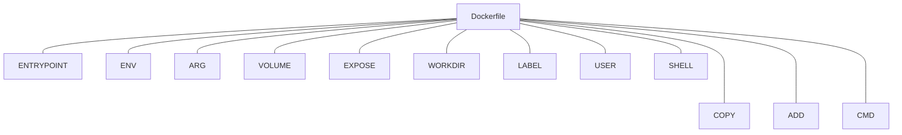

Docker是目前比较流行的轻量虚拟化方案，使用 Docker，可以让应用的部署、测试和分发都变得前所未有的高效和轻松！使用 Docker，可以让应用的部署、测试和分发都变得前所未有的高效和轻松！

<!-- more -->

* TOC
{:toc}
我之所以使用docker，主要是在于Docker的高效，与便于部署。尤其是在云服务器， 做到快速部署，而不必再从头做起。

# Docker介绍

**Docker** 使用 `Google` 公司推出的 [Go 语言](https://golang.google.cn/) 进行开发实现，基于 `Linux` 内核的 [cgroup](https://zh.wikipedia.org/wiki/Cgroups)，[namespace](https://en.wikipedia.org/wiki/Linux_namespaces)，以及 [OverlayFS](https://docs.docker.com/storage/storagedriver/overlayfs-driver/) 类的 [Union FS](https://en.wikipedia.org/wiki/Union_mount) 等技术，对进程进行封装隔离，属于 [操作系统层面的虚拟化技术](https://en.wikipedia.org/wiki/Operating-system-level_virtualization)。由于隔离的进程独立于宿主和其它的隔离的进程，因此也称其为容器。最初实现是基于 [LXC](https://linuxcontainers.org/lxc/introduction/)，从 `0.7` 版本以后开始去除 `LXC`，转而使用自行开发的 [libcontainer](https://github.com/docker/libcontainer)，从 `1.11` 版本开始，则进一步演进为使用 [runC](https://github.com/opencontainers/runc) 和 [containerd](https://github.com/containerd/containerd)。


 

**Docker** 在容器的基础上，进行了进一步的封装，从文件系统、网络互联到进程隔离等等，极大的简化了容器的创建和维护。使得 `Docker` 技术比虚拟机技术更为轻便、快捷。

下面的图片比较了 **Docker** 和传统虚拟化方式的不同之处。传统虚拟机技术是虚拟出一套硬件后，在其上运行一个完整操作系统，在该系统上再运行所需应用进程；而容器内的应用进程直接运行于宿主的内核，容器内没有自己的内核，而且也没有进行硬件虚拟。因此容器要比传统虚拟机更为轻便。


<center>传统虚拟化</center>


<center>Docker</center>

# 为什么选用Docker

作为一种新兴的虚拟化方式，`Docker` 跟传统的虚拟化方式相比具有众多的优势。

## 更高效的利用系统资源

由于容器不需要进行硬件虚拟以及运行完整操作系统等额外开销，`Docker` 对系统资源的利用率更高。无论是应用执行速度、内存损耗或者文件存储速度，都要比传统虚拟机技术更高效。因此，相比虚拟机技术，一个相同配置的主机，往往可以运行更多数量的应用。

## 更快速的启动时间

传统的虚拟机技术启动应用服务往往需要数分钟，而 `Docker` 容器应用，由于直接运行于宿主内核，无需启动完整的操作系统，因此可以做到秒级、甚至毫秒级的启动时间。大大的节约了开发、测试、部署的时间。

## 一致的运行环境

开发过程中一个常见的问题是环境一致性问题。由于开发环境、测试环境、生产环境不一致，导致有些 bug 并未在开发过程中被发现。而 `Docker` 的镜像提供了除内核外完整的运行时环境，确保了应用运行环境一致性，从而不会再出现 *「这段代码在我机器上没问题啊」* 这类问题。

## 持续交付和部署

对开发和运维（[DevOps](https://zh.wikipedia.org/wiki/DevOps)）人员来说，最希望的就是一次创建或配置，可以在任意地方正常运行。

使用 `Docker` 可以通过定制应用镜像来实现持续集成、持续交付、部署。开发人员可以通过 [Dockerfile](https://yeasy.gitbook.io/docker_practice/image/dockerfile) 来进行镜像构建，并结合 [持续集成(Continuous Integration)](https://en.wikipedia.org/wiki/Continuous_integration) 系统进行集成测试，而运维人员则可以直接在生产环境中快速部署该镜像，甚至结合 [持续部署(Continuous Delivery/Deployment)](https://en.wikipedia.org/wiki/Continuous_delivery) 系统进行自动部署。

而且使用 [`Dockerfile`](https://yeasy.gitbook.io/docker_practice/image/build) 使镜像构建透明化，不仅仅开发团队可以理解应用运行环境，也方便运维团队理解应用运行所需条件，帮助更好的生产环境中部署该镜像。

## 更轻松的迁移

由于 `Docker` 确保了执行环境的一致性，使得应用的迁移更加容易。`Docker` 可以在很多平台上运行，无论是物理机、虚拟机、公有云、私有云，甚至是笔记本，其运行结果是一致的。因此用户可以很轻易的将在一个平台上运行的应用，迁移到另一个平台上，而不用担心运行环境的变化导致应用无法正常运行的情况。

## 更轻松的维护和扩展

`Docker` 使用的分层存储以及镜像的技术，使得应用重复部分的复用更为容易，也使得应用的维护更新更加简单，基于基础镜像进一步扩展镜像也变得非常简单。此外，`Docker` 团队同各个开源项目团队一起维护了一大批高质量的 [官方镜像](https://hub.docker.com/search/?type=image&image_filter=official)，既可以直接在生产环境使用，又可以作为基础进一步定制，大大的降低了应用服务的镜像制作成本。

## 对比传统虚拟机总结

| 特性       | 容器               | 虚拟机      |
| :--------- | :----------------- | :---------- |
| 启动       | 秒级               | 分钟级      |
| 硬盘使用   | 一般为 `MB`        | 一般为 `GB` |
| 性能       | 接近原生           | 弱于        |
| 系统支持量 | 单机支持上千个容器 | 一般几十个  |


# 定制镜像

## 慎用docker commit

` docker diff webserver`可以查看container做的修改

使用docker commit将当前修改生成新的image

```
docker commit \
    --author "Tao Wang <twang2218@gmail.com>" \
    --message "修改了默认网页" \
    webserver \
    nginx:v2
sha256:07e33465974800ce65751acc279adc6ed2dc5ed4e0838f8b86f0c87aa1795214
```

使用docker commit，会导致image变得越来越臃肿，难以维护。

## 使用 Dockerfile 定制镜像

Dockerfile 是一个文本文件，其内包含了一条条的 **指令(Instruction)**，每一条指令构建一层，因此每一条指令的内容，就是描述该层应当如何构建。

FROM制定基础镜像

RUN执行命令，并完成当前层的commit

```
FROM debian:stretch

RUN set -x; buildDeps='gcc libc6-dev make wget' \
    && apt-get update \
    && apt-get install -y $buildDeps \
    && wget -O redis.tar.gz "http://download.redis.io/releases/redis-5.0.3.tar.gz" \
    && mkdir -p /usr/src/redis \
    && tar -xzf redis.tar.gz -C /usr/src/redis --strip-components=1 \
    && make -C /usr/src/redis \
    && make -C /usr/src/redis install \
    && rm -rf /var/lib/apt/lists/* \
    && rm redis.tar.gz \
    && rm -r /usr/src/redis \
    && apt-get purge -y --auto-remove $buildDeps
```

注意把冗余数据进行清理。很多人初学 Docker 制作出了很臃肿的镜像的原因之一，就是忘记了每一层构建的最后一定要清理掉无关文件。

docker build 构建镜像

```
docker build -t nginx:v3 .
Sending build context to Docker daemon 2.048 kB
Step 1 : FROM nginx
 ---> e43d811ce2f4
Step 2 : RUN echo '<h1>Hello, Docker!</h1>' > /usr/share/nginx/html/index.html
 ---> Running in 9cdc27646c7b
 ---> 44aa4490ce2c
Removing intermediate container 9cdc27646c7b
Successfully built 44aa4490ce2c
```


**容器中应用在前台执行和后台执行的问题**，这是初学者常出现的一个混淆。

Docker 不是虚拟机，容器中的应用都应该以前台执行，而不是像虚拟机、物理机里面那样，用 `systemd` 去启动后台服务，容器内没有后台服务的概念。

一些初学者将 `CMD` 写为：

`CMD service nginx start`

然后发现容器执行后就立即退出了。甚至在容器内去使用 `systemctl` 命令结果却发现根本执行不了。这就是因为没有搞明白前台、后台的概念，没有区分容器和虚拟机的差异，依旧在以传统虚拟机的角度去理解容器。

对于容器而言，其启动程序就是容器应用进程，容器就是为了主进程而存在的，主进程退出，容器就失去了存在的意义，从而退出，其它辅助进程不是它需要关心的东西。

而使用 `service nginx start` 命令，则是希望 upstart 来以后台守护进程形式启动 `nginx` 服务。而刚才说了 `CMD service nginx start` 会被理解为 `CMD [ "sh", "-c", "service nginx start"]`，因此主进程实际上是 `sh`。那么当 `service nginx start` 命令结束后，`sh` 也就结束了，`sh` 作为主进程退出了，自然就会令容器退出。

正确的做法是直接执行 `nginx` 可执行文件，并且要求以前台形式运行。比如：

` CMD ["nginx", "-g", "daemon off;"]`

### USER

指定用户名，实际要求用户名需要存在。

```
RUN groupadd -r redis && useradd -r -g redis redis
USER redis
RUN [ "redis-server" ]
```

### Template

```
ARG VERSION=1.0.0

FROM A:${VERSION} as builder

SHELL ["powershell", "-command"]

RUN echo

FROM B

ARG <name>[=<default value>]

LABEL <key>=<value> <key>=<value> <key>=<value> ...

COPY --from=builder /src/path /target/path

COPY --from=builder /file /file2 /target/path/

ENV <key>=<value> ...

USER <user>[:<group>]

USER <UID>[:<GID>]

ADD --chown=55:mygroup files* /somedir/

COPY [--chown=<user>:<group>] <src>... <dest>

EXPOSE <port> [<port>/<protocol>...]

VOLUME ["/data"]

ENTRYPOINT ["/bin/sh","-c"]

CMD ["executable","param1","param2"]

CMD [ "echo", "$HOME" ]

CMD [ "sh", "-c", "echo $HOME" ]

ONBUILD RUN echo "你把我当作基础镜像了" \
              && echo "构建当前镜像我不执行"

STOPSIGNAL signal

HEALTHCHECK --interval=5m --timeout=3s \
  CMD curl -f http://localhost/ || exit 1

WORKDIR /path/to/workdir
```




# Reference

- [Docker从入门到实践](https://yeasy.gitbook.io/docker_practice/)
- `Dockerfile` 官方文档：https://docs.docker.com/engine/reference/builder/
- `Dockerfile` 最佳实践文档：https://docs.docker.com/develop/develop-images/dockerfile_best-practices/
- `Docker` 官方镜像 `Dockerfile`：https://github.com/docker-library/docs
