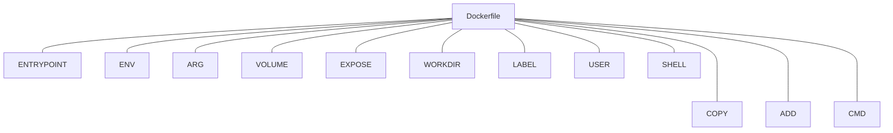

Docker是目前比较流行的轻量虚拟化方案，使用 Docker，可以让应用的部署、测试和分发都变得前所未有的高效和轻松！使用 Docker，可以让应用的部署、测试和分发都变得前所未有的高效和轻松！

<!-- more -->

* TOC
{:toc}
我之所以使用docker，主要是在于Docker的高效，与便于部署。尤其是在云服务器， 做到快速部署，而不必再从头做起。

# Docker介绍

**Docker** 使用 `Google` 公司推出的 [Go 语言](https://golang.google.cn/) 进行开发实现，基于 `Linux` 内核的 [cgroup](https://zh.wikipedia.org/wiki/Cgroups)，[namespace](https://en.wikipedia.org/wiki/Linux_namespaces)，以及 [OverlayFS](https://docs.docker.com/storage/storagedriver/overlayfs-driver/) 类的 [Union FS](https://en.wikipedia.org/wiki/Union_mount) 等技术，对进程进行封装隔离，属于 [操作系统层面的虚拟化技术](https://en.wikipedia.org/wiki/Operating-system-level_virtualization)。由于隔离的进程独立于宿主和其它的隔离的进程，因此也称其为容器。最初实现是基于 [LXC](https://linuxcontainers.org/lxc/introduction/)，从 `0.7` 版本以后开始去除 `LXC`，转而使用自行开发的 [libcontainer](https://github.com/docker/libcontainer)，从 `1.11` 版本开始，则进一步演进为使用 [runC](https://github.com/opencontainers/runc) 和 [containerd](https://github.com/containerd/containerd)。


**Docker** 在容器的基础上，进行了进一步的封装，从文件系统、网络互联到进程隔离等等，极大的简化了容器的创建和维护。使得 `Docker` 技术比虚拟机技术更为轻便、快捷。

下面的图片比较了 **Docker** 和传统虚拟化方式的不同之处。传统虚拟机技术是虚拟出一套硬件后，在其上运行一个完整操作系统，在该系统上再运行所需应用进程；而容器内的应用进程直接运行于宿主的内核，容器内没有自己的内核，而且也没有进行硬件虚拟。因此容器要比传统虚拟机更为轻便。


# 为什么选用Docker

作为一种新兴的虚拟化方式，`Docker` 跟传统的虚拟化方式相比具有众多的优势。

更高效的利用系统资源

由于容器不需要进行硬件虚拟以及运行完整操作系统等额外开销，`Docker` 对系统资源的利用率更高。无论是应用执行速度、内存损耗或者文件存储速度，都要比传统虚拟机技术更高效。因此，相比虚拟机技术，一个相同配置的主机，往往可以运行更多数量的应用。

**更快速的启动时间**

传统的虚拟机技术启动应用服务往往需要数分钟，而 `Docker` 容器应用，由于直接运行于宿主内核，无需启动完整的操作系统，因此可以做到秒级、甚至毫秒级的启动时间。大大的节约了开发、测试、部署的时间。

**一致的运行环境**

开发过程中一个常见的问题是环境一致性问题。由于开发环境、测试环境、生产环境不一致，导致有些 bug 并未在开发过程中被发现。而 `Docker` 的镜像提供了除内核外完整的运行时环境，确保了应用运行环境一致性，从而不会再出现 *「这段代码在我机器上没问题啊」* 这类问题。

**持续交付和部署**

对开发和运维（[DevOps](https://zh.wikipedia.org/wiki/DevOps)）人员来说，最希望的就是一次创建或配置，可以在任意地方正常运行。

使用 `Docker` 可以通过定制应用镜像来实现持续集成、持续交付、部署。开发人员可以通过 [Dockerfile](https://yeasy.gitbook.io/docker_practice/image/dockerfile) 来进行镜像构建，并结合 [持续集成(Continuous Integration)](https://en.wikipedia.org/wiki/Continuous_integration) 系统进行集成测试，而运维人员则可以直接在生产环境中快速部署该镜像，甚至结合 [持续部署(Continuous Delivery/Deployment)](https://en.wikipedia.org/wiki/Continuous_delivery) 系统进行自动部署。

而且使用 [`Dockerfile`](https://yeasy.gitbook.io/docker_practice/image/build) 使镜像构建透明化，不仅仅开发团队可以理解应用运行环境，也方便运维团队理解应用运行所需条件，帮助更好的生产环境中部署该镜像。

**更轻松的迁移**

由于 `Docker` 确保了执行环境的一致性，使得应用的迁移更加容易。`Docker` 可以在很多平台上运行，无论是物理机、虚拟机、公有云、私有云，甚至是笔记本，其运行结果是一致的。因此用户可以很轻易的将在一个平台上运行的应用，迁移到另一个平台上，而不用担心运行环境的变化导致应用无法正常运行的情况。

**更轻松的维护和扩展**

`Docker` 使用的分层存储以及镜像的技术，使得应用重复部分的复用更为容易，也使得应用的维护更新更加简单，基于基础镜像进一步扩展镜像也变得非常简单。此外，`Docker` 团队同各个开源项目团队一起维护了一大批高质量的 [官方镜像](https://hub.docker.com/search/?type=image&image_filter=official)，既可以直接在生产环境使用，又可以作为基础进一步定制，大大的降低了应用服务的镜像制作成本。

## 对比传统虚拟机总结

| 特性       | 容器               | 虚拟机      |
| :--------- | :----------------- | :---------- |
| 启动       | 秒级               | 分钟级      |
| 硬盘使用   | 一般为 `MB`        | 一般为 `GB` |
| 性能       | 接近原生           | 弱于        |
| 系统支持量 | 单机支持上千个容器 | 一般几十个  |

# Docker 基本操作

## 安装Docker

因为Docker历史原因， 存在多个版本， 需要确认是否需要历史版本，并做移除, 目前最新的docker 社区版本为docker-ce.

```sh
$ sudo apt-get remove docker \
               docker-engine \
               docker.io
```

由于 `apt` 源使用 HTTPS 以确保软件下载过程中不被篡改。因此，我们首先需要添加使用 HTTPS 传输的软件包以及 CA 证书。

```sh
$ sudo apt-get update

$ sudo apt-get install \
    apt-transport-https \
    ca-certificates \
    curl \
    gnupg \
    lsb-release
```

鉴于国内网络问题，强烈建议使用国内源，官方源请在注释中查看。

为了确认所下载软件包的合法性，需要添加软件源的 `GPG` 密钥。

```sh
$ curl -fsSL https://mirrors.aliyun.com/docker-ce/linux/ubuntu/gpg | sudo gpg --dearmor -o /usr/share/keyrings/docker-archive-keyring.gpg

# 官方源
# $ curl -fsSL https://download.docker.com/linux/ubuntu/gpg | sudo gpg --dearmor -o /usr/share/keyrings/docker-archive-keyring.gpg
```

然后，我们需要向 `sources.list` 中添加 Docker 软件源

```sh
$ echo \
  "deb [arch=amd64 signed-by=/usr/share/keyrings/docker-archive-keyring.gpg] https://mirrors.aliyun.com/docker-ce/linux/ubuntu \
  $(lsb_release -cs) stable" | sudo tee /etc/apt/sources.list.d/docker.list > /dev/null


# 官方源
# $ echo \
#   "deb [arch=amd64 signed-by=/usr/share/keyrings/docker-archive-keyring.gpg] https://download.docker.com/linux/ubuntu \
#   $(lsb_release -cs) stable" | sudo tee /etc/apt/sources.list.d/docker.list > /dev/null
```

> 以上命令会添加稳定版本的 Docker APT 镜像源，如果需要测试版本的 Docker 请将 stable 改为 test。

更新 apt 软件包缓存，并安装 `docker-ce`：

```sh
$ sudo apt-get update

$ sudo apt-get install docker-ce docker-ce-cli containerd.io
```

## 使用Docker

启动Docker 服务

```sh
$ sudo systemctl enable docker
$ sudo systemctl start docker
```

默认情况下，`docker` 命令会使用 [Unix socket](https://en.wikipedia.org/wiki/Unix_domain_socket) 与 Docker 引擎通讯。而只有 `root` 用户和 `docker` 组的用户才可以访问 Docker 引擎的 Unix socket。出于安全考虑，一般 Linux 系统上不会直接使用 `root` 用户。因此，更好地做法是将需要使用 `docker` 的用户加入 `docker` 用户组。

建立 `docker` 组：

```sh
$ sudo groupadd docker
```

将当前用户加入 `docker` 组：

```sh
$ sudo usermod -aG docker $USER
```

退出当前终端并重新登录，使用户组生效。

测试是否可以使用docker：

```sh
$ docker run --rm hello-world

Unable to find image 'hello-world:latest' locally
latest: Pulling from library/hello-world
b8dfde127a29: Pull complete
Digest: sha256:308866a43596e83578c7dfa15e27a73011bdd402185a84c5cd7f32a88b501a24
Status: Downloaded newer image for hello-world:latest

Hello from Docker!
This message shows that your installation appears to be working correctly.

To generate this message, Docker took the following steps:
 1. The Docker client contacted the Docker daemon.
 2. The Docker daemon pulled the "hello-world" image from the Docker Hub.
    (amd64)
 3. The Docker daemon created a new container from that image which runs the
    executable that produces the output you are currently reading.
 4. The Docker daemon streamed that output to the Docker client, which sent it
    to your terminal.

To try something more ambitious, you can run an Ubuntu container with:
 $ docker run -it ubuntu bash

Share images, automate workflows, and more with a free Docker ID:
 https://hub.docker.com/

For more examples and ideas, visit:
 https://docs.docker.com/get-started/
```

## 镜像加速

国内从 Docker Hub 拉取镜像有时会遇到困难，此时可以配置镜像加速器。国内很多云服务商都提供了国内加速器服务，例如：

- [阿里云加速器(点击管理控制台 -> 登录账号(淘宝账号) -> 右侧镜像工具 -> 镜像加速器 -> 复制加速器地址)](https://www.aliyun.com/product/acr?source=5176.11533457&userCode=8lx5zmtu)
- [网易云加速器 `https://hub-mirror.c.163.com`](https://www.163yun.com/help/documents/56918246390157312)
- [百度云加速器 `https://mirror.baidubce.com`](https://cloud.baidu.com/doc/CCE/s/Yjxppt74z#使用dockerhub加速器)

**由于镜像服务可能出现宕机，建议同时配置多个镜像。各个镜像站测试结果请到** [**docker-practice/docker-registry-cn-mirror-test**](https://github.com/docker-practice/docker-registry-cn-mirror-test/actions) **查看。**

> 国内各大云服务商（腾讯云、阿里云、百度云）均提供了 Docker 镜像加速服务，建议根据运行 Docker 的云平台选择对应的镜像加速服务，具体请参考本页最后一小节。

本节我们以 [网易云](https://www.163yun.com/) 镜像服务 `https://hub-mirror.c.163.com` 为例进行介绍。

请首先执行以下命令，查看是否在 `docker.service` 文件中配置过镜像地址。

```sh
$ systemctl cat docker | grep '\-\-registry\-mirror'
```

如果该命令有输出，那么请执行 `$ systemctl cat docker` 查看 `ExecStart=` 出现的位置，修改对应的文件内容去掉 `--registry-mirror` 参数及其值，并按接下来的步骤进行配置。

如果以上命令没有任何输出，那么就可以在 `/etc/docker/daemon.json` 中写入如下内容（如果文件不存在请新建该文件）：

```json
{
  "registry-mirrors": [
    "https://hub-mirror.c.163.com",
    "https://mirror.baidubce.com"
  ]
}
```

之后重新启动服务。

```sh
$ sudo systemctl daemon-reload
$ sudo systemctl restart docker
```

## 使用镜像

### 获取镜像

```sh
$ docker pull [选项] [Docker Registry 地址[:端口号]/]仓库名[:标签]
```

### 运行docker

```
docker run [可选参数] images [镜像名称][版本号]/[镜像id]
```

`docker run` 就是运行容器的命令，具体格式我们会在 [容器]() 一节进行详细讲解，我们这里简要的说明一下上面用到的参数。

- `-it`：这是两个参数，一个是 `-i`：交互式操作，一个是 `-t` 终端。我们这里打算进入 `bash` 执行一些命令并查看返回结果，因此我们需要交互式终端。
- `--rm`：这个参数是说容器退出后随之将其删除。默认情况下，为了排障需求，退出的容器并不会立即删除，除非手动 `docker rm`。我们这里只是随便执行个命令，看看结果，不需要排障和保留结果，因此使用 `--rm` 可以避免浪费空间。
- `ubuntu:18.04`：这是指用 `ubuntu:18.04` 镜像为基础来启动容器。
- `bash`：放在镜像名后的是 **命令**，这里我们希望有个交互式 Shell，因此用的是 `bash`。

```sh
$ docker run -it --rm ubuntu:18.04 bash

root@e7009c6ce357:/# cat /etc/os-release
NAME="Ubuntu"
VERSION="18.04.1 LTS (Bionic Beaver)"
ID=ubuntu
ID_LIKE=debian
PRETTY_NAME="Ubuntu 18.04.1 LTS"
VERSION_ID="18.04"
HOME_URL="https://www.ubuntu.com/"
SUPPORT_URL="https://help.ubuntu.com/"
BUG_REPORT_URL="https://bugs.launchpad.net/ubuntu/"
PRIVACY_POLICY_URL="https://www.ubuntu.com/legal/terms-and-policies/privacy-policy"
VERSION_CODENAME=bionic
UBUNTU_CODENAME=bionic
```

### 列出本地镜像

```sh
$ docker image ls
REPOSITORY           TAG                 IMAGE ID            CREATED             SIZE
redis                latest              5f515359c7f8        5 days ago          183 MB
nginx                latest              05a60462f8ba        5 days ago          181 MB
mongo                3.2                 fe9198c04d62        5 days ago          342 MB
<none>               <none>              00285df0df87        5 days ago          342 MB
ubuntu               18.04               329ed837d508        3 days ago          63.3MB
ubuntu               bionic              329ed837d508        3 days ago          63.3MB
```

### 镜像存储信息

```sh
$ docker system df

TYPE                TOTAL               ACTIVE              SIZE                RECLAIMABLE
Images              24                  0                   1.992GB             1.992GB (100%)
Containers          1                   0                   62.82MB             62.82MB (100%)
Local Volumes       9                   0                   652.2MB             652.2MB (100%)
Build Cache                                                 0B                  0B

## 格式化输出
$ docker image ls --format "table {{.ID}}\t{{.Repository}}\t{{.Tag}}"
IMAGE ID            REPOSITORY          TAG
5f515359c7f8        redis               latest
05a60462f8ba        nginx               latest
fe9198c04d62        mongo               3.2
00285df0df87        <none>              <none>
329ed837d508        ubuntu              18.04
329ed837d508        ubuntu              bionic

```

### 删除本地镜像

如果要删除本地的镜像，可以使用 `docker image rm` 命令，其格式为：

```sh
$ docker image rm [选项] <镜像1> [<镜像2> ...]
```

`数据卷` 是一个可供一个或多个容器使用的特殊目录，它绕过 UnionFS，可以提供很多有用的特性：

-   `数据卷` 可以在容器之间共享和重用
-   对 `数据卷` 的修改会立马生效
-   对 `数据卷` 的更新，不会影响镜像
-  `数据卷` 默认会一直存在，即使容器被删除
> 注意：`数据卷` 的使用，类似于 Linux 下对目录或文件进行 mount，镜像中的被指定为挂载点的目录中的文件会复制到数据卷中（仅数据卷为空时会复制）。

## 映射文件

### 创建一个数据卷

```sh
$ docker volume create my-vol
```

**查看所有的 `数据卷`**

```sh
$ docker volume ls

DRIVER              VOLUME NAME
local               my-vol
```

在主机里使用以下命令可以查看指定 `数据卷` 的信息
```sh
$ docker volume inspect my-vol
[
​    {
​        "Driver": "local",
​        "Labels": {},
​        "Mountpoint": "/var/lib/docker/volumes/my-vol/_data",
​        "Name": "my-vol",
​        "Options": {},
​        "Scope": "local"
​    }
]
```

**启动一个挂载数据卷的容器**

在用 `docker run` 命令的时候，使用 `--mount` 标记来将 `数据卷` 挂载到容器里。在一次 `docker run` 中可以挂载多个 `数据卷`。

下面创建一个名为 `web` 的容器，并加载一个 `数据卷` 到容器的 `/usr/share/nginx/html` 目录。
```sh
$ docker run -d -P \
​    --name web \
​    \# -v my-vol:/usr/share/nginx/html \
​    --mount source=my-vol,target=/usr/share/nginx/html \
​    nginx:alpine
```

**查看数据卷的具体信息

在主机里使用以下命令可以查看 `web` 容器的信息
```sh
$ docker inspect web

`数据卷` 信息在 "Mounts" Key 下面
"Mounts": [
​    {
​        "Type": "volume",
​        "Name": "my-vol",
​        "Source": "/var/lib/docker/volumes/my-vol/_data",
​        "Destination": "/usr/share/nginx/html",
​        "Driver": "local",
​        "Mode": "",
​        "RW": true,
​        "Propagation": ""
​    }
],
```

** 删除数据卷
```sh
$ docker volume rm my-vol
```
`数据卷` 是被设计用来持久化数据的，它的生命周期独立于容器，Docker 不会在容器被删除后自动删除 `数据卷`，并且也不存在垃圾回收这样的机制来处理没有任何容器引用的 `数据卷`。如果需要在删除容器的同时移除数据卷。可以在删除容器的时候使用 `docker rm -v` 这个命令。

无主的数据卷可能会占据很多空间，要清理请使用以下命令
```sh
$ docker volume prune
```

### 挂载主机目录

**挂载一个主机目录作为数据卷

使用 `--mount` 标记可以指定挂载一个本地主机的目录到容器中去。
```sh
$ docker run -d -P \
​    --name web \
​    \# -v /src/webapp:/usr/share/nginx/html \
​    --mount type=bind,source=/src/webapp,target=/usr/share/nginx/html \
​    nginx:alpine
```
上面的命令加载主机的 `/src/webapp` 目录到容器的 `/usr/share/nginx/html`目录。这个功能在进行测试的时候十分方便，比如用户可以放置一些程序到本地目录中，来查看容器是否正常工作。本地目录的路径必须是绝对路径，以前使用 `-v` 参数时如果本地目录不存在 Docker 会自动为你创建一个文件夹，现在使用 `--mount` 参数时如果本地目录不存在，Docker 会报错。

Docker 挂载主机目录的默认权限是 `读写`，用户也可以通过增加 `readonly` 指定为 `只读`。
```sh
$ docker run -d -P \
​    --name web \
​    \# -v /src/webapp:/usr/share/nginx/html:ro \
​    --mount type=bind,source=/src/webapp,target=/usr/share/nginx/html,readonly \
​    nginx:alpine
```
加了 `readonly` 之后，就挂载为 `只读` 了。如果你在容器内 `/usr/share/nginx/html` 目录新建文件，会显示如下错误
```
/usr/share/nginx/html # touch new.txt
touch: new.txt: Read-only file system
```
** 查看数据卷的具体信息

在主机里使用以下命令可以查看 `web` 容器的信息
```sh
$ docker inspect web
```
`挂载主机目录` 的配置信息在 "Mounts" Key 下面
```
"Mounts": [
​    {
​        "Type": "bind",
​        "Source": "/src/webapp",
​        "Destination": "/usr/share/nginx/html",
​        "Mode": "",
​        "RW": true,
​        "Propagation": "rprivate"
​    }
],
```

** 挂载一个本地主机文件作为数据卷

`--mount` 标记也可以从主机挂载单个文件到容器中
```sh
$ docker run --rm -it \
   \# -v $HOME/.bash_history:/root/.bash_history \
   --mount ype=bind,source=$HOME/.bash_history,target=/root/.bash_history \
   ubuntu:18.04 \
   bash
root@2affd44b4667:/# history
1  ls
2  diskutil list
```
这样就可以记录在容器输入过的命令了。


## 操作容器

```sh
docker run [OPTIONS] IMAGE [COMMAND] [ARG...]
```

## Options

| Name, shorthand                                              | Default   | Description                                                  |
| ------------------------------------------------------------ | --------- | ------------------------------------------------------------ |
| [`--add-host`](https://docs.docker.com/engine/reference/commandline/run/#add-host) |           | Add a custom host-to-IP mapping (host:ip)                    |
| `--annotation`                                               |           | [**API 1.43+**](https://docs.docker.com/engine/api/v1.43/) Add an annotation to the container (passed through to the OCI runtime) |
| [`--attach`](https://docs.docker.com/engine/reference/commandline/run/#attach) , [`-a`](https://docs.docker.com/engine/reference/commandline/run/#attach) |           | Attach to STDIN, STDOUT or STDERR                            |
| `--blkio-weight`                                             |           | Block IO (relative weight), between 10 and 1000, or 0 to disable (default 0) |
| `--blkio-weight-device`                                      |           | Block IO weight (relative device weight)                     |
| `--cap-add`                                                  |           | Add Linux capabilities                                       |
| `--cap-drop`                                                 |           | Drop Linux capabilities                                      |
| `--cgroup-parent`                                            |           | Optional parent cgroup for the container                     |
| `--cgroupns`                                                 |           | [**API 1.41+**](https://docs.docker.com/engine/api/v1.41/) Cgroup namespace to use (host\|private) ‘host’: Run the container in the Docker host’s cgroup namespace ‘private’: Run the container in its own private cgroup namespace ‘’: Use the cgroup namespace as configured by the default-cgroupns-mode option on the daemon (default) |
| [`--cidfile`](https://docs.docker.com/engine/reference/commandline/run/#cidfile) |           | Write the container ID to the file                           |
| `--cpu-count`                                                |           | CPU count (Windows only)                                     |
| `--cpu-percent`                                              |           | CPU percent (Windows only)                                   |
| `--cpu-period`                                               |           | Limit CPU CFS (Completely Fair Scheduler) period             |
| `--cpu-quota`                                                |           | Limit CPU CFS (Completely Fair Scheduler) quota              |
| `--cpu-rt-period`                                            |           | Limit CPU real-time period in microseconds                   |
| `--cpu-rt-runtime`                                           |           | Limit CPU real-time runtime in microseconds                  |
| `--cpu-shares` , `-c`                                        |           | CPU shares (relative weight)                                 |
| `--cpus`                                                     |           | Number of CPUs                                               |
| `--cpuset-cpus`                                              |           | CPUs in which to allow execution (0-3, 0,1)                  |
| `--cpuset-mems`                                              |           | MEMs in which to allow execution (0-3, 0,1)                  |
| `--detach` , `-d`                                            |           | Run container in background and print container ID           |
| `--detach-keys`                                              |           | Override the key sequence for detaching a container          |
| [`--device`](https://docs.docker.com/engine/reference/commandline/run/#device) |           | Add a host device to the container                           |
| [`--device-cgroup-rule`](https://docs.docker.com/engine/reference/commandline/run/#device-cgroup-rule) |           | Add a rule to the cgroup allowed devices list                |
| `--device-read-bps`                                          |           | Limit read rate (bytes per second) from a device             |
| `--device-read-iops`                                         |           | Limit read rate (IO per second) from a device                |
| `--device-write-bps`                                         |           | Limit write rate (bytes per second) to a device              |
| `--device-write-iops`                                        |           | Limit write rate (IO per second) to a device                 |
| `--disable-content-trust`                                    | `true`    | Skip image verification                                      |
| `--dns`                                                      |           | Set custom DNS servers                                       |
| `--dns-option`                                               |           | Set DNS options                                              |
| `--dns-search`                                               |           | Set custom DNS search domains                                |
| `--domainname`                                               |           | Container NIS domain name                                    |
| `--entrypoint`                                               |           | Overwrite the default ENTRYPOINT of the image                |
| [`--env`](https://docs.docker.com/engine/reference/commandline/run/#env) , [`-e`](https://docs.docker.com/engine/reference/commandline/run/#env) |           | Set environment variables                                    |
| `--env-file`                                                 |           | Read in a file of environment variables                      |
| `--expose`                                                   |           | Expose a port or a range of ports                            |
| [`--gpus`](https://docs.docker.com/engine/reference/commandline/run/#gpus) |           | [**API 1.40+**](https://docs.docker.com/engine/api/v1.40/) GPU devices to add to the container (‘all’ to pass all GPUs) |
| `--group-add`                                                |           | Add additional groups to join                                |
| `--health-cmd`                                               |           | Command to run to check health                               |
| `--health-interval`                                          |           | Time between running the check (ms\|s\|m\|h) (default 0s)    |
| `--health-retries`                                           |           | Consecutive failures needed to report unhealthy              |
| `--health-start-period`                                      |           | Start period for the container to initialize before starting health-retries countdown (ms\|s\|m\|h) (default 0s) |
| `--health-timeout`                                           |           | Maximum time to allow one check to run (ms\|s\|m\|h) (default 0s) |
| `--help`                                                     |           | Print usage                                                  |
| `--hostname` , `-h`                                          |           | Container host name                                          |
| `--init`                                                     |           | Run an init inside the container that forwards signals and reaps processes |
| `--interactive` , `-i`                                       |           | Keep STDIN open even if not attached                         |
| `--io-maxbandwidth`                                          |           | Maximum IO bandwidth limit for the system drive (Windows only) |
| `--io-maxiops`                                               |           | Maximum IOps limit for the system drive (Windows only)       |
| `--ip`                                                       |           | IPv4 address (e.g., 172.30.100.104)                          |
| `--ip6`                                                      |           | IPv6 address (e.g., 2001:db8::33)                            |
| `--ipc`                                                      |           | IPC mode to use                                              |
| [`--isolation`](https://docs.docker.com/engine/reference/commandline/run/#isolation) |           | Container isolation technology                               |
| `--kernel-memory`                                            |           | Kernel memory limit                                          |
| [`--label`](https://docs.docker.com/engine/reference/commandline/run/#label) , [`-l`](https://docs.docker.com/engine/reference/commandline/run/#label) |           | Set meta data on a container                                 |
| `--label-file`                                               |           | Read in a line delimited file of labels                      |
| `--link`                                                     |           | Add link to another container                                |
| `--link-local-ip`                                            |           | Container IPv4/IPv6 link-local addresses                     |
| `--log-driver`                                               |           | Logging driver for the container                             |
| `--log-opt`                                                  |           | Log driver options                                           |
| `--mac-address`                                              |           | Container MAC address (e.g., 92:d0:c6:0a:29:33)              |
| [`--memory`](https://docs.docker.com/engine/reference/commandline/run/#memory) , [`-m`](https://docs.docker.com/engine/reference/commandline/run/#memory) |           | Memory limit                                                 |
| `--memory-reservation`                                       |           | Memory soft limit                                            |
| `--memory-swap`                                              |           | Swap limit equal to memory plus swap: ‘-1’ to enable unlimited swap |
| `--memory-swappiness`                                        | `-1`      | Tune container memory swappiness (0 to 100)                  |
| [`--mount`](https://docs.docker.com/engine/reference/commandline/run/#mount) |           | Attach a filesystem mount to the container                   |
| [`--name`](https://docs.docker.com/engine/reference/commandline/run/#name) |           | Assign a name to the container                               |
| [`--network`](https://docs.docker.com/engine/reference/commandline/run/#network) |           | Connect a container to a network                             |
| `--network-alias`                                            |           | Add network-scoped alias for the container                   |
| `--no-healthcheck`                                           |           | Disable any container-specified HEALTHCHECK                  |
| `--oom-kill-disable`                                         |           | Disable OOM Killer                                           |
| `--oom-score-adj`                                            |           | Tune host’s OOM preferences (-1000 to 1000)                  |
| `--pid`                                                      |           | PID namespace to use                                         |
| `--pids-limit`                                               |           | Tune container pids limit (set -1 for unlimited)             |
| `--platform`                                                 |           | Set platform if server is multi-platform capable             |
| [`--privileged`](https://docs.docker.com/engine/reference/commandline/run/#privileged) |           | Give extended privileges to this container                   |
| [`--publish`](https://docs.docker.com/engine/reference/commandline/run/#publish) , [`-p`](https://docs.docker.com/engine/reference/commandline/run/#publish) |           | Publish a container’s port(s) to the host                    |
| `--publish-all` , `-P`                                       |           | Publish all exposed ports to random ports                    |
| [`--pull`](https://docs.docker.com/engine/reference/commandline/run/#pull) | `missing` | Pull image before running (`always`, `missing`, `never`)     |
| `--quiet` , `-q`                                             |           | Suppress the pull output                                     |
| [`--read-only`](https://docs.docker.com/engine/reference/commandline/run/#read-only) |           | Mount the container’s root filesystem as read only           |
| [`--restart`](https://docs.docker.com/engine/reference/commandline/run/#restart) | `no`      | Restart policy to apply when a container exits               |
| `--rm`                                                       |           | Automatically remove the container when it exits             |
| `--runtime`                                                  |           | Runtime to use for this container                            |
| [`--security-opt`](https://docs.docker.com/engine/reference/commandline/run/#security-opt) |           | Security Options                                             |
| `--shm-size`                                                 |           | Size of /dev/shm                                             |
| `--sig-proxy`                                                | `true`    | Proxy received signals to the process                        |
| [`--stop-signal`](https://docs.docker.com/engine/reference/commandline/run/#stop-signal) |           | Signal to stop the container                                 |
| [`--stop-timeout`](https://docs.docker.com/engine/reference/commandline/run/#stop-timeout) |           | Timeout (in seconds) to stop a container                     |
| [`--storage-opt`](https://docs.docker.com/engine/reference/commandline/run/#storage-opt) |           | Storage driver options for the container                     |
| [`--sysctl`](https://docs.docker.com/engine/reference/commandline/run/#sysctl) |           | Sysctl options                                               |
| [`--tmpfs`](https://docs.docker.com/engine/reference/commandline/run/#tmpfs) |           | Mount a tmpfs directory                                      |
| `--tty` , `-t`                                               |           | Allocate a pseudo-TTY                                        |
| [`--ulimit`](https://docs.docker.com/engine/reference/commandline/run/#ulimit) |           | Ulimit options                                               |
| `--user` , `-u`                                              |           | Username or UID (format: <name\|uid>[:<group\|gid>])         |
| `--userns`                                                   |           | User namespace to use                                        |
| `--uts`                                                      |           | UTS namespace to use                                         |
| [`--volume`](https://docs.docker.com/engine/reference/commandline/run/#volume) , [`-v`](https://docs.docker.com/engine/reference/commandline/run/#volume) |           | Bind mount a volume                                          |
| `--volume-driver`                                            |           | Optional volume driver for the container                     |
| [`--volumes-from`](https://docs.docker.com/engine/reference/commandline/run/#volumes-from) |           | Mount volumes from the specified container(s)                |
| [`--workdir`](https://docs.docker.com/engine/reference/commandline/run/#workdir) , [`-w`](https://docs.docker.com/engine/reference/commandline/run/#workdir) |           | Working directory inside the container                       |

### 进入容器

在使用 -d 参数时，容器启动后会进入后台。
某些时候需要进入容器进行操作，包括使用 docker attach 命令或 docker exec 命令(从stdin退出，是否导致容器退出），推荐大家使用 docker exec 命令，原因会在下面说明。
attach 命令
下面示例如何使用 docker attach 命令。
```sh
# create and run container
$ docker run -dit ubuntu
243c32535da7d142fb0e6df616a3c3ada0b8ab417937c853a9e1c251f499f550
# check container
$ docker container ls
CONTAINER ID        IMAGE               COMMAND             CREATED             STATUS              PORTS               NAMES
243c32535da7        ubuntu:latest       "/bin/bash"         18 seconds ago      Up 17 seconds                           nostalgic_hypatia
# attach to container
$ docker attach 243c
root@243c32535da7:/#
```
> 注意： 如果从这个 stdin 中 exit，会导致容器的停止。

exec 命令
-i -t 参数
docker exec 后边可以跟多个参数，这里主要说明 -i -t 参数。
只用 -i 参数时，由于没有分配伪终端，界面没有我们熟悉的 Linux 命令提示符，但命令执行结果仍然可以返回。
当 -i -t 参数一起使用时，则可以看到我们熟悉的 Linux 命令提示符。
```sh
$ docker run -dit ubuntu
69d137adef7a8a689cbcb059e94da5489d3cddd240ff675c640c8d96e84fe1f6

$ docker container ls
CONTAINER ID        IMAGE               COMMAND             CREATED             STATUS              PORTS               NAMES
69d137adef7a        ubuntu:latest       "/bin/bash"         18 seconds ago      Up 17 seconds                           zealous_swirles

$ docker exec -i 69d1 bash
ls
bin
boot
dev
...

$ docker exec -it 69d1 bash
root@69d137adef7a:/#
```
***如果从这个 stdin 中 exit，不会导致容器的停止***。这就是为什么推荐大家使用 docker exec 的原因。
更多参数说明请使用 docker exec --help 查看。

**制定用户信息**

第一次用run创建并启动容器，运行命令

　　docker run -it -u user_name --name container_name -d image_name /bin/bash

之后可以用exec进入容器，运行命令

　　docker exec -it -u user_name container_name /bin/bash

还可以指定主机名

　　--hostname user_hostname

指定网络

　　--network=user_network

指定ip

　　--ip 172.18.0.3


### 删除容器
可以使用 docker container rm 来删除一个处于终止状态的容器。例如
```sh
$ docker container rm trusting_newton
trusting_newton
```
如果要删除一个运行中的容器，可以添加 -f 参数。Docker 会发送 SIGKILL 信号给容器。
清理所有处于终止状态的容器
用 `docker container ls -a` 命令可以查看所有已经创建的包括终止状态的容器，如果数量太多要一个个删除可能会很麻烦，用下面的命令可以清理掉所有处于终止状态的容器。
```sh
$ docker container prune
```

### GPU Containers

### Access an NVIDIA GPU

The `--gpus` flag allows you to access NVIDIA GPU resources. First you need to install the [nvidia-container-runtime](https://nvidia.github.io/nvidia-container-runtime/).

Read [Specify a container’s resources](https://docs.docker.com/config/containers/resource_constraints/) for more information.

To use `--gpus`, specify which GPUs (or all) to use. If you provide no value, Docker uses all available GPUs. The example below exposes all available GPUs.

```
$ docker run -it --rm --gpus all ubuntu nvidia-smi
```

Use the `device` option to specify GPUs. The example below exposes a specific GPU.

```
$ docker run -it --rm --gpus device=GPU-3a23c669-1f69-c64e-cf85-44e9b07e7a2a ubuntu nvidia-smi
```

The example below exposes the first and third GPUs.

```
$ docker run -it --rm --gpus '"device=0,2"' nvidia-smi
```


## 使用网络

Docker 允许通过外部访问容器或容器互联的方式来提供网络服务。

### 外部访问容器
容器中可以运行一些网络应用，要让外部也可以访问这些应用，可以通过 -P 或 -p 参数来指定端口映射。
当使用 -P 标记时，Docker 会随机映射一个端口到内部容器开放的网络端口。
使用 `docker container ls `可以看到，本地主机的 32768 被映射到了容器的 80 端口。此时访问本机的 32768 端口即可访问容器内 NGINX 默认页面。
```sh
$ docker run -d -P nginx:alpine
$ docker container ls -l
CONTAINER ID        IMAGE               COMMAND                  CREATED             STATUS              PORTS                   NAMES
fae320d08268        nginx:alpine        "/docker-entrypoint.…"   24 seconds ago      Up 20 seconds       0.0.0.0:32768->80/tcp   bold_mcnulty
```
同样的，可以通过 docker logs 命令来查看访问记录。
```sh
$ docker logs fa
172.17.0.1 - - [25/Aug/2020:08:34:04 +0000] "GET / HTTP/1.1" 200 612 "-" "Mozilla/5.0 (Windows NT 10.0; Win64; x64; rv:80.0) Gecko/20100101 Firefox/80.0" "-"
```

-p 则可以指定要映射的端口，并且，在一个指定端口上只可以绑定一个容器。
支持的格式有 ip:hostPort:containerPort | ip::containerPort | hostPort:containerPort。

映射所有接口地址
使用 hostPort:containerPort 格式本地的 80 端口映射到容器的 80 端口，可以执行
```sh
$ docker run -d -p 80:80 nginx:alpine
```
此时默认会绑定本地所有接口上的所有地址。
映射到指定地址的指定端口
可以使用 ip:hostPort:containerPort 格式指定映射使用一个特定地址，比如 localhost 地址 127.0.0.1
```sh
$ docker run -d -p 127.0.0.1:80:80 nginx:alpine
```
映射到指定地址的任意端口
使用 ip::containerPort 绑定 localhost 的任意端口到容器的 80 端口，本地主机会自动分配一个端口。
```sh
$ docker run -d -p 127.0.0.1::80 nginx:alpine
```
还可以使用 udp 标记来指定 udp 端口
```sh
$ docker run -d -p 127.0.0.1:80:80/udp nginx:alpine
```
查看映射端口配置
使用 docker port 来查看当前映射的端口配置，也可以查看到绑定的地址
```sh
$ docker port fa 80
0.0.0.0:32768
```
注意：
容器有自己的内部网络和 ip 地址（使用 docker inspect 查看，Docker 还可以有一个可变的网络配置。）
-p 标记可以多次使用来绑定多个端口
例如
```sh
$ docker run -d \
    -p 80:80 \
    -p 443:443 \
    nginx:alpine
```

### 定制镜像

## 慎用docker commit

` docker diff webserver`可以查看container做的修改

使用docker commit将当前修改生成新的image

```sh
docker commit \
    --author "Tao Wang <twang2218@gmail.com>" \
    --message "修改了默认网页" \
    webserver \
    nginx:v2
sha256:07e33465974800ce65751acc279adc6ed2dc5ed4e0838f8b86f0c87aa1795214
```

使用docker commit，会导致image变得越来越臃肿，难以维护。

## 使用 Dockerfile 定制镜像

Dockerfile 是一个文本文件，其内包含了一条条的 **指令(Instruction)**，每一条指令构建一层，因此每一条指令的内容，就是描述该层应当如何构建。

FROM制定基础镜像

RUN执行命令，并完成当前层的commit

```
FROM debian:stretch

RUN set -x; buildDeps='gcc libc6-dev make wget' \
    && apt-get update \
    && apt-get install -y $buildDeps \
    && wget -O redis.tar.gz "http://download.redis.io/releases/redis-5.0.3.tar.gz" \
    && mkdir -p /usr/src/redis \
    && tar -xzf redis.tar.gz -C /usr/src/redis --strip-components=1 \
    && make -C /usr/src/redis \
    && make -C /usr/src/redis install \
    && rm -rf /var/lib/apt/lists/* \
    && rm redis.tar.gz \
    && rm -r /usr/src/redis \
    && apt-get purge -y --auto-remove $buildDeps
```

注意把冗余数据进行清理。很多人初学 Docker 制作出了很臃肿的镜像的原因之一，就是忘记了每一层构建的最后一定要清理掉无关文件。

docker build 构建镜像

```
docker build -t nginx:v3 .
Sending build context to Docker daemon 2.048 kB
Step 1 : FROM nginx
 ---> e43d811ce2f4
Step 2 : RUN echo '<h1>Hello, Docker!</h1>' > /usr/share/nginx/html/index.html
 ---> Running in 9cdc27646c7b
 ---> 44aa4490ce2c
Removing intermediate container 9cdc27646c7b
Successfully built 44aa4490ce2c
```


**容器中应用在前台执行和后台执行的问题**，这是初学者常出现的一个混淆。

Docker 不是虚拟机，容器中的应用都应该以前台执行，而不是像虚拟机、物理机里面那样，用 `systemd` 去启动后台服务，容器内没有后台服务的概念。

一些初学者将 `CMD` 写为：

`CMD service nginx start`

然后发现容器执行后就立即退出了。甚至在容器内去使用 `systemctl` 命令结果却发现根本执行不了。这就是因为没有搞明白前台、后台的概念，没有区分容器和虚拟机的差异，依旧在以传统虚拟机的角度去理解容器。

对于容器而言，其启动程序就是容器应用进程，容器就是为了主进程而存在的，主进程退出，容器就失去了存在的意义，从而退出，其它辅助进程不是它需要关心的东西。

而使用 `service nginx start` 命令，则是希望 upstart 来以后台守护进程形式启动 `nginx` 服务。而刚才说了 `CMD service nginx start` 会被理解为 `CMD [ "sh", "-c", "service nginx start"]`，因此主进程实际上是 `sh`。那么当 `service nginx start` 命令结束后，`sh` 也就结束了，`sh` 作为主进程退出了，自然就会令容器退出。

正确的做法是直接执行 `nginx` 可执行文件，并且要求以前台形式运行。比如：

` CMD ["nginx", "-g", "daemon off;"]`

### USER

指定用户名，实际要求用户名需要存在。

```
RUN groupadd -r redis && useradd -r -g redis redis
USER redis
RUN [ "redis-server" ]
```

### Template

```
ARG VERSION=1.0.0

FROM A:${VERSION} as builder

SHELL ["powershell", "-command"]

RUN echo

FROM B

ARG <name>[=<default value>]

LABEL <key>=<value> <key>=<value> <key>=<value> ...

COPY --from=builder /src/path /target/path

COPY --from=builder /file /file2 /target/path/

ENV <key>=<value> ...

USER <user>[:<group>]

USER <UID>[:<GID>]

ADD --chown=55:mygroup files* /somedir/

COPY [--chown=<user>:<group>] <src>... <dest>

EXPOSE <port> [<port>/<protocol>...]

VOLUME ["/data"]

ENTRYPOINT ["/bin/sh","-c"]

CMD ["executable","param1","param2"]

CMD [ "echo", "$HOME" ]

CMD [ "sh", "-c", "echo $HOME" ]

ONBUILD RUN echo "你把我当作基础镜像了" \
              && echo "构建当前镜像我不执行"

STOPSIGNAL signal

HEALTHCHECK --interval=5m --timeout=3s \
  CMD curl -f http://localhost/ || exit 1

WORKDIR /path/to/workdir
```




# Reference

- [Docker从入门到实践](https://yeasy.gitbook.io/docker_practice/)
- `Dockerfile` 官方文档：https://docs.docker.com/engine/reference/builder/
- `Dockerfile` 最佳实践文档：https://docs.docker.com/develop/develop-images/dockerfile_best-practices/
- `Docker` 官方镜像 `Dockerfile`：https://github.com/docker-library/docs
