在最近深度学习非常火爆， 尤其是chatgpt问世后，让人一改对AI/人工智能的死板印象。因为平时工作或是兴趣使然，会在Ubuntu学习或是验证下网络模型，所以摘录汇总在ubuntu上搭建深度学习开发环境。

<!-- more -->

* TOC
{:toc}
## **1. 硬件篇**

### **1.1 工作站配置选型**

秀一下知乎稚晖君的设备， 我等屌丝只能望洋兴叹了。

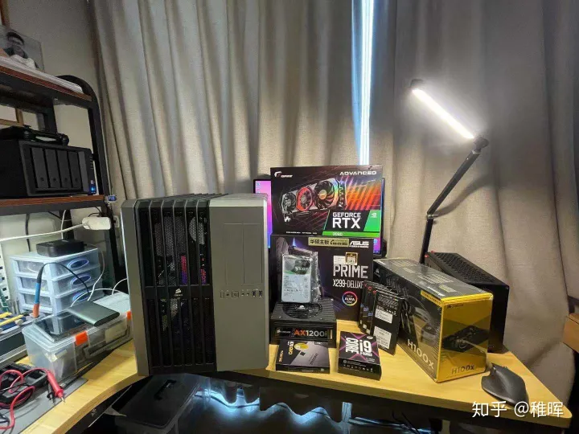

配件全家福

服务器的配置以个人使用性价比为主，同时考虑到以后的扩展性像是主板和机箱这些配件配置设置一些冗余。首先是CPU平台的选择，虽然AMD这两年实在是香，但是作为生产力工具考虑到软件库的兼容性问题，还是决定选择intel平台里十代X系列CPU+X299主板，算是比较稳的方案，而且某东上CPU搭配主板套装一起买也性价比也很高。GPU方面今年的30系显卡都比较良心，使用两块3080或者一块3090都是很给力的，24G的显存也已经跟TITAN RTX持平了（价格却只要一半）...这里考虑到主板上只能插两块PCIEx16的卡，为了以后可能的提升性能还需要再加一块卡，所以3090是最佳选择。

最后选定的配置如下：

- **CPU**：i9-10920X
- **显卡GPU**：七彩虹RTX3090 Advance
- **内存**：芝奇幻光戟16G x 4共64G
- **主板**：华硕X299-DELUXE PRIME
- **固态硬盘**：1TB西数NVME SSD + 1TB三星870QVO SATA SSD
- **机械硬盘**：希捷EXOS 12TB氦气盘
- **电源**：海盗船AX1200i 1200W模组电源
- **散热器**：海盗船H100X240水冷 + 若干120机箱风扇
- **机箱**：海盗船AIR540 E-ATX机箱

其中硬盘的设计是这样的：1T的NVME固态做系统盘，12T的机械盘作为数据集仓库，另外一个1T SATA固态作为训练时的数据集缓存，因为IO读写速度也是会影响训练效率的，所以相比于直接从机械盘里面读取数据，加一块SSD做cache效果会好很多。

### **1.2 电脑组装**

总之就是快乐的玩具拼装过程~

机箱尺寸比较大，预留的空间非常足所以不会出现像是在装A4机箱时那种考验走线和装配顺序的技巧问题；而且服务器嘛，安静地塞在某个角落就好了，也不用过于考虑什么美观问题，所以走线就很随意了：

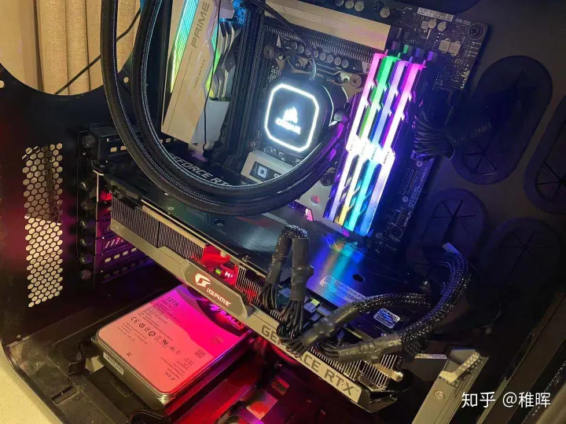

这个机箱设计还是很科学的，预留了足够多的扩展接口比如：2个 3.5寸可快拆盘位、5个2.5寸可快拆盘位、光驱位（用不到，后期改造了）、前后顶部一堆风扇位等等。线材基本都可以塞到机箱的另一个侧面，前面板安装了三个进风风扇，背部安装了一个出风风扇，水冷的冷排和风扇在顶端。

## **2. 系统篇**

系统选择DL开发里面最常用的Ubuntu，最新的稳定版本是20.04， 不过22.04版本也是可选的（ 如CUDA12 版本支持到了22.04版本），安装过程需要准备一个U盘作为系统启动盘。

### **2.1 安装Ubuntu 20.04/22.04系统**

1. 在官网下载Ubuntu镜像：[Ubuntu 20.04.1 LTS (Focal Fossa)](https://link.zhihu.com/?target=http%3A//releases.ubuntu.com/20.04/)，选择**Desktop Image**版本，得到.iso的镜像文件。
2. Windows下使用UltraISO工具打开.iso镜像文件，并将其写入到一个U盘，得到系统启动盘：

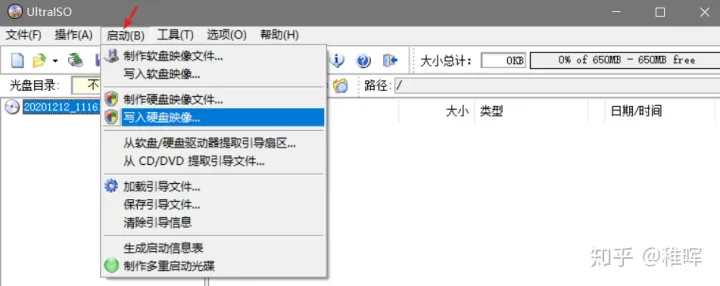

3. 将U盘插到服务器上，开机按`del键`（具体什么键跟主板型号有关）选择启动项进入临时的Ubuntu系统，在图形界面中选择**Install Ubuntu**，所有配置都可以使用默认的，改一下用户名和密码即可。 这里建议使用英文作为默认语言，省得给自己日后开发找麻烦哈。

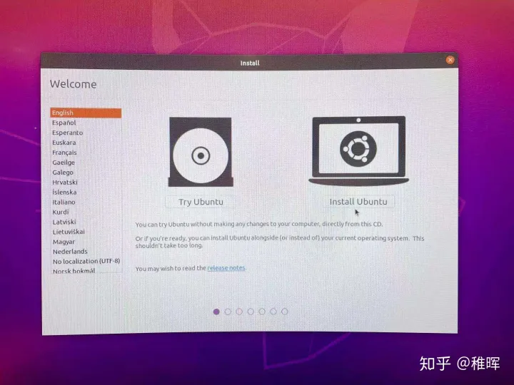

安装过程中会联网下载一些软件包更新，可以直接点skip掉，在安装好系统之后再手动更新也是一样的。

4. 进入系统后设置一下root账户密码：

```text
sudo passwd root
```

5. 同时为了避免每次sudo都要输入密码，这里配置一下`visudo`：

```text
sudo visudo
```

在文件最后加上一句（改为自己的用户名）：

```text
[user_name] ALL=(ALL) NOPASSWD: ALL
```

### **2.2 配置国内镜像软件源**

为了提升后续安装软件时的幸福感，第一步当然先要替换一下软件源。

1. 备份原来的源：

```text
cp /etc/apt/sources.list /etc/apt/sources.list.bak
```

2. 将源的内容设置为阿里云镜像：

```text
sudo vim /etc/apt/sources.list
```

内容改为：

ubuntu 20.04

```text
 deb http://mirrors.aliyun.com/ubuntu/ focal main restricted universe multiverse
 deb-src http://mirrors.aliyun.com/ubuntu/ focal main restricted universe multiverse
 deb http://mirrors.aliyun.com/ubuntu/ focal-security main restricted universe multiverse
 deb-src http://mirrors.aliyun.com/ubuntu/ focal-security main restricted universe multiverse
 deb http://mirrors.aliyun.com/ubuntu/ focal-updates main restricted universe multiverse
 deb-src http://mirrors.aliyun.com/ubuntu/ focal-updates main restricted universe multiverse
 deb http://mirrors.aliyun.com/ubuntu/ focal-proposed main restricted universe multiverse
 deb-src http://mirrors.aliyun.com/ubuntu/ focal-proposed main restricted universe multiverse
 deb http://mirrors.aliyun.com/ubuntu/ focal-backports main restricted universe multiverse
 deb-src http://mirrors.aliyun.com/ubuntu/ focal-backports main restricted universe multiverse
```

ubuntu 22.04

```
deb https://repo.huaweicloud.com/ubuntu/ jammy main restricted
deb https://repo.huaweicloud.com/ubuntu/ jammy-updates main restricted
deb https://repo.huaweicloud.com/ubuntu/ jammy universe
deb https://repo.huaweicloud.com/ubuntu/ jammy-updates universe
deb https://repo.huaweicloud.com/ubuntu/ jammy multiverse
deb https://repo.huaweicloud.com/ubuntu/ jammy-updates multiverse
deb https://repo.huaweicloud.com/ubuntu/ jammy-backports main restricted universe multiverse
deb https://repo.huaweicloud.com/ubuntu/ jammy-security main restricted
deb https://repo.huaweicloud.com/ubuntu/ jammy-security universe
deb https://repo.huaweicloud.com/ubuntu/ jammy-security multiverse
```

3. 更新软件列表：

```text
sudo apt update
sudo apt upgrade
```

也可以去网上搜其他镜像，在我这边经测试阿里云是最快的。另外也可以在图形桌面环境下打开`Software & Updates`软件，在里面也有网速测试并选择最佳源的功能。

### **2.3 安装Python和pip**

1. Ubuntu系统默认自带python，有版本需求的话也可以自己安装一下（不安装也行因为后面会安装conda环境）：

```text
sudo apt install python3
sudo apt install python3-pip
```

2. 不管是不是自己安装的python，替换python的pip源建议是一定操作一下的，pip安装速度会快很多：

```text
cd ~
mkdir .pip
```

直接新建并编辑pip.conf：

```text
sudo vim ~/.pip/pip.conf
```

改为以下内容（这里用的清华源，也可以试一下阿里、豆瓣等源）：

```text
[global]
index-url = https://pypi.tuna.tsinghua.edu.cn/simple/ 
[install]
trusted-host = pypi.tuna.tsinghua.edu.cn
```

3. 更改默认python版本，python目录默认链接的是python2，而现在基本都是用python3开发了，每次都输入python3很麻烦所以这里直接更换默认的python命令链接。

把原来的python软链接删掉：

```text
sudo rm /usr/bin/python
```

新建一个软链接：

```text
sudo ln -s /usr/bin/python3 /usr/bin/python
sudo ln -s /usr/bin/pip3 /usr/bin/pip
```

现在输入python就会进入python3环境了。

### **2.4 配置SSH & 远程桌面**

纯净安装的系统里面默认没有开启SSH，我们手动安装一下。

1. 安装ssh：

```text
sudo apt install ssh
```

会自动安装好很多依赖包并启动服务，完成之后用XShell等软件就可以SSH登录服务器了。

2. 安装xrdp

Xrdp 是一个微软远程桌面协议（RDP）的开源实现，它允许我们通过图形界面控制远程系统。这里使用RDP而不是VNC作为远程桌面，是因为Windows自带的远程桌面连接软件就可以连接很方便，另外RDP在Windows下的体验非常好，包括速度很快（因为压缩方案做得比较好），可以直接在主机和远程桌面之间复制粘贴等等。

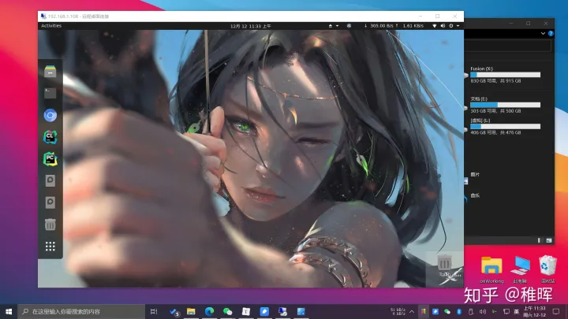

> 有的Xwindow软件是不太兼容xrdp的（比如ubuntu 18.04的默认桌面），但是ubuntu 20.04使用的Gnome是完全ok的。

安装过程如下：

```text
sudo apt install xrdp 
```

安装完成xrdp 服务将会自动启动，可以输入下面的命令验证它：

```text
sudo systemctl status xrdp
```

默认情况下，xrdp 使用`/etc/ssl/private/ssl-cert-snakeoil.key`，它仅仅对ssl-cert用户组成语可读，所以需要运行下面的命令，将xrdp用户添加到这个用户组：

```text
sudo adduser xrdp ssl-cert  
sudo systemctl restart xrdp
```

然后使用Windows自带的远程桌面软件连接服务器IP地址或者域名就行了。

### **2.5 安装frp进行内网穿透**

前面介绍的SSH和远程桌面都是需要在局域网下通过IP地址进行连接的，而我们配置一台服务器最重要的诉求，应该是可以**随时随地**去访问服务器。

那在家里面，网络运营商提供的网络服务通过路由器路由到各个设备，此时路由器会同时具备内网地址（路由器之内，局域网，LAN，也就是192.168.x.x）和外网地址（路由器之外，互联网，WAN）。但是其实这个WAN口的IP并不是真正的“公网IP”，而时经过了多层的NAT转换之后的地址，外网的设备是不能通过这个地址访问到路由器的。这个问题的原因是ipv4地址池紧张，如果运营商给每家的路由器都安排一个公网ip的话，那ip地址早就不够用了呀。

因此为了能让外网访问到我们局域网内的设备，就需要跟中国电信等运营商申请公网ip（现在能申请到的概率也已经不大了，而且即使申请到也不是所有端口都可以使用的），或者我们自己动手做一些操作来达到同样的目的。

有几种方法:

- 可以直接用类似[花生壳](https://hsk.oray.com/)这样的DDNS服务平台做转发实现内网穿透，优点是比较简单稳定，缺点是需要持续付费，而且速度和延迟效果一般，而且每加一个端口都要额外付费。
- 也可以像我一样使用frp之类的软件做反向代理来实现内网穿透，这个方案也是需要你有一台带公网IP的云服务器的，优点就是完全可控，自己想配置多少个端口的穿透都可以，速度跟你的云服务器带宽有关。

> 为什么需要多个端口？ 是因为不同应用占用的端口不同，比如我们的SSH走的是22号端口，而远程桌面的rdp走的是3389号端口，如果需要自建Web服务的话则是走80/443端口、想把工作站作为上外网的代理服务器的话会需要1080端口等等...所以用上面第二个方案显然会方便很多，而且云服务器也不贵，我在腾讯云上购买一年只要200左右。

下面介绍如何安装配置frp：

frp分为frps（server）和frpc（client）两个包 ，其中前者安装到我们的云服务器上，后者安装在需要被外网访问到的各个设备上，这里就是指我们的深度学习工作站。

**云服务器端：**

去[这里](https://github.com/fatedier/frp/releases)下载适合你服务器系统的frp软件，我这里是用的是腾讯云64位Ubuntu16.04所以选择[frp_0.34.3_linux_amd64.tar.gz](https://github.com/fatedier/frp/releases/download/v0.34.3/frp_0.34.3_linux_amd64.tar.gz)，下好之后解压：

```text
tar -zxvf frp_0.34.3_linux_amd64.tar.gz
```

我们需要编辑的文件是frps.ini :

内容改为：

```text
 [common]
 bind_port = 7000 # frp服务的端口号，可以自己定
 dashboard_port = 7500 # frp的web界面的端口号
 dashboard_user = user # web界面的登陆账户，自己修改
 dashboard_pwd = pass # web界面的登陆密码，自己修改
 authentication_method = token
 token = xxxxx # frp客户端连接时的密码，自己修改
```

保存配置后，使用该命令启动：

```text
 ./frps -c ./frps.ini
```

在浏览器输入 `[云服务器的公网ip]:7500` 即可访问到 frp的web管理界面。

> 注意，可能需要去云服务器控制台配置安全组规则 开放以上涉及到的端口，否则无法访问。

**本地的深度学习服务器端：**

1. 下载相应版本的frpc软件包（跟刚刚一样的）：[Releases · fatedier/frp (github.com)](https://github.com/fatedier/frp/releases)，这里选amd64的，下好之后解压到一个临时文件夹。
2. 修改frpc.ini配置文件，内容如下：

```text
 [common]
 server_addr = xx.xx.xx.xx # 你的云服务器的公网ip
 authentication_method = token
 token = xxxxx # 刚刚配置的frp连接密码 
 server_port = 7000 # 刚刚配置的frp服务端口
 
 [Fusion-ssh]
 type = tcp
 local_ip = 127.0.0.1
 local_port = 22
 remote_port = 20022
 
 [Fusion-rdp]
 type = tcp
 local_ip = 127.0.0.1
 local_port = 3389
 remote_port = 23389
```

通过上面的脚本就可以把对于云服务器特定端口的访问给重定向到本地服务器的某个端口了，简单地讲就是：假如我用SSH客户端访问 `[云服务器ip]:20022`，就可以经过反向代理直接访问到`[本地的训练服务器ip]:22`；同理需要连接远程桌面的话，只需要访问`[云服务器ip]:23389`就可以了。

**当然你也可以修改脚本添加更多映射~**

3. 添加开机自动启动的脚本，新建一个文件内容如下：

文件名`/etc/systemd/system/frpc.service`，注意修改其中的路径：

```text
 [Fusion]
 Description=Frp Server Daemon
 After=syslog.target network.target
 Wants=network.target
 
 [Service]
 Type=simple
 ExecStart=/usr/local/bin/frp/frpc -c /usr/local/bin/frp/frpc.ini # 修改为你的frp实际安装目录
 ExecStop=/usr/bin/killall frpc
 #启动失败1分钟后再次启动
 RestartSec=1min
 KillMode=control-group
 #重启控制：总是重启
 Restart=always
 
 [Install]
 WantedBy=multi-user.target
```

然后执行以下命令启用脚本：

```text
sudo systemctl enable frpc.service
sudo systemctl start frpc.service
```

通过下面的命令查看服务状态，如果是running的话就说明可以了：

```text
sudo systemctl status frpc.service
```

> 这里顺便提一下，按照习惯一般把上面的frp软件解压防止在`/usr/local/bin`目录下。Linux 的软件安装目录是也是有讲究的，理解这一点，在对系统管理是有益的

- `/usr`：系统级的目录，可以理解为`C:/Windows/`
- `/usr/lib`：可以理解为`C:/Windows/System32`
- `/usr/local`：用户级的程序目录，可以理解为`C:/Progrem Files/`，用户自己编译的软件默认会安装到这个目录下
- `/opt`：用户级的程序目录，可以理解为`D:/Software`，opt有可选的意思，这里可以用于放置第三方大型软件（或游戏），当你不需要时，直接`rm -rf`掉即可。在硬盘容量不够时，也可将`/opt`单独挂载到其他磁盘上使用

> 源码放哪里？

- `/usr/src`：系统级的源码目录
- `/usr/local/src`：用户级的源码目录。

### **2.6 安装SAMBA服务**

**如果能把服务器上的磁盘直接挂载到我们使用的Windows个人PC上是不是很爽？**

如开头的视频里面演示的，可以通过建立局域网SAMBA服务来实现这个效果：

1. 安装`samba` 和`samba-common-bin`

```text
sudo apt-get install samba samba-common-bin
```

1. 配置/etc/samba/smb.conf文件

```text
sudo nano /etc/samba/smb.conf
```

在最后一行后面加入：

```text
# 共享文件夹显示的名称
[home]
# 说明信息
comment = Fusion WorkStation Storage
# 可以访问的用户
valid users = [user_name],root
# 共享文件的路径
path = /home/[user_name]/
# 可被其他人看到资源名称（非内容）
browseable = yes
# 可写
writable = yes
# 新建文件的权限为 664
create mask = 0664
# 新建目录的权限为 775
directory mask = 0775
```

可以把配置文件中你不需要的分享名称删除，例如 [homes], [printers] 等。

运行这个命令测试一下配置文件是否有错误，根据提示做相应修改：`testparm`

3. 添加登陆账户并创建密码

必须是 linux 已存在的用户：

```text
sudo smbpasswd -a pi
```

然后重启服务即可：

```text
sudo /etc/init.d/samba-ad-dc restart
```

接下来可以在Windows的网络中发现设备了：

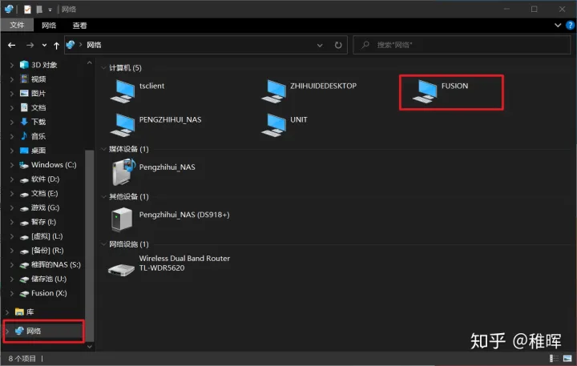

但是可能会出现无法点开的情况，这里需要在Windows的凭据管理器中添加账户信息（开始菜单里搜索凭据管理器即可打开），点击添加Windows凭据，输入你的服务器名称和账户密码：

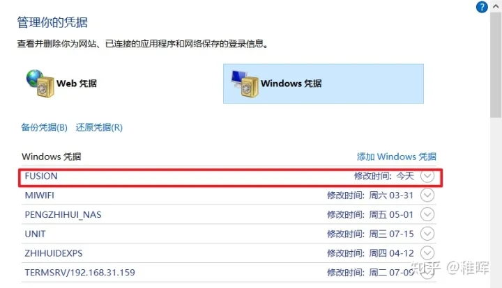

接下来就可以点进去看到服务器上的文件了。 为了更加方便地进行文件交互，我们添加对应的磁盘到Windows资源管理器的此电脑中：

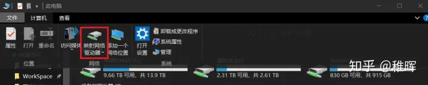

选择刚刚服务器的网络路径即可添加：

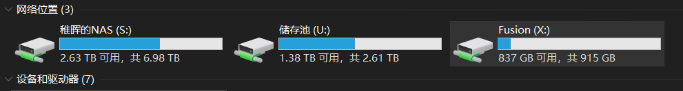


## **2.7 install chinese input method(pinyin) **

在Linux系统上，常见的输入法框架（Keyboard input method system）有三种：**IBus**（Intelligent Input Bus）、**Fcitx**（FlexibleInput Method Framework）、**XIM**（X Input Method）。在Ubuntu20.04系统中，默认已经安装了IBus和XIM这两种输入法框架，Fcitx需要自己安装。

如下所示，每种输入法框架下，都有其支持的中文输入法（有些是框架自带的，有些需要另外安装）：

- **Fcitx**：谷歌拼音、搜狗拼音、搜狗五笔拼音
- **IBus**：智能拼音，五笔（86版）
- **XIM**：略(现在用的相对比较少)

```
sudo apfcitx-pinyin
sudo apt install  fcitx-googlepinyin
```

选择输入法框架， fcitx。

在右侧状态栏会多一个键盘的图标，点击图标后，设置输入法，选择google pinyin。


## **3. DL开发环境配置篇**

配置这台服务器的主要作用就是做深度学习训练，所以GPU相关的驱动和环境时肯定要安排好的，网上资料很多很杂，这里梳理出了最便捷可靠的安装方法供大家参考~

### **3.1 安装Nvidia显卡驱动**

最简单的方式是通过系统的软件与更新来安装：

1. 进入系统的图形桌面，打开`Software & Updates`软件，可以看到标签栏有一个`Additional Drivers`：

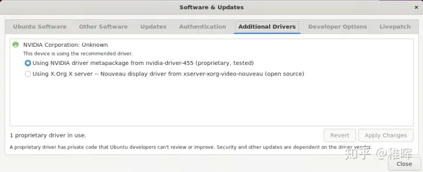

选择第一个安装Nvidia官方驱动（第二个是开源驱动）即可，根据网络情况稍等大概十分钟，安装完重启服务器。

也可以使用命令行方式

```
sudo apt-get nvidia-common
sudo add-apt-repository ppa:graphics-drivers
sudo apt update
ubuntu-drivers devices
sudo apt install nvidia-driver-530 #选择正确驱动版本, 这里选择最新的530
```

具体寻找和是的驱动，可以参考NVIDIA[官网地址](https://www.nvidia.com/Download/Find.aspx)

重启完之后更新一下软件：

```text
sudo apt update
sudo apt upgrade
```

这里会连带Nvidia的驱动一起升级一遍，更新到最新的驱动；更新完可能会出现nvidia-smi命令报错，再重启一下就解决了。

### **3.2 安装CUDA**

如果之前安装了旧版本的cuda和cudnn的话，需要先卸载后再安装：

```text
 sudo apt-get remove --purge nvidia*
```

按照前面的方法**重新安装显卡驱动后**，开始安装CUDA

### CUDA 11.0

安装CUDA：

1. 去官网下载cuda安装包：[CUDA Toolkit 11.0 Download | NVIDIA Developer](https://developer.nvidia.com/cuda-11.0-download-archive)，相关选项如下（根据实际情况选择）：

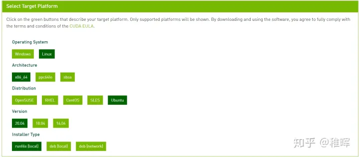

1. 运行下面的命令进行安装：

```text
chmod +x cuda_11.0.2_450.51.05_linux.run
sudo sh ./cuda_11.0.2_450.51.05_linux.run
```

可能会报一个警告：

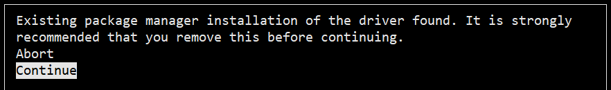

前面已经卸载过旧版本了直接Continue就好。然后根据提示选择安装选项，注意不要勾选第一个安装显卡驱动的，因为之前已经安装过了。 安装完成后提示

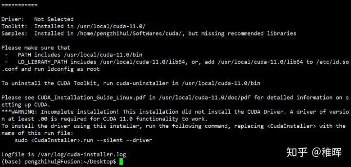

2. 根据上图提示需要配置环境变量：

```text
nano  ~/.bashrc
```

再文件最后加入以下语句：

```text
export CUDA_HOME=/usr/local/cuda-11.0
export LD_LIBRARY_PATH=${CUDA_HOME}/lib64
export PATH=${CUDA_HOME}/bin:${PATH}
```

然后使其生效：

```text
source ~/.bashrc
```

3. 可以使用命令`nvcc -V`查看安装的版本信息：

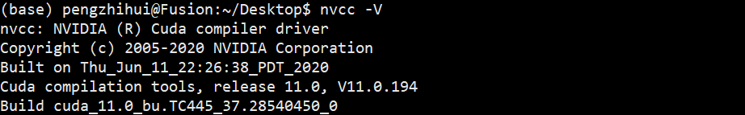

也可以编译一个程序测试安装是否成功，执行以下几条命令：

```text
cd ~/Softwares/cuda/NVIDIA_CUDA-11.0_Samples/1_Utilities/deviceQuery
 make
./deviceQuery
```

正常的话会有相应输出，打印显卡的信息。

### 安装CUDA 12.0

[CUDA Toolkit 12.0 Download | NVIDIA Developer](https://developer.nvidia.com/cuda-downloads?target_os=Linux&target_arch=x86_64&Distribution=Ubuntu&target_version=22.04&target_type=deb_local)

```
wget https://developer.download.nvidia.com/compute/cuda/repos/ubuntu2204/x86_64/cuda-ubuntu2204.pin
sudo mv cuda-ubuntu2204.pin /etc/apt/preferences.d/cuda-repository-pin-600
wget https://developer.download.nvidia.com/compute/cuda/12.1.0/local_installers/cuda-repo-ubuntu2204-12-1-local_12.1.0-530.30.02-1_amd64.deb
sudo dpkg -i cuda-repo-ubuntu2204-12-1-local_12.1.0-530.30.02-1_amd64.deb
sudo cp /var/cuda-repo-ubuntu2204-12-1-local/cuda-*-keyring.gpg /usr/share/keyrings/
sudo apt-get update
sudo apt-get -y install cuda
```


### **3.3 安装CuDNN(注意选择匹配cuda的版本）**

进入到CUDNN的下载官网：[cuDNN Download | NVIDIA Developer](https://developer.nvidia.com/rdp/cudnn-download)，然点击Download开始选择下载版本，当然在下载之前还有登录，选择版本界面如下：

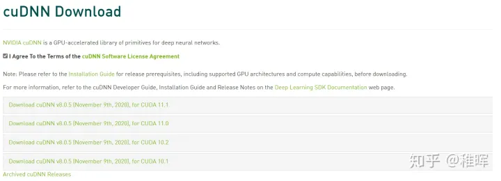

我们选择和之前cuda版本对应的cudnn版本：

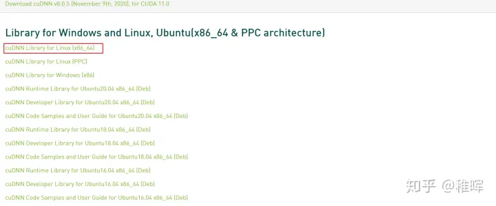

下载之后是一个压缩包，对它进行解压，命令如下：

```text
 tar -xzvf cudnn-11.0-linux-x64-v8.0.5.39.tgz
```

使用以下两条命令复制这些文件到CUDA目录下：

```text
 sudo cp cuda/lib64/* /usr/local/cuda-11.0/lib64/
 sudo cp cuda/include/* /usr/local/cuda-11.0/include/
```

拷贝完成之后，可以使用以下命令查看CUDNN的版本信息：

```text
 cat /usr/local/cuda/include/cudnn_version.h | grep CUDNN_MAJOR -A 2
```

可以看到版本信息如下，为`8.0.5`：

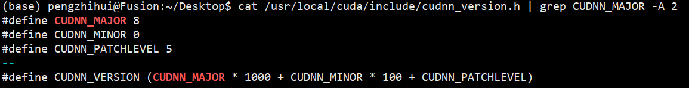

*ps* 或者选择deb文件， 直接安装

### **3.4 安装Conda环境**

不同的训练框架和版本可能会需要不同的python版本相对应，而且有的包比如numpy也对版本有要求，所以比较优雅的方法是给每个配置建立一个**虚拟的python环境**，在需要的时候可以随时切换，而不需要的时候也能删除不浪费磁盘资源，那在这方面conda是做得最好的。

下面介绍怎么安装conda：

1. 在Anaconda官网下载Linux安装包：[Anaconda | Individual Edition](https://www.anaconda.com/products/individual)
2. 运行下面的命令安装：

```text
chmod +x Anaconda3-2020.11-Linux-x86_64.sh

./Anaconda3-2020.11-Linux-x86_64.sh
```

一路按ENTER确认，然后根据提示输入yes，这里我为了目录整洁不安装在默认路径，设置为下面的路径：`/home/[user_name]/Softwares/anaconda`

然后会询问你是否要初始化conda，输入yes确认，重开终端窗口之后，就可以看到conda环境可用了（base代表默认环境）：


**conda的使用方法网上搜一下有很多，这里就不赘述了。**

### **3.5 安装Nvidia-Docker**

Docker也是虚拟化环境的神器，前面说的conda虽然可以提供python的虚拟环境并方便地切换，但是有的时候我们的开发环境并不只是用到python，比如有的native库需要对应gcc版本的编译环境，或者进行交叉编译时哟啊安装很多工具链等等。如果这些操作都在服务器本地上进行，那时间久了就会让服务器的文件系统非常杂乱，而且还会遇到各种软件版本冲突问题。

Docker就可以很好地解决这些问题，它其实可以理解为就是一个非常轻量化的虚拟机，我们可以在宿主服务器上新建很多个这种被称为`容器`的虚拟机，然后在里面配置我们的开发环境，且这些配置好的环境是可以打包成`镜像`的，方便随时做分享和重用；不需要的时候，我们直接删除容器就好了，其资源是和我们的服务器宿主机完全隔离的。

Docker的具体使用可以自己搜索一下很多教程，这里主要介绍如何把GPU暴露给Docker的容器（因为大家都知道像是VMware这种虚拟机里面都是无法共享宿主机的GPU的），是通过`nvidia-docker`实现的。

> 以前为了配置nvidia-docker，需要安装完docker之后再安装单独的nvidia docker2，而现在只需要安装nvidia container toolkit即可，更加方便了。

1. docker安装 官网上有详细的介绍：[Install Docker Engine on Ubuntudocs.docker.com](https://docs.docker.com/engine/install/ubuntu/) 或者运行下面的命令安装：

```text
#uninstall old docker version
sudo apt-get remove docker docker-engine docker.io containerd runc
sudo apt-get update
sudo apt-get install \
	ca-certificates \
	curl \
	gnupg
sudo install -m 0755 -d /etc/apt/keyrings
curl -fsSL https://download.docker.com/linux/ubuntu/gpg | sudo gpg --dearmor -o /etc/apt/keyrings/docker.gpg
sudo chmod a+r /etc/apt/keyrings/docker.gpg

echo \
  "deb [arch="$(dpkg --print-architecture)" signed-by=/etc/apt/keyrings/docker.gpg] https://download.docker.com/linux/ubuntu \
  "$(. /etc/os-release && echo "$VERSION_CODENAME")" stable" | \
  sudo tee /etc/apt/sources.list.d/docker.list > /dev/null
  
sudo apt-get update
sudo apt-get install docker-ce docker-ce-cli containerd.io docker-buildx-plugin docker-compose-plugin
# verify
sudo docker run hello-world
```

可以运行这条命令检查是否安装成功：

```text
docker version
```

add current user to docker group

```
sudo adduser [name] docker
# using id to check if supplementary group has been added.
id
# restart system
```


2. 安装NVIDIA Container Toolkit


官网安装步骤：[NVIDIA/nvidia-docker: Build and run Docker containers leveraging NVIDIA GPUs (github.com)](https://github.com/NVIDIA/nvidia-docker) 或者直接运行下面的命令：

```text
##首先要确保已经安装了nvidia driver
# 1. 添加源
distribution=$(. /etc/os-release;echo $ID$VERSION_ID)
curl -s -L https://nvidia.github.io/nvidia-docker/gpgkey | sudo apt-key add -
curl -s -L https://nvidia.github.io/nvidia-docker/$distribution/nvidia-docker.list | sudo tee /etc/apt/sources.list.d/nvidia-docker.list

# 2. 安装并重启
sudo apt-get update && sudo apt-get install -y nvidia-container-toolkit
sudo systemctl restart docker
```

install docker image, refer to the nvidia-smi's cuda version.

```
docker pull nvidia/cuda:12.1.0-base-ubuntu20.04
```

安装完成后可以新建一个容器测试一下：

```text
sudo docker run -it --name test_nvidia_docker --gpus all nvidia/cuda:12.1.0-base-ubuntu20.04
```

其中最后的参数`nvidia/cuda:12.1.0-base-ubuntu20.04` 是Nvidia官方的镜像，需要根据工作站主机中实际安装的cuda版本进行修改，版本可以用`nvcc -V`查看。

进入容器之后可以跑一下`nvidia-smi`命令看看：

```
# nvidia-smi
---------------------------------------------------------------------------------------+
| NVIDIA-SMI 530.30.02              Driver Version: 530.30.02    CUDA Version: 12.1     |
|-----------------------------------------+----------------------+----------------------+
| GPU  Name                  Persistence-M| Bus-Id        Disp.A | Volatile Uncorr. ECC |
| Fan  Temp  Perf            Pwr:Usage/Cap|         Memory-Usage | GPU-Util  Compute M. |
|                                         |                      |               MIG M. |
|=========================================+======================+======================|
|   0  NVIDIA GeForce RTX 2070 S...    On | 00000000:01:00.0 Off |                  N/A |
|  0%   40C    P8               25W / 215W|    345MiB /  8192MiB |      2%      Default |
|                                         |                      |                  N/A |
+-----------------------------------------+----------------------+----------------------+
```

现在可以在docker里面正常使用GPU啦~


### **3.6 测试**

这里通过一个简单的python脚本测试一下GPU训练是否一切正常，跑一个DL里面的Hello World程序，通过两种方法测试：本地conda和docker虚拟机。

> 以后的开发过程中一般还是使用Docker的方式来进行更为优雅。

### **1. 本地Conda环境方式：**

先用conda新建一个python3.8+pytorch1.7+cuda11.0的虚拟环境：

```text
 conda create --name python_38-pytorch_1.7.0 python=3.8
```

创建完成后进入环境：

```text
 conda activate python_38-pytorch_1.7.0
```

检查一下是否切换到所需环境了：

```text
 which pip
```

如果看到使用的确实是我们设置的环境目录中的pip的话说明就ok。

接下来在环境中安装pytorch，可以参考官网的安装命令：[Start Locally | PyTorch](https://pytorch.org/get-started/locally/)

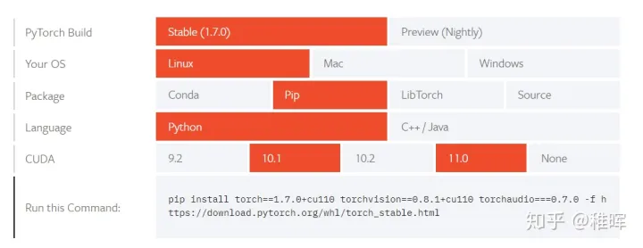

输入以下命令进行安装：

```text
#cu118/torch-2.0.0%2Bcu118-cp38-cp38-linux_x86_64.whl
#cu118/torchvision-0.15.1%2Bcu118-cp39-cp39-linux_x86_64.whl
#cu118/torchaudio-2.0.1%2Bcu118-cp38-cp38-linux_x86_64.whl

pip install torch==2.0.0+cu118 torchvision==0.15.1+cu118 torchaudio==2.0.1+cu118 -f https://download.pytorch.org/whl/torch_stable.html 
```

环境配置就完成了，启动python，检查一下cuda

```
Python 3.8.10 (default, Mar 13 2023, 10:26:41) 
[GCC 9.4.0] on linux
Type "help", "copyright", "credits" or "license" for more information.
>>> import torch
>>> print(torch.cuda.is_available())
# True
```

测试训练，新建`mnist_train.py`，内容如下：

```text
import torch
import torch.nn as nn
import torch.nn.functional as F
import torch.optim as optim
import torch.backends.cudnn as cudnn
from torchvision import datasets, transforms


class Net(nn.Module):
    def __init__(self):
        super(Net, self).__init__()
        self.conv1 = nn.Conv2d(1, 10, kernel_size=5)
        self.conv2 = nn.Conv2d(10, 20, kernel_size=5)
        self.conv2_drop = nn.Dropout2d()
        self.fc1 = nn.Linear(320, 50)
        self.fc2 = nn.Linear(50, 10)


    def forward(self, x):
        x = F.relu(F.max_pool2d(self.conv1(x), 2))
        x = F.relu(F.max_pool2d(self.conv2_drop(self.conv2(x)), 2))
        x = x.view(-1, 320)
        x = F.relu(self.fc1(x))
        x = F.dropout(x, training=self.training)
        x = self.fc2(x)
        return F.log_softmax(x, dim=1)


def train(model, device, train_loader, optimizer, epoch):
    model.train()
    for batch_idx, (data, target) in enumerate(train_loader):
        data, target = data.to(device), target.to(device)
        optimizer.zero_grad()
        output = model(data)
        loss = F.nll_loss(output, target)
        loss.backward()
        optimizer.step()
        if batch_idx % 10 == 0:
            print('Train Epoch: {} [{}/{} ({:.0f}%)]\tLoss: {:.6f}'.format(
                epoch, batch_idx * len(data), len(train_loader.dataset),
                       100. * batch_idx / len(train_loader), loss.item()))


def main():
    cudnn.benchmark = True
    torch.manual_seed(1)
    device = torch.device("cuda") if torch.cuda.is_available() else torch.device("cpu")
    print("Using device: {}".format(device))
    kwargs = {'num_workers': 1, 'pin_memory': True}
    train_loader = torch.utils.data.DataLoader(
        datasets.MNIST('./data', train=True, download=True,
                       transform=transforms.Compose([
                           transforms.ToTensor(),
                           transforms.Normalize((0.1307,), (0.3081,))
                       ])),
        batch_size=64, shuffle=True, **kwargs)

    model = Net().to(device)
    optimizer = optim.SGD(model.parameters(), lr=0.01, momentum=0.5)

    for epoch in range(1, 11):
        train(model, device, train_loader, optimizer, epoch)

if __name__ == '__main__':
    main()
```

运行脚本，正常的话就可以看到训练输出了：

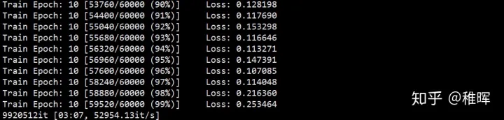

### **2. Docker环境方式：**

首先还是新建一个Docker镜像，运行下面的命令：

```text
 sudo docker run  -it  --name train_mnist \
 -v /etc/timezone:/etc/timezone \
 -v /etc/localtime:/etc/localtime \
 -v /home/[user_name]/WorkSpace/_share:/home/workspace/_share  \
 --gpus all nvidia/cuda:12.1.0-base-ubuntu20.04
```

就进入到了带gpu的ubuntu20.04容器中按照前面的配置方法同样配置好pytorch和其他软件包，然后运行同样的脚本，也可以得到上述输出，说明gpu在docker中正常工作。


## **4. 工作站维护篇**

### **4.1 工作站系统备份还原**

1. **备份**

由于Linux本身万物皆文件的设计理念，加上root用户对几乎全部的系统文件都有访问和更改的权限，因此Linux系统的备份和还原其实非常简单，我们直接打包整个根文件系统就可以了。

我们可以使用tar命令来打包并压缩文件系统，不过这里在打包的过程中需要排除一些不需要文件，或者与新系统文件冲突的文件，包括`/tmp`、`/proc`、`/lost+found` 等目录。

找一个你想保存备份文件的目录，运行下面的命令：

```text
tar -cvpzf ubuntu_backup@`date +%Y-%m+%d`.tar.gz --exclude=/proc --exclude=/tmp --exclude=/boot  --exclude=/lost+found --exclude=/media --exclude=/mnt --exclude=/run /
```

我们会得到一个名为`backup.tgz`的压缩文件，这个文件包含我们需要备份的系统的全部内容。

**2. 还原**

如果系统没有出问题可以正常启动的话，那直接在刚刚的压缩包找找到想还原的文件替换就好了。而如果系统无法启动了，或者说想换一块硬盘克隆一样的系统，那么可以按一下步骤操作：

- 重装干净的Ubuntu系统。跟上面介绍的一样，使用U盘给目标磁盘重装一个干净的系统，这一步是为了省去自己分配存储空间和挂载的麻烦，如果你会自己配置的话那也可以不做这一步。
- 再次使用U盘进入系统，这次选择`try ubuntu without installing`，然后可以看到挂载好的刚刚安装了干净系统的另一个盘，我们在这里对盘里的根文件系统进行一些文件的提取：

```text
sudo su

# 在tryUbuntu根目录下有media文件夹，里面是U盘文件夹和新安装的系统文件夹，在在里分别用（U盘）和（UBUNTU）表示
cd /media/（U盘）
mount -o remount rw ./
 
# 将新系统根目录下/boot/grub/grub.cfg文件备份到U盘中
sudo cp /media/(Ubuntu)/boot/grub/grub.cfg ./    
 
# 将新系统根目录下/etc/fstab文件备份到U盘中，fstab是与系统开机挂载有关的文件，grub.cfg是与开机引导有关的文件，所以这一步至关重要
sudo cp /media/(UBUNTU)/etc/fstab ./
 
# 这一步删除新装ubuntu全部的系统文件，有用的fstab及grub.cfg已经备份
cd /media/(UBUNTU)
sudo rm -rf ./*
 
# 将U盘中backup.tgz复制到该目录下并解压缩
cp /media/(U盘)/backup.tgz ./
sudo tar xvpfz backup.tgz ./
 
# 创建打包系统时排除的文件
sudo mkdir proc lost+found mnt sys media
```

这一步完成后，在用我们在新系统中备份的`fatab`及`grub.cfg` 文件去替换压缩包中解压出来的同名文件，`sudo reboot`重启后就发现系统已经恢复到备份时的状态，包括各种框架，环境，系统设置~