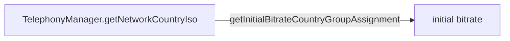
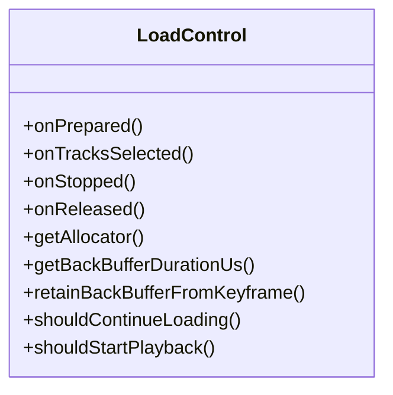
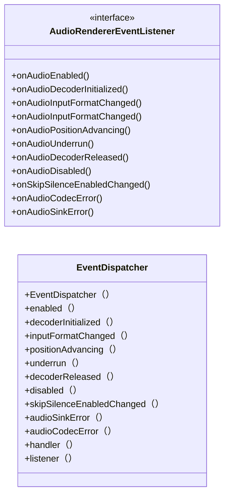
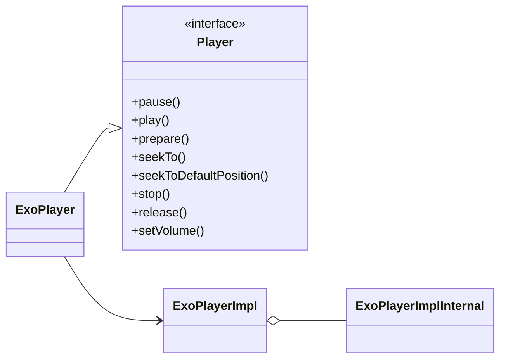
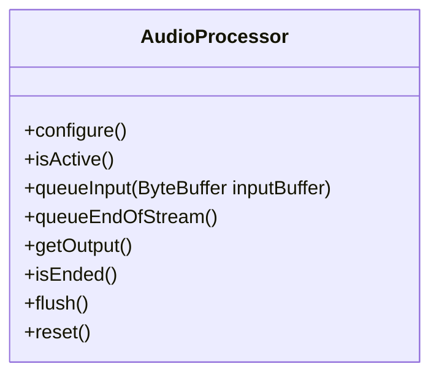
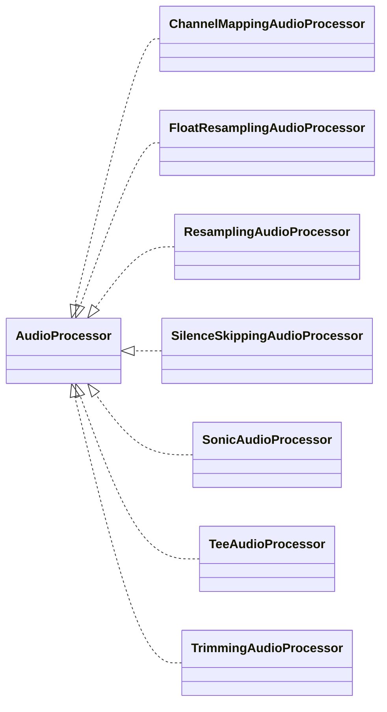
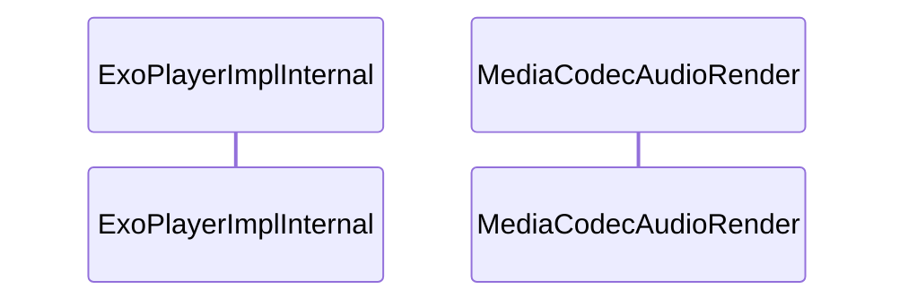

本文尝试介绍Android ExoPlayer实现，从中学习音频/视频的相关知识。
<!-- more -->

# 音频基础

声音的三个特征：

> - 音调：声音频率的高低叫做音调(Pitch),是声音的三个主要的主观属性,即音量(响度)、音调、音色(也称音品) 之一。表示人的听觉分辨一个声音的调子高低的程度。音调主要由声音的频率决定,同时也与声音强度有关
> - 响度：人主观上感觉声音的大小（俗称音量），由“振幅”（amplitude）和人离声源的距离决定，振幅越大响度越大，人和声源的距离越小，响度越大。（单位：分贝dB）
> - 音色：又称音品，波形决定了声音的音色。声音因不同物体材料的特性而具有不同特性，音色本身是一种抽象的东西，但波形是把这个抽象直观的表现。音色不同，波形则不同。典型的音色波形有方波，锯齿波，正弦波，脉冲波等。不同的音色，通过波形，完全可以分辨的。


# ExoPlayer使用

`hello world`演示代码

```java
ExoPlayer player = new ExoPlayer.Builder(context).build();
// Build the media items.
MediaItem firstItem = MediaItem.fromUri(firstVideoUri);
MediaItem secondItem = MediaItem.fromUri(secondVideoUri);
// Add the media items to be played.
player.addMediaItem(firstItem);
player.addMediaItem(secondItem);
// Prepare the player.
player.prepare();
// Start the playback.
player.play();
```

### MediaItem

描述一个媒体内容， 如果需要播放媒体内容，只需要构建一个MediaItem,并且把他添加到播放器，最终调用`play`即可进行播放。

```java
private MediaItem(
    String mediaId,
    ClippingProperties clippingConfiguration,
    @Nullable PlaybackProperties localConfiguration,
    LiveConfiguration liveConfiguration,
    MediaMetadata mediaMetadata,
    RequestMetadata requestMetadata) {
  this.mediaId = mediaId;
  this.localConfiguration = localConfiguration;
  this.playbackProperties = localConfiguration;
  this.liveConfiguration = liveConfiguration;
  this.mediaMetadata = mediaMetadata;
  this.clippingConfiguration = clippingConfiguration;
  this.clippingProperties = clippingConfiguration;
  this.requestMetadata = requestMetadata;
}
```

## 控制播放器

- `play` and `pause` start and pause playback.
- `seekTo` allows seeking within the media.
- `hasPrevious`, `hasNext`, `previous` and `next` allow navigating through the playlist.
- `setRepeatMode` controls if and how media is looped.
- `setShuffleModeEnabled` controls playlist shuffling.
- `setPlaybackParameters` adjusts playback speed and audio pitch.

如需要释放播放器，则只需要调用`release`.

## ExoPlayer初始化

```java
public Builder(Context context) {
  this(
      context,
      () -> new DefaultRenderersFactory(context),
      () -> new DefaultMediaSourceFactory(context, new DefaultExtractorsFactory()));
}

private Builder(
    Context context,
    Supplier<RenderersFactory> renderersFactorySupplier,
    Supplier<MediaSource.Factory> mediaSourceFactorySupplier) {
  this(
      context,
      renderersFactorySupplier,
      mediaSourceFactorySupplier,
      () -> new DefaultTrackSelector(context),
      DefaultLoadControl::new,
      () -> DefaultBandwidthMeter.getSingletonInstance(context),
      DefaultAnalyticsCollector::new);
}

private Builder(
    Context context,
    Supplier<RenderersFactory> renderersFactorySupplier,
    Supplier<MediaSource.Factory> mediaSourceFactorySupplier,
    Supplier<TrackSelector> trackSelectorSupplier,
    Supplier<LoadControl> loadControlSupplier,
    Supplier<BandwidthMeter> bandwidthMeterSupplier,
    Function<Clock, AnalyticsCollector> analyticsCollectorFunction) {
  this.context = context;
  this.renderersFactorySupplier = renderersFactorySupplier;
  this.mediaSourceFactorySupplier = mediaSourceFactorySupplier;
  this.trackSelectorSupplier = trackSelectorSupplier;
  this.loadControlSupplier = loadControlSupplier;
  this.bandwidthMeterSupplier = bandwidthMeterSupplier;
  this.analyticsCollectorFunction = analyticsCollectorFunction;
  looper = Util.getCurrentOrMainLooper();
  audioAttributes = AudioAttributes.DEFAULT;
  wakeMode = C.WAKE_MODE_NONE;
  videoScalingMode = C.VIDEO_SCALING_MODE_DEFAULT;
  videoChangeFrameRateStrategy = C.VIDEO_CHANGE_FRAME_RATE_STRATEGY_ONLY_IF_SEAMLESS;
  useLazyPreparation = true;
  seekParameters = SeekParameters.DEFAULT;
  seekBackIncrementMs = C.DEFAULT_SEEK_BACK_INCREMENT_MS;
  seekForwardIncrementMs = C.DEFAULT_SEEK_FORWARD_INCREMENT_MS;
  livePlaybackSpeedControl = new DefaultLivePlaybackSpeedControl.Builder().build();
  //默认使用SystemClock
  clock = Clock.DEFAULT;
  releaseTimeoutMs = DEFAULT_RELEASE_TIMEOUT_MS;
  detachSurfaceTimeoutMs = DEFAULT_DETACH_SURFACE_TIMEOUT_MS;
  usePlatformDiagnostics = true;
}

private Builder(
     Context context,
     Supplier<RenderersFactory> renderersFactorySupplier,
     Supplier<MediaSource.Factory> mediaSourceFactorySupplier,
     Supplier<TrackSelector> trackSelectorSupplier,
     Supplier<LoadControl> loadControlSupplier,
     Supplier<BandwidthMeter> bandwidthMeterSupplier,
     Function<Clock, AnalyticsCollector> analyticsCollectorFunction) {
   this.context = context;
   this.renderersFactorySupplier = renderersFactorySupplier;
   this.mediaSourceFactorySupplier = mediaSourceFactorySupplier;
   this.trackSelectorSupplier = trackSelectorSupplier;
   this.loadControlSupplier = loadControlSupplier;
   this.bandwidthMeterSupplier = bandwidthMeterSupplier;
   this.analyticsCollectorFunction = analyticsCollectorFunction;
   looper = Util.getCurrentOrMainLooper();
   audioAttributes = AudioAttributes.DEFAULT;
   wakeMode = C.WAKE_MODE_NONE;
   videoScalingMode = C.VIDEO_SCALING_MODE_DEFAULT;
   videoChangeFrameRateStrategy = C.VIDEO_CHANGE_FRAME_RATE_STRATEGY_ONLY_IF_SEAMLESS;
   useLazyPreparation = true;
   seekParameters = SeekParameters.DEFAULT;
   seekBackIncrementMs = C.DEFAULT_SEEK_BACK_INCREMENT_MS;
   seekForwardIncrementMs = C.DEFAULT_SEEK_FORWARD_INCREMENT_MS;
   livePlaybackSpeedControl = new DefaultLivePlaybackSpeedControl.Builder().build();
   clock = Clock.DEFAULT;
   releaseTimeoutMs = DEFAULT_RELEASE_TIMEOUT_MS;
   detachSurfaceTimeoutMs = DEFAULT_DETACH_SURFACE_TIMEOUT_MS;
   usePlatformDiagnostics = true;
 }
```

## DefaultBandwidthMeter-带宽测量

针对不同地区，配置不同网络类型对应的比特率。



```java
private static Map<Integer, Long> getInitialBitrateEstimatesForCountry(String countryCode) {
  int[] groupIndices = getInitialBitrateCountryGroupAssignment(countryCode);
  Map<Integer, Long> result = new HashMap<>(/* initialCapacity= */ 8);
  result.put(C.NETWORK_TYPE_UNKNOWN, DEFAULT_INITIAL_BITRATE_ESTIMATE);
  result.put(
      C.NETWORK_TYPE_WIFI,      DEFAULT_INITIAL_BITRATE_ESTIMATES_WIFI.get(groupIndices[COUNTRY_GROUP_INDEX_WIFI]));
  // ....  
  return result;
}
```

## DefaultLoadControl-负载控制

根据内容加载情况，判断是否可以开始播放



## DefaultRenderersFactory




## DefaultExtractorsFactory

```
An ExtractorsFactory that provides an array of extractors for the following formats:
MP4, including M4A (Mp4Extractor)
fMP4 (FragmentedMp4Extractor)
Matroska and WebM (MatroskaExtractor)
Ogg Vorbis/FLAC (OggExtractor
MP3 (Mp3Extractor)
AAC (AdtsExtractor)
MPEG TS (TsExtractor)
MPEG PS (PsExtractor)
FLV (FlvExtractor)
WAV (WavExtractor)
AC3 (Ac3Extractor)
AC4 (Ac4Extractor)
AMR (AmrExtractor)
FLAC
If available, the FLAC extension's com.google.android.exoplayer2.ext.flac.FlacExtractor is used.
Otherwise, the core FlacExtractor is used. Note that Android devices do not generally include a FLAC decoder before API 27. This can be worked around by using the FLAC extension or the FFmpeg extension.
JPEG (JpegExtractor)
MIDI, if available, the MIDI extension's com.google.android.exoplayer2.decoder.midi.MidiExtractor is used.
```

## ExoPlayerImpl

```java
/**
 * Builds an {@link ExoPlayer} instance.
 *
 * @throws IllegalStateException If this method has already been called.
 */
public ExoPlayer build() {
  checkState(!buildCalled);
  buildCalled = true;
  return new ExoPlayerImpl(/* builder= */ this, /* wrappingPlayer= */ null);
}

```



## ExoPlayer.prepare()

```java
```

# MediaCodecAudioRenderer

library/core/src/main/java/com/google/android/exoplayer2/audio/MediaCodecAudioRenderer.java

# AudioProcessor



configure : 配置当前的AudioFormat

isActive : 当前的AudioProcessor是否可用

queueInput ： 输入input buffer数据，这个ByteBuffer是需要是DirectBuffer并且是Native字节序

queueEndOfStream：当前队列中已经没有数据了

getOutput：处理完的ByteBuffer数据，送给DefaultAudioSink，开始AudioTrack播放

## AudioProcessor实现类



ChannelMappingAudioProcessor

FloatResamplingAudioProcessor：将24-bit和32-bit 的整型audio转化为32-bit的浮点型audio，整型和浮点型占用的位宽不一样，浮点型表现出现的声音更加细腻

ResamplingAudioProcessor：将其他位数的audio数据重采样位16-bit的audio数据

SilenceSkippingAudioProcessor：跳过静音部分

SonicAudioProcessor：使用Sonic库修改音频速度/音调和采样率

TeeAudioProcessor： 调试用途

TrimmingAudioProcessor：裁减音频


# ExoPlayer音画同步




## ExoPlayerImplInternal

library/core/src/main/java/com/google/android/exoplayer2/ExoPlayerImplInternal.java

ExoPlayerImplInternal是Exoplayer的主loop所在处，这个大loop不停的循环运转，将下载、解封装的数据送给AudioTrack和MediaCodec去播放。

MediaCodecAudioRenderer和MediaCodecVideoRenderer分别是处理音频和视频数据的类，在MediaCodecAudioRenderer中会调用AudioTrack的write方法，写入音频数据，同时还会调用AudioTrack的getTimeStamp、getPlaybackHeadPosition、getLantency方法来获得“Audio当前播放的时间”。在MediaCodecVideoRenderer中会调用MediaCodec的几个关键API，例如通过调用releaseOutputBuffer方法来将视频帧送显。在MediaCodecVideoRenderer类中，会依据avsync逻辑调整视频帧的pts，并且控制着丢帧的逻辑。

VideoFrameReleaseTimeHelper可以获取系统的vsync时间和间隔，并且利用vsync信号调整视频帧的送显时间。


```java
final class ExoPlayerImplInternal
    implements Handler.Callback,
        MediaPeriod.Callback,
        TrackSelector.InvalidationListener,
        MediaSourceList.MediaSourceListInfoRefreshListener,
        PlaybackParametersListener,
        PlayerMessage.Sender {
            
}
```


# 参考文章

> [深入理解Android音视频同步机制（一）ExoPlayer的avsync逻辑](https://blog.csdn.net/m0_60259116/article/details/126956392)
>
> 
