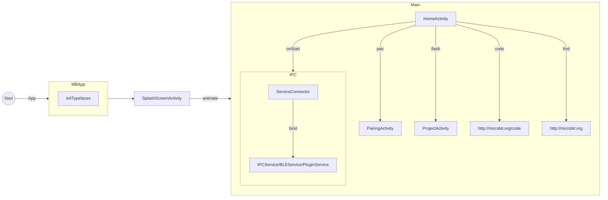
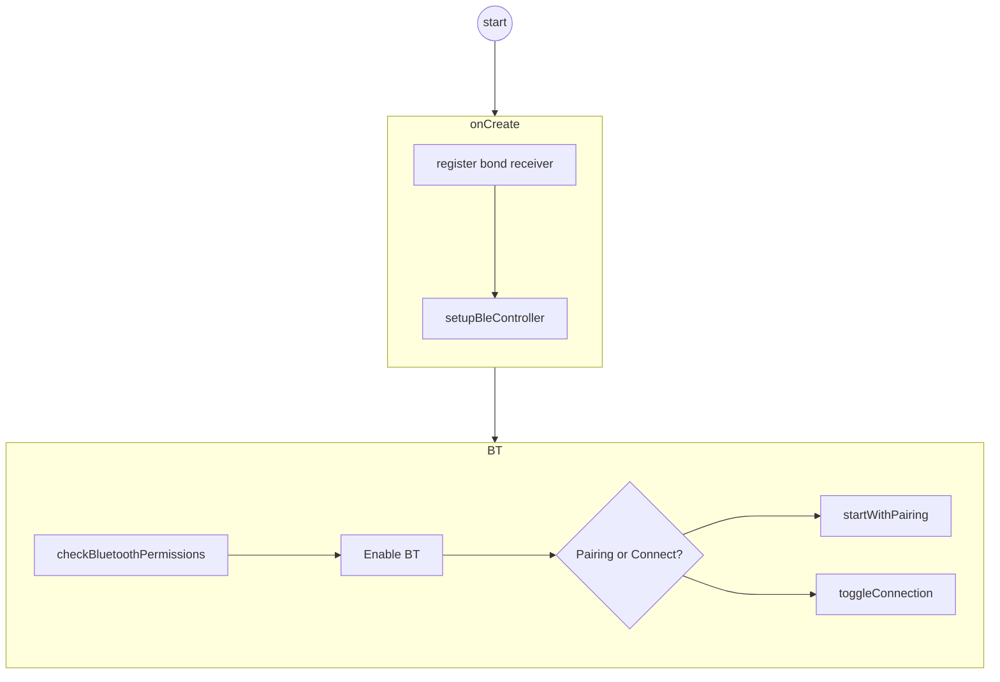
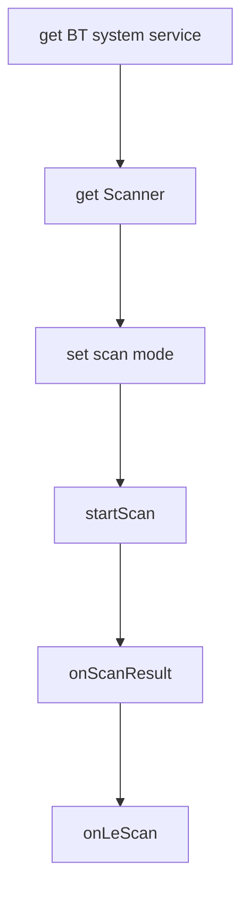

因为小朋友正在学习电子积木，所以也接触了下microbit， 感觉这个开源硬件确实适合初学者入门。
<!-- more -->

Microbit Android BLE App


# app demos

- https://github.com/microbit-foundation/microbit-blue
- https://github.com/Samsung/microbit




# Pairing




## Controll through blutetooth




```java
/**
* Starts activity to enable bluetooth.
*/
private void enableBluetooth() {
    Intent enableBtIntent = new Intent(BluetoothAdapter.ACTION_REQUEST_ENABLE);
    startActivityForResult(enableBtIntent, RequestCodes.REQUEST_ENABLE_BT);
}

// @formatter:off
private static final int DEVICE_CODE_ARRAY[] = {
    0, 0, 0, 0, 0,
    0, 0, 0, 0, 0,
    0, 0, 0, 0, 0,
    0, 0, 0, 0, 0,
    0, 0, 0, 0, 0};

private static final String DEVICE_NAME_MAP_ARRAY[] = {
    "T", "A", "T", "A", "T",
    "P", "E", "P", "E", "P",
    "G", "I", "G", "I", "G",
    "V", "O", "V", "O", "V",
    "Z", "U", "Z", "U", "Z"};
// @formatter:on

private void generateName() {
    StringBuilder deviceNameBuilder = new StringBuilder();
    //Columns
    for(int col = 0; col < 5; col++) {
        //Rows
        for(int row = 0; row < 5; row++) {
            if(DEVICE_CODE_ARRAY[(col + (5 * row))] == 1) {
                deviceNameBuilder.append(DEVICE_NAME_MAP_ARRAY[(col + (5 * row))]);
                break;
            }
        }
    }

    newDeviceCode = deviceNameBuilder.toString();
    newDeviceName = "BBC microbit [" + deviceNameBuilder.toString() + "]";
    //Toast.makeText(this, "Pattern :"+newDeviceCode, Toast.LENGTH_SHORT).show();
}

/**
 * Allows to start or stop scanning for a low energy device.
 *
 * @param enable True - start scanning, false - stop scanning.
 */
private void scanLeDevice(final boolean enable) {
    logi("scanLeDevice() :: enable = " + enable);
    if(enable) {
        //Start scanning.
        if(!setupBleController()) {
            logi("scanLeDevice() :: FAILED ");
            return;
        }
        if(!scanning) {
            logi("scanLeDevice ::   Searching For " + newDeviceName.toLowerCase());
            // Stops scanning after a pre-defined scan period.
            scanning = true;
            ((TextView) findViewById(R.id.search_microbit_step_3_title))
                    .setText(getString(R.string.searchingTitle));
            handler.postDelayed(scanTimedOut, SCAN_PERIOD);
            if(Build.VERSION.SDK_INT < Build.VERSION_CODES.LOLLIPOP) {
                bluetoothAdapter.startLeScan(getOldScanCallback());
            } else {
                List<ScanFilter> filters = new ArrayList<>();
                // TODO: play with ScanSettings further to ensure the Kit kat devices connectMaybeIn
                ScanSettings settings = new ScanSettings.Builder().setScanMode(ScanSettings.SCAN_MOD
                leScanner.startScan(filters, settings, getNewScanCallback());
            }
        }
    } else {
        //Stop scanning.
        if(scanning) {
            scanning = false;
            handler.removeCallbacks(scanTimedOut);
            if(Build.VERSION.SDK_INT < Build.VERSION_CODES.LOLLIPOP) {
                bluetoothAdapter.stopLeScan(getOldScanCallback());
            } else {
                leScanner.stopScan(getNewScanCallback());
            }
        }
    }
}
                                                                               
//scan callback
if(newScanCallback == null) {
    newScanCallback = new ScanCallback() {
        @Override
        public void onScanResult(int callbackType, ScanResult result) {
            super.onScanResult(callbackType, result);
            Log.i("callbackType = ", String.valueOf(callbackType));
            Log.i("result = ", result.toString());
            BluetoothDevice btDevice = result.getDevice();
            final ScanRecord scanRecord = result.getScanRecord();
            if(scanRecord != null) {
                onLeScan(btDevice, result.getRssi(), scanRecord.getBytes());
            }
        }

        @Override
        public void onBatchScanResults(List<ScanResult> results) {
            super.onBatchScanResults(results);
            for(ScanResult sr : results) {
                Log.i("Scan result - Results ", sr.toString());
            }
        }

        @Override
        public void onScanFailed(int errorCode) {
            super.onScanFailed(errorCode);
            Log.i("Scan failed", "Error Code : " + errorCode);
        }
    };
}                                                                        

                                                                               
    /**
     * Checks if device is paired, if true - stops scanning and proceeds with success message,
     * else - starts pairing to the device.
     *
     * @param device Device to pair with.
     */
    private void startPairingSecureBle(BluetoothDevice device) {
        logi("###>>>>>>>>>>>>>>>>>>>>> startPairingSecureBle");
        //Check if the device is already bonded
        if(device.getBondState() == BluetoothDevice.BOND_BONDED) {
            logi("Device is already bonded.");
            stopScanning();
            //Get device name from the System settings if present and add to our list
            ConnectedDevice newDev = new ConnectedDevice(newDeviceCode.toUpperCase(),
                    newDeviceCode.toUpperCase(), false, newDeviceAddress, 0, null,
                    System.currentTimeMillis());
            handlePairingSuccessful(newDev);
        } else {
            logi("device.createBond returns " + device.createBond());
        }
    }
```


```mermaid
flowchart LR


```


