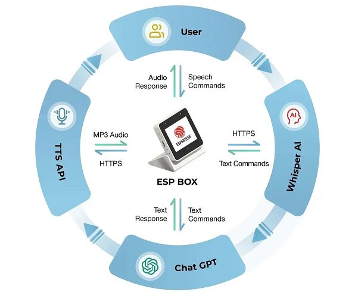

在ESP上， 使用大模型来做点东西吧

<!-- more -->

# 参考产品

## ESP Box

https://www.bilibili.com/opus/806649640762998866

https://github.com/espressif/esp-box/blob/master/docs/hardware_overview/esp32_s3_box_3/hardware_overview_for_box_3.md

**环境设置** 

为了避免错误，需设置合适的环境并安装正确的软件版本。 

- ESP-IDF 

在本示例中，我们将使用 ESP-IDF 5.0 版本（主分支）。如果你需要关于如何设置 ESP-IDF 的指导，请参考官方《ESP-IDF 编程指南》了解更多信息。 

*截至撰写本文时，IDF 提交头为 df9310ada2。 

- ChatGPT API 

ChatGPT 是一个基于 GPT-3.5 架构的强大语言模型，要使用 ChatGPT，请先前往 OpenAI 平台上创建账户，获取免费或付费的 API 密钥。通过 API 密钥，可获取很多功能和能力，例如自然语言处理与生成、文本补全以及对话建模等，还可根据自己的需求定义这些功能。更多信息请访问官方 API 参考。 

*请务必保障 API 密钥的机密性和安全性，防止未经授权访问您的账户和数据。 

**赋能离线语音识别** 

乐鑫开发的创新性语音识别框架 ESP-SR 能够使设备在不依赖外部云服务的情况下识别口语词汇和短语，因此非常适合离线语音识别应用。 

ESP-SR 框架包含多个模块，包括音频前端 (AFE)、唤醒词引擎 (WakeNet)、语音指令词识别 (MultiNet) 和语音合成（目前仅支持中文）。请查阅 ESP-SR 官方文档获取更多信息

