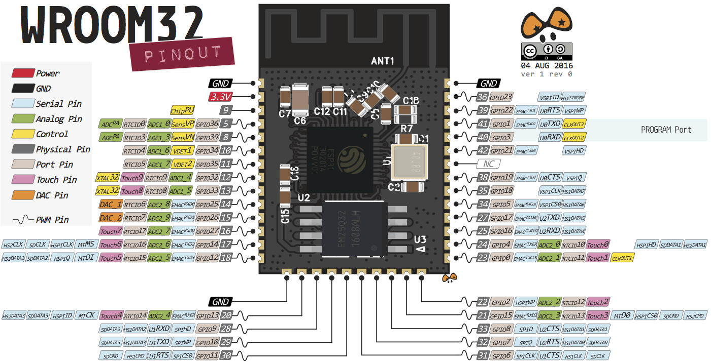
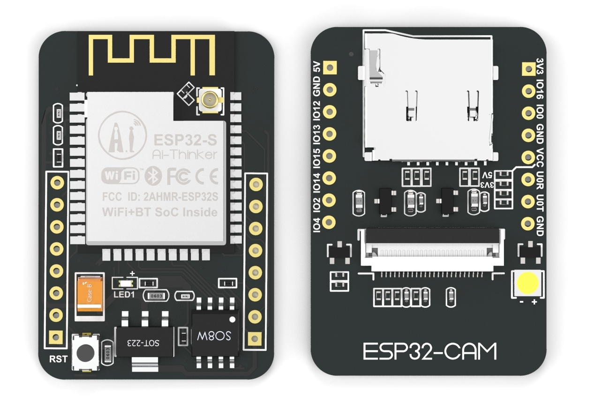
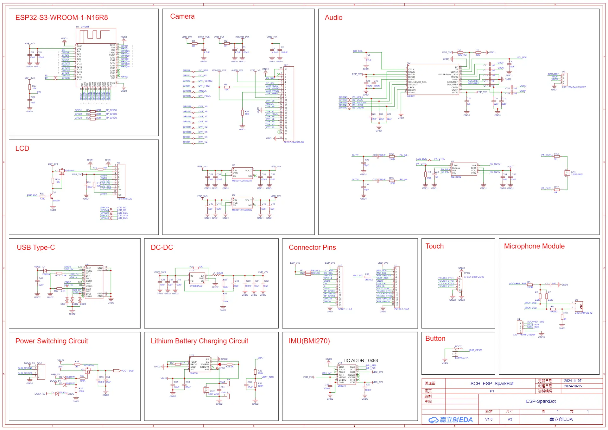

本文记录了复刻网络上的桌面机器人过程

<!-- more -->

* TOC
{:toc}
# ESP32 S3 SparkBot

ESP32 Bare Pin






采用低功耗双核32位CPU，可作应用处理器

主频高达240MHz，运算能力高达 600 DMIPS

内置 520 KB SRAM，外置8MB PSRAM

支持UART/SPI/I2C/PWM/ADC/DAC等接口

支持OV2640和OV7670摄像头，内置闪光灯

支持图片WiFI上传

支持TF卡

支持多种休眠模式。

内嵌Lwip和FreeRTOS

支持 STA/AP/STA+AP 工作模式

支持 Smart Config/AirKiss 一键配网

支持二次开发





## LCD

factory_demo_v1\managed_components\espressif__esp_lvgl_port\test_apps

```
/* LCD pins */
#define EXAMPLE_LCD_GPIO_SCLK       (GPIO_NUM_7)
#define EXAMPLE_LCD_GPIO_MOSI       (GPIO_NUM_6)
#define EXAMPLE_LCD_GPIO_RST        (GPIO_NUM_48)
#define EXAMPLE_LCD_GPIO_DC         (GPIO_NUM_4)
#define EXAMPLE_LCD_GPIO_CS         (GPIO_NUM_5)
#define EXAMPLE_LCD_GPIO_BL         (GPIO_NUM_45)
```


https://forum.lvgl.io/t/st7735-128-160-interface-with-esp32-framework-espidf/6552/3

https://docs.lvgl.io/master/details/integration/driver/display/st7735.html


## Audio


# xiaozhi ESP


后端模型：Qwen-72B，SenseVoiceSmall 飞书文档：https://ccnphfhqs21z.feishu.cn/wiki/EH6wwrgvNiU7aykr7HgclP09nCh （附配件链接） 硬件开源：https://github.com/78/xiaozhi-esp32 Q群交流：946599635


https://github.com/78/xiaozhi-esp32


