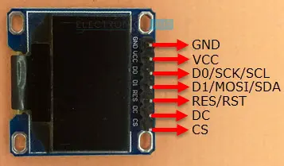
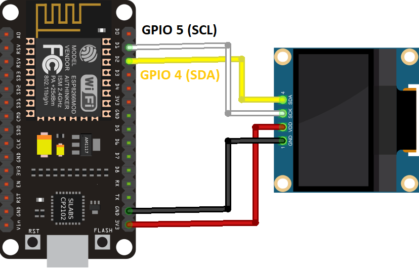
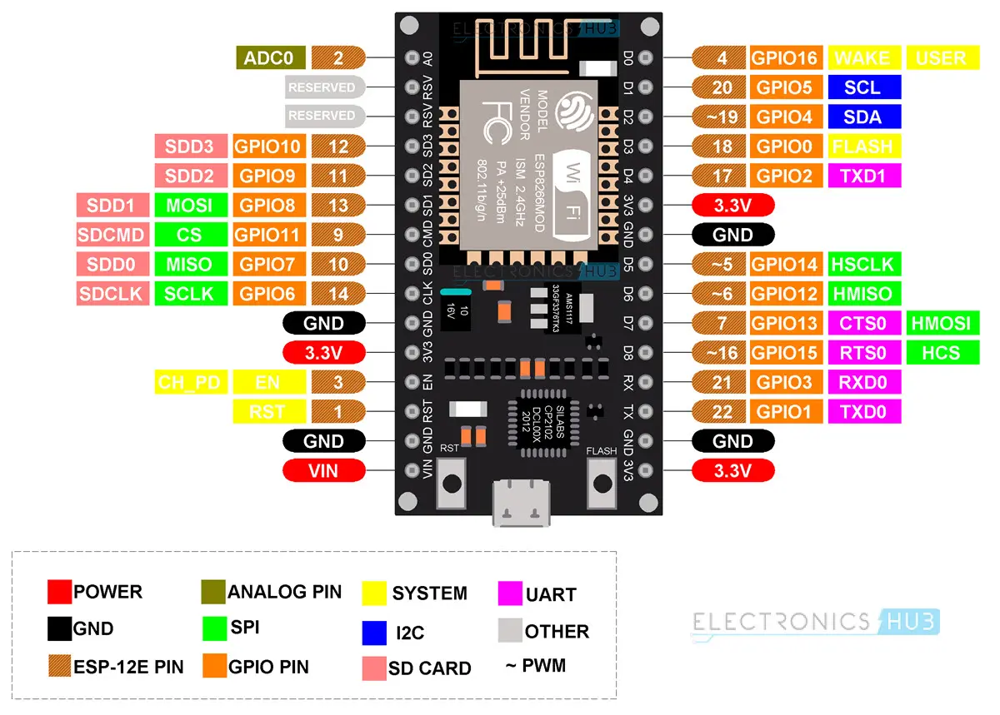
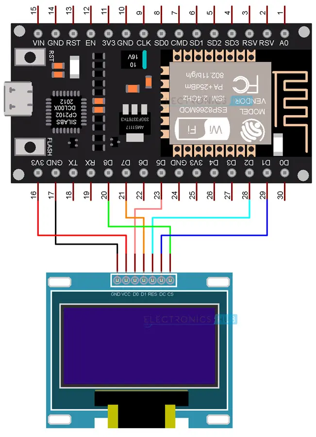

本文记录了使用ESP 8266 SPI驱动0.96英寸屏幕

<!-- more -->

* TOC
{:toc}


# [0.96 inch OLED LCD Display](http://www.lcdwiki.com/0.96inch_SPI_OLED_Module)

|  |  |
| ------------------------------------------------------------ | ------------------------------------------------------------ |

**NOTE:**

1.This module supports IIC, 3-wire SPI and 4-wire SPI interface bus mode switching (shown in red box in Figure 2). The details are as follows:
**A. Using 4.7K resistance to solder only R3 and R4 resistors, then choose 4-wire SPI bus interface (default);**
B.Using 4.7K resistance to solder only R2 and R3 resistors, then select 3-wire SPI bus interface;
C.Using 4.7K resistance to solder only R1, R4, R6, R7, R8 resistors, then select the IIC bus interface;

2.After the interface bus mode is switched, you need to select the corresponding software and the corresponding wiring pins (as shown in Figure 1)
for the module to operate normally. The corresponding wiring pins are described as follows:

**A.select the 4-wire SPI bus interface, all pins need to be used;**
B.select the 3-wire SPI bus interface, only the DC pin does not need to be used(it can not be connected), other pins need to be used;
C.select the IIC bus interface, only need to use the four pins GND, VCC, D0, D1, At the same time, the RES pin is connected to the
high level (can be connected to the VCC), the DC and CS pins are connected to the power GND;




| Number | Module Pin | Pin description                                              |
| ------ | ---------- | ------------------------------------------------------------ |
| 1      | GND        | OLED power ground                                            |
| 2      | VCC        | OLED power positive (3.3V~5V)                                |
| 3      | D0         | OLED SPI and IIC bus clock signals                           |
| 4      | D1         | OLED SPI and IIC bus data signals                            |
| 5      | RES        | OLED reset signal, low level reset(this pin need to connected to the high level (can be connected to the VCC) when selecting IIC bus) |
| 6      | DC         | OLED command / data input select signal, high level: data, low level: command(this pin is not required(it can not be connected) when selecting 3-wire SPI bus; this pin need to connected to the power GND when selecting IIC bus) |
| 7      | CS         | OLED chip select signal, low level enable(this pin need to connected to the power GND when selecting IIC bus) |

# I2C

Pin	ESP8266
Vin	3.3V

``` 
GND	GND
SCL	GPIO 5 (D1)
SDA	GPIO 4 (D2)
```




## check I2C address

```c
/*********
  Rui Santos
  Complete project details at https://randomnerdtutorials.com  
*********/

#include <Wire.h>
 
void setup() {
  Wire.begin();
  Serial.begin(115200);
  Serial.println("\nI2C Scanner");
}
 
void loop() {
  byte error, address;
  int nDevices;
  Serial.println("Scanning...");
  nDevices = 0;
  for(address = 1; address < 127; address++ ) {
    Wire.beginTransmission(address);
    error = Wire.endTransmission();
    if (error == 0) {
      Serial.print("I2C device found at address 0x");
      if (address<16) {
        Serial.print("0");
      }
      Serial.println(address,HEX);
      nDevices++;
    }
    else if (error==4) {
      Serial.print("Unknow error at address 0x");
      if (address<16) {
        Serial.print("0");
      }
      Serial.println(address,HEX);
    }    
  }
  if (nDevices == 0) {
    Serial.println("No I2C devices found\n");
  }
  else {
    Serial.println("done\n");
  }
  delay(5000);          
}
```

## test

```c
/*********
  Rui Santos
  Complete project details at https://randomnerdtutorials.com  
*********/

#include <Wire.h>
#include <Adafruit_GFX.h>
#include <Adafruit_SSD1306.h>

#define SCREEN_WIDTH 128 // OLED display width, in pixels
#define SCREEN_HEIGHT 64 // OLED display height, in pixels

// Declaration for an SSD1306 display connected to I2C (SDA, SCL pins)
Adafruit_SSD1306 display(SCREEN_WIDTH, SCREEN_HEIGHT, &Wire, -1);

void setup() {
  Serial.begin(115200);

  if(!display.begin(SSD1306_SWITCHCAPVCC, 0x3C)) { // Address 0x3D for 128x64
    Serial.println(F("SSD1306 allocation failed"));
    for(;;);
  }
  delay(2000);
  display.clearDisplay();

  display.setTextSize(1);
  display.setTextColor(WHITE);
  display.setCursor(0, 10);
  // Display static text
  display.println("Hello, world!");
  display.display(); 
}

void loop() {
  
}
```


# SPI

## 0.96


| **HSPI**  | **GPIO** | **NodeMCU** |
| --------- | -------- | ----------- |
| HSPI_MISO | GPIO 12  | D6          |
| HSPI_MOSI | GPIO 13  | D7          |
| HSPI_CLK  | GPIO 14  | D5          |
| HSPI_CS   | GPIO 15  | D8          |



| **OLED Display** | **ESP8266 NodeMCU** |
| ---------------- | ------------------- |
| GND              | GND                 |
| VCC              | 3.3V                |
| D0 (SCK / CLK)   | GPIO 14 (D5)        |
| D1 (MOSI)        | GPIO 13 (D7)        |
| RES              | GPIO 4 (D2)         |
| DC               | GPIO 5 (D1)         |
| CS               | GPIO 15 (D8)        |




### install libraries

Adafruit SSD1306

Adafruit GFX

display text

```c++
#include <SPI.h>
#include <Wire.h>
#include <Adafruit_GFX.h>
#include <Adafruit_SSD1306.h>

#define SCREEN_WIDTH 128
#define SCREEN_HEIGHT 64

#define OLED_MOSI   13
#define OLED_CLK   14
#define OLED_DC    5
#define OLED_CS    15
#define OLED_RESET 4
Adafruit_SSD1306 display(SCREEN_WIDTH, SCREEN_HEIGHT,
  OLED_MOSI, OLED_CLK, OLED_DC, OLED_RESET, OLED_CS);


void AllPixels()
{
  int i;
  int j;
  display.clearDisplay();
  for(i=0;i<128;i++)
  {
    for(j=0;j<64;j++)
    {
      display.drawPixel(i, j, SSD1306_WHITE);
      
    }
    display.display();
    delay(20);
  }
  
  for(i=0;i<128;i++)
  {
    for(j=0;j<64;j++)
    {
      display.drawPixel(i, j, SSD1306_BLACK);
      
    }
    display.display();
    delay(20);
  }
  
}

void TextDisplay()
{
  display.clearDisplay();
  display.setTextSize(1);
  display.setTextColor(SSD1306_WHITE);
  display.setCursor(5,28);
  display.println("Electronics Hub");
  display.display();
  delay(3000);
}

void InvertedTextDisplay()
{
  display.clearDisplay();
  display.setTextColor(SSD1306_BLACK, SSD1306_WHITE);
  display.setCursor(5,28);
  display.println("Electronics Hub");
  display.display();
  delay(3000);
}

void ScrollText()
{
  display.clearDisplay();
  display.setCursor(0,0);
  display.setTextSize(1);
  display.setTextColor(SSD1306_WHITE);
  display.println("This is a");
  display.println("Scrolling");
  display.println("Text!");
  display.display();
  delay(100);
  display.startscrollright(0x00, 0x0F);
  delay(2000);
  //display.stopscroll();
  //delay(1000);
  display.startscrollleft(0x00, 0x0F);
  delay(2000);
  //display.stopscroll();
  //delay(1000);
  display.startscrolldiagright(0x00, 0x0F);
  delay(2000);
  display.startscrolldiagleft(0x00, 0x0F);
  delay(2000);
  display.stopscroll();
}

void DisplayChars()
{
  display.clearDisplay();

  display.setTextSize(1);
  display.setTextColor(SSD1306_WHITE);
  display.setCursor(0, 0);
  display.cp437(true);
  
  for(int16_t i=0; i<256; i++)
  {
    if(i == '\n')
    {
      display.write(' ');
    }
    else
    {
      display.write(i);
    }
  }

  display.display();
  delay(3000);
}
void TextSize()
{
  display.clearDisplay();

  display.setTextSize(1);
  display.setTextColor(SSD1306_WHITE);
  display.setCursor(0,0);
  display.println(F("Size: 1"));
  display.println(F("ABC"));

  display.setTextSize(2);
  display.setTextColor(SSD1306_WHITE);
  display.println("Size: 2");
  display.println(F("ABC"));

  display.display();
  delay(3000);
}


void setup()
{
  Serial.begin(115200);
  if(!display.begin(SSD1306_SWITCHCAPVCC))
  {
    Serial.println(F("SSD1306 allocation failed"));
    for(;;);
  }
  
  display.clearDisplay();
  display.display();
  delay(100);
}

void loop()
{
  AllPixels();
  TextDisplay();
  InvertedTextDisplay();
  ScrollText();
  DisplayChars();
  TextSize();
}
```

display graphic

```c
#include <SPI.h>
#include <Wire.h>
#include <Adafruit_GFX.h>
#include <Adafruit_SSD1306.h>

#define SCREEN_WIDTH 128
#define SCREEN_HEIGHT 64

#define OLED_MOSI   13
#define OLED_CLK   14
#define OLED_DC    5
#define OLED_CS    15
#define OLED_RESET 4
Adafruit_SSD1306 display(SCREEN_WIDTH, SCREEN_HEIGHT,
  OLED_MOSI, OLED_CLK, OLED_DC, OLED_RESET, OLED_CS);


void DrawRectangle()
{
  display.clearDisplay();
  display.setTextSize(1);
  display.setTextColor(WHITE);
  display.setCursor(0,0);
  display.println("Rectangle");
  display.drawRect(0, 15, 90, 45, SSD1306_WHITE);
  display.display();
  delay(2000);
}

void DrawFilledRectangle()
{
  display.clearDisplay();  
  display.setTextSize(1);
  display.setTextColor(WHITE);
  display.setCursor(0,0);
  display.println("Filled Rectangle");
  display.fillRect(0, 15, 90, 45, SSD1306_WHITE);
  display.display();
  delay(2000);
  
}

void DrawRoundRectangle()
{
  display.clearDisplay();
  display.setTextSize(1);
  display.setTextColor(SSD1306_WHITE);
  display.setCursor(0,0);
  display.println("Round Rectangle");
  display.drawRoundRect(0, 15, 90, 45, 10, SSD1306_WHITE);
  display.display();
  delay(5000);
}

void DrawFilledRoundRectangle()
{
  display.clearDisplay();  
  display.setTextSize(1);
  display.setTextColor(SSD1306_WHITE);
  display.setCursor(0,0);
  display.println("Filled Round Rect");
  display.fillRoundRect(0, 15, 90, 45, 10, SSD1306_WHITE);
  display.display();
  delay(2000);
  
}

void DrawCircle()
{
  display.clearDisplay();
  display.setTextSize(1);
  display.setTextColor(SSD1306_WHITE);
  display.setCursor(0,0);
  display.println("Circle");
  display.drawCircle(30, 36, 25, SSD1306_WHITE);
  display.display();
  delay(2000);
}
void DrawFilledCircle()
{
  display.clearDisplay();
  display.setTextSize(1);
  display.setTextColor(SSD1306_WHITE);
  display.setCursor(0,0);
  display.println("Filled Circle");
  display.fillCircle(30, 36, 25, SSD1306_WHITE);
  display.display();
  delay(2000);
  
}

void DrawTriangle()
{
  display.clearDisplay();
  display.setTextSize(1);
  display.setTextColor(SSD1306_WHITE);
  display.setCursor(0,0);
  display.println("Triangle");
  display.drawTriangle(30, 15, 0, 60, 60, 60, SSD1306_WHITE);
  display.display();
  delay(2000);  
}

void DrawFilledTriangle()
{
  display.clearDisplay();
  display.setTextSize(1);
  display.setTextColor(SSD1306_WHITE);
  display.setCursor(0,0);
  display.println("Filled Triangle");
  display.fillTriangle(30, 15, 0, 60, 60, 60, SSD1306_WHITE);
  display.display();
  delay(2000);
}


void setup()
{
  Serial.begin(115200);
  if(!display.begin(SSD1306_SWITCHCAPVCC))
  {
    Serial.println(F("SSD1306 allocation failed"));
    for(;;);
  }
  
  display.clearDisplay();
  display.display();
  delay(100);
}

void loop()
{
  DrawRectangle();
  DrawFilledRectangle();
  DrawRoundRectangle();
  DrawFilledRoundRectangle();
  DrawCircle();
  DrawFilledCircle();
  DrawTriangle();
  DrawFilledTriangle();
}
```

display bitmap

```c
#include <SPI.h>
#include <Wire.h>
#include <Adafruit_GFX.h>
#include <Adafruit_SSD1306.h>

#define SCREEN_WIDTH 128
#define SCREEN_HEIGHT 64

#define OLED_MOSI   13
#define OLED_CLK   14
#define OLED_DC    5
#define OLED_CS    15
#define OLED_RESET 4
Adafruit_SSD1306 display(SCREEN_WIDTH, SCREEN_HEIGHT,
  OLED_MOSI, OLED_CLK, OLED_DC, OLED_RESET, OLED_CS);

const unsigned char electronicshub_logo [] PROGMEM = {
  0x00, 0x00, 0x00, 0x00, 0x00, 0x00, 0x00, 0x00, 0x00, 0x00, 0x00, 0x00, 0x00, 0x00, 0x00, 0x00, 
  0x00, 0x00, 0x00, 0x00, 0x00, 0x00, 0x00, 0x00, 0x00, 0x00, 0x00, 0x00, 0x00, 0x00, 0x00, 0x00, 
  0x00, 0x00, 0x00, 0x00, 0x00, 0x00, 0x00, 0x00, 0x00, 0x00, 0x00, 0x00, 0x00, 0x00, 0x00, 0x00, 
  0x00, 0x00, 0x00, 0x00, 0x00, 0x00, 0x00, 0x00, 0x00, 0x00, 0x00, 0x00, 0x00, 0x00, 0x00, 0x00, 
  0x00, 0x00, 0x00, 0x00, 0x00, 0x00, 0x00, 0x00, 0x00, 0x00, 0x00, 0x00, 0x00, 0x00, 0x00, 0x00, 
  0x00, 0x00, 0x00, 0x00, 0x00, 0x00, 0x00, 0x00, 0x00, 0x00, 0x00, 0x00, 0x00, 0x00, 0x00, 0x00, 
  0x00, 0x00, 0x00, 0x00, 0x00, 0x00, 0x00, 0x00, 0x00, 0x00, 0x00, 0x00, 0x00, 0x00, 0x00, 0x00, 
  0x00, 0x00, 0x00, 0x00, 0x00, 0x00, 0x00, 0x00, 0x00, 0x00, 0x00, 0x00, 0x00, 0x00, 0x00, 0x00, 
  0x00, 0x00, 0x00, 0x00, 0x00, 0x00, 0x00, 0x00, 0x00, 0x00, 0x00, 0x00, 0x00, 0x00, 0x00, 0x00, 
  0x00, 0x00, 0x00, 0x00, 0x00, 0x00, 0x00, 0x00, 0x00, 0x00, 0x00, 0x00, 0x00, 0x00, 0x00, 0x00, 
  0x00, 0x00, 0x00, 0x00, 0x00, 0x00, 0x00, 0x00, 0x00, 0x00, 0x00, 0x00, 0x00, 0x00, 0x00, 0x00, 
  0x00, 0x00, 0x00, 0x00, 0x00, 0x00, 0x00, 0x00, 0x00, 0x00, 0x00, 0x00, 0x00, 0x00, 0x00, 0x00, 
  0x00, 0x00, 0x00, 0x00, 0x00, 0x00, 0x00, 0x00, 0x00, 0x00, 0x00, 0x00, 0x00, 0x00, 0x00, 0x00, 
  0x00, 0x00, 0x00, 0x00, 0x00, 0x00, 0x00, 0x00, 0x00, 0x00, 0x00, 0x0f, 0xff, 0xff, 0xff, 0x80, 
  0x00, 0x00, 0x00, 0x00, 0x00, 0x00, 0x00, 0x00, 0x00, 0x00, 0x00, 0x0f, 0xff, 0xff, 0xff, 0x80, 
  0x00, 0x00, 0x00, 0x00, 0x00, 0x00, 0x00, 0x00, 0x00, 0x00, 0x00, 0x0f, 0xff, 0xff, 0xff, 0x80, 
  0x00, 0x00, 0x00, 0x00, 0x00, 0x00, 0x00, 0x00, 0x00, 0x00, 0x00, 0x0f, 0xff, 0xff, 0xff, 0x80, 
  0x00, 0x00, 0x00, 0x00, 0x00, 0x00, 0x00, 0x00, 0x00, 0x00, 0x00, 0x0f, 0xff, 0xff, 0xff, 0x80, 
  0x00, 0x00, 0x00, 0x00, 0x00, 0x00, 0x00, 0x00, 0x00, 0x00, 0x00, 0x0f, 0xff, 0xff, 0xff, 0x80, 
  0x03, 0xe0, 0x07, 0xc3, 0x87, 0xcf, 0x03, 0x02, 0x11, 0x07, 0x04, 0x0f, 0xbd, 0xbd, 0xc7, 0x80, 
  0x03, 0xe4, 0x07, 0xc3, 0xc7, 0xcf, 0x07, 0x82, 0x11, 0x07, 0x8e, 0x0f, 0xbd, 0xbd, 0xc7, 0x80, 
  0x02, 0x04, 0x04, 0x06, 0xc1, 0x01, 0x84, 0xc2, 0x11, 0x0d, 0x8a, 0x0f, 0xbd, 0xbd, 0xf3, 0x80, 
  0x02, 0x04, 0x04, 0x04, 0x61, 0x00, 0x88, 0x42, 0x11, 0x08, 0x8a, 0x0f, 0xbd, 0xbd, 0xfb, 0x80, 
  0x02, 0x04, 0x04, 0x0c, 0x21, 0x00, 0x88, 0x43, 0x11, 0x10, 0x08, 0x0f, 0xbd, 0xbd, 0xfb, 0x80, 
  0x02, 0x04, 0x04, 0x08, 0x01, 0x00, 0x88, 0x23, 0x11, 0x10, 0x08, 0x0f, 0xbd, 0xbd, 0xfb, 0x80, 
  0x02, 0x04, 0x04, 0x08, 0x01, 0x00, 0x88, 0x23, 0x11, 0x10, 0x08, 0x0f, 0xbd, 0xbd, 0xfb, 0x80, 
  0x02, 0x04, 0x04, 0x08, 0x01, 0x00, 0x90, 0x23, 0x11, 0x10, 0x08, 0x0f, 0xbd, 0xbd, 0xfb, 0x80, 
  0x02, 0x04, 0x04, 0x08, 0x01, 0x00, 0x90, 0x22, 0x91, 0x10, 0x08, 0x0f, 0xbd, 0xbd, 0xf7, 0x80, 
  0x02, 0x04, 0x04, 0x08, 0x01, 0x00, 0x90, 0x22, 0x91, 0x10, 0x0e, 0x0f, 0xbd, 0xbd, 0xc7, 0x80, 
  0x03, 0x84, 0x07, 0x08, 0x01, 0x00, 0x90, 0x22, 0x91, 0x10, 0x06, 0x0f, 0x81, 0xbd, 0xc7, 0x80, 
  0x03, 0x84, 0x07, 0x08, 0x01, 0x07, 0x90, 0x22, 0xd1, 0x10, 0x03, 0x0f, 0x81, 0xbd, 0xf7, 0x80, 
  0x02, 0x04, 0x04, 0x08, 0x01, 0x07, 0x10, 0x22, 0x51, 0x10, 0x01, 0x0f, 0xbd, 0xbd, 0xfb, 0x80, 
  0x02, 0x04, 0x04, 0x08, 0x01, 0x06, 0x10, 0x22, 0x51, 0x10, 0x01, 0x0f, 0xbd, 0xbd, 0xfb, 0x80, 
  0x02, 0x04, 0x04, 0x08, 0x01, 0x02, 0x10, 0x22, 0x51, 0x10, 0x01, 0x0f, 0xbd, 0xbd, 0xfb, 0x80, 
  0x02, 0x04, 0x04, 0x08, 0x01, 0x02, 0x08, 0x22, 0x31, 0x10, 0x01, 0x0f, 0xbd, 0xbd, 0xfb, 0x80, 
  0x02, 0x04, 0x04, 0x08, 0x01, 0x01, 0x08, 0x22, 0x31, 0x10, 0x01, 0x0f, 0xbd, 0xbd, 0xfb, 0x80, 
  0x02, 0x04, 0x04, 0x0c, 0x21, 0x01, 0x08, 0x42, 0x31, 0x10, 0x01, 0x0f, 0xbd, 0xdb, 0xfb, 0x80, 
  0x02, 0x04, 0x04, 0x04, 0x61, 0x01, 0x88, 0x42, 0x31, 0x08, 0x99, 0x0f, 0xbd, 0xdb, 0xf3, 0x80, 
  0x02, 0x04, 0x04, 0x06, 0xc1, 0x00, 0x84, 0xc2, 0x11, 0x0d, 0x8b, 0x0f, 0xbd, 0xc3, 0xc7, 0x80, 
  0x03, 0xe7, 0xc7, 0xc3, 0xc1, 0x00, 0x87, 0x82, 0x11, 0x07, 0x8e, 0x0f, 0xbd, 0xe7, 0xc7, 0x80, 
  0x03, 0xe7, 0xc7, 0xc3, 0x81, 0x00, 0x83, 0x02, 0x11, 0x07, 0x06, 0x0f, 0xff, 0xff, 0xff, 0x80, 
  0x00, 0x00, 0x00, 0x00, 0x00, 0x00, 0x00, 0x00, 0x00, 0x00, 0x00, 0x0f, 0xff, 0xff, 0xff, 0x80, 
  0x00, 0x00, 0x00, 0x00, 0x00, 0x00, 0x00, 0x00, 0x00, 0x00, 0x00, 0x0f, 0xff, 0xff, 0xff, 0x80, 
  0x00, 0x00, 0x00, 0x00, 0x00, 0x00, 0x00, 0x00, 0x00, 0x00, 0x00, 0x0f, 0xff, 0xff, 0xff, 0x80, 
  0x00, 0x00, 0x00, 0x00, 0x00, 0x00, 0x00, 0x00, 0x00, 0x00, 0x00, 0x0f, 0xff, 0xff, 0xff, 0x80, 
  0x00, 0x00, 0x00, 0x00, 0x00, 0x00, 0x00, 0x00, 0x00, 0x00, 0x00, 0x0f, 0xff, 0xff, 0xff, 0x80, 
  0x07, 0xff, 0xff, 0xff, 0xff, 0xff, 0xff, 0xff, 0xff, 0xff, 0xff, 0xff, 0xff, 0xff, 0xff, 0x80, 
  0x07, 0xff, 0xff, 0xff, 0xff, 0xff, 0xff, 0xff, 0xff, 0xff, 0xff, 0xff, 0xff, 0xff, 0xff, 0x80, 
  0x00, 0x02, 0x00, 0x00, 0x00, 0x00, 0x00, 0x00, 0x00, 0x00, 0x00, 0x00, 0x00, 0x00, 0x00, 0x00, 
  0x00, 0x02, 0x00, 0x00, 0x00, 0x00, 0x00, 0x00, 0x00, 0x00, 0x00, 0x00, 0x00, 0x00, 0x00, 0x00, 
  0x00, 0x02, 0x00, 0x00, 0x00, 0x00, 0x00, 0x00, 0x00, 0x00, 0x00, 0x00, 0x00, 0x00, 0x00, 0x00, 
  0x00, 0x02, 0x00, 0x00, 0x00, 0x00, 0x00, 0x00, 0x00, 0x00, 0x00, 0x00, 0x00, 0x00, 0x00, 0x00, 
  0x00, 0x04, 0x00, 0x00, 0x00, 0x00, 0x00, 0x00, 0x00, 0x00, 0x00, 0x00, 0x00, 0x00, 0x00, 0x00, 
  0x00, 0x04, 0x00, 0x00, 0x00, 0x00, 0x00, 0x00, 0x00, 0x00, 0x00, 0x00, 0x00, 0x00, 0x00, 0x00, 
  0x00, 0x04, 0x00, 0x00, 0x00, 0x00, 0x00, 0x00, 0x00, 0x00, 0x00, 0x00, 0x00, 0x00, 0x00, 0x00, 
  0x00, 0x08, 0x00, 0x00, 0x00, 0x00, 0x00, 0x00, 0x00, 0x00, 0x00, 0x00, 0x00, 0x00, 0x00, 0x00, 
  0x07, 0xf0, 0x00, 0x00, 0x00, 0x00, 0x00, 0x00, 0x00, 0x00, 0x00, 0x00, 0x00, 0x00, 0x00, 0x00, 
  0x00, 0x00, 0x00, 0x00, 0x00, 0x00, 0x00, 0x00, 0x00, 0x00, 0x00, 0x00, 0x00, 0x00, 0x00, 0x00, 
  0x00, 0x00, 0x00, 0x00, 0x00, 0x00, 0x00, 0x00, 0x00, 0x00, 0x00, 0x00, 0x00, 0x00, 0x00, 0x00, 
  0x00, 0x00, 0x00, 0x00, 0x00, 0x00, 0x00, 0x00, 0x00, 0x00, 0x00, 0x00, 0x00, 0x00, 0x00, 0x00, 
  0x00, 0x00, 0x00, 0x00, 0x00, 0x00, 0x00, 0x00, 0x00, 0x00, 0x00, 0x00, 0x00, 0x00, 0x00, 0x00, 
  0x00, 0x00, 0x00, 0x00, 0x00, 0x00, 0x00, 0x00, 0x00, 0x00, 0x00, 0x00, 0x00, 0x00, 0x00, 0x00, 
  0x00, 0x00, 0x00, 0x00, 0x00, 0x00, 0x00, 0x00, 0x00, 0x00, 0x00, 0x00, 0x00, 0x00, 0x00, 0x00, 
  0x00, 0x00, 0x00, 0x00, 0x00, 0x00, 0x00, 0x00, 0x00, 0x00, 0x00, 0x00, 0x00, 0x00, 0x00, 0x00
};

void setup()
{
  Serial.begin(115200);
  if(!display.begin(SSD1306_SWITCHCAPVCC))
  {
    Serial.println(F("SSD1306 allocation failed"));
    for(;;);
  }
  
  display.clearDisplay();
  display.display();
  delay(100);

  display.clearDisplay();
  display.drawBitmap(0, 0, electronicshub_logo, SCREEN_WIDTH, SCREEN_HEIGHT, SSD1306_WHITE);
  display.display();
  //delay(5000);
}

void loop()
{
  
}
```

## 1.8 inch

确认显示芯片为ST7735, 然后再Arduino库中找ST7735

| TFT-LCD PIN | Arduino Pin | 说明   |
| ----------- | ----------- | ------ |
| GND         | GND         | 电源地 |
| VCC  | 3.3/5V | 电源正 3.3V 或 5V 都可 |
| SCL  | GPIO 14(D5) | 时钟线                 |
| SDA  | GPIO 13(D7) | 数据线                 |
| RES  | GPIO 4 (D2) | 复位线                 |
| DC   | GPIO 5 (D1) | 数据/命令选择线        |
| CS   | GPIO 15 (D8) | 片选                   |
| BL   | 空置 | 背光开关               |


### Adafruit_ST7735.h

下载地址：https://github.com/adafruit/Adafruit-ST7735-Library，把所有文件下载至librariesAdafruit_ST7735文件夹即可，当然也可以通过Arduino库管理器安装。这个库使用比较简单，引用Adafruit_GFX.h、Adafruit_ST7735.h这两个库文件就可以使用了，简单的代码如下：


```c
#include <Adafruit_GFX.h>    // Core graphics library
#include <Adafruit_ST7735.h> // Hardware-specific library for ST7735
#include <SPI.h>

#define TFT_CS         15
#define TFT_RST        4                                            
#define TFT_DC         5

   
// OPTION 1 (recommended) is to use the HARDWARE SPI pins, which are unique
// to each board and not reassignable. This is the fastest mode of operation and is required if
// using the breakout board's microSD card.

// For 1.44" and 1.8" TFT with ST7735 use:
Adafruit_ST7735 tft = Adafruit_ST7735(TFT_CS, TFT_DC, TFT_RST);
 
void setup(void) {
  tft.initR(INITR_BLACKTAB); 
  tft.fillScreen(ST7735_RED);
  tft.setTextColor(ST7735_YELLOW);
  tft.setTextSize(2);
  tft.setCursor(10,30);
  tft.print("Hello ST7735!");
}
 
void loop(void) {
}
```

### TFT_eSPI.h

这个库稍微麻烦一点，但是功能丰富。下载：[GitHub - Bodmer/TFT_eSPI: Arduino and PlatformIO IDE compatible TFT library optimised for the Raspberry Pi Pico (RP2040), STM32, ESP8266 and ESP32 that supports different driver chips](https://github.com/Bodmer/TFT_eSPI)，安装好库之后需要修改User_Setup.h配置文件。主要改下面几个地，都是按照这块屏幕设置。

```cpp
...
//驱动选择
#define ST7735_DRIVER 
...
//选择宽高像素值
#define TFT_WIDTH  128
#define TFT_HEIGHT 160
...
#define ST7735_BLACKTAB
...
#define TFT_INVERSION_OFF
...
#define TFT_BACKLIGHT_ON HIGH
...
//定义引脚
#define TFT_MOSI 3
#define TFT_SCLK 2
#define TFT_CS    7  // Chip select control pin
#define TFT_DC    6  // Data Command control pin
#define TFT_RST   10  // Reset pin (could connect to RST pin)
...
//后面一般不用修改
...
```


[ESP8266 0.96 inch OLED Display with Arduino IDE](https://randomnerdtutorials.com/esp8266-0-96-inch-oled-display-with-arduino-ide/)

https://www.electronicshub.org/nodemcu-esp8266-oled-display/
